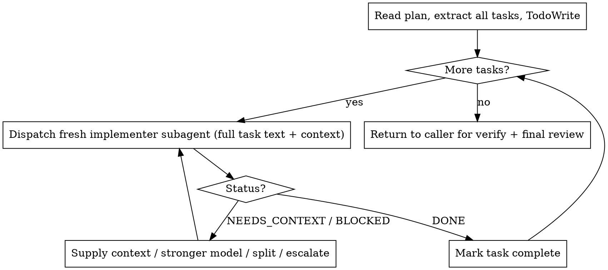

# Subagent-Driven Development

## Overview

Execute a plan by dispatching a **fresh subagent per task**. The controller (you)
keeps only plan + coordination context; each implementer subagent gets exactly
the task it needs and nothing else. This preserves your context for the long run
and keeps each task focused.

**Announce at start:** "Executing the plan with subagent-driven-development."

**Core principle:** Fresh subagent per task + per-task self-review + one final
review = focused context, fast iteration.

**superharness scope:** Per-task review is **self-review only** — there are no
per-task reviewer subagents. Whole-change quality is gated once, by the caller's
final `superharness:requesting-code-review` pass (`go` Phase 4).

## When to use

- You have a written plan (from `superharness:writing-plans`).
- Its tasks are **mostly independent** (not tightly coupled).
- You are staying in this session.

If tasks are tightly coupled, or the goal is trivial (1–2 steps), skip subagents
and implement inline with `superharness:test-driven-development`.

## Process

1. **Read the plan once.** Extract every task with its full text and surrounding
   context (where it fits, files involved). Create one TodoWrite item per task.
2. **Per task, in order** (never dispatch two implementers in parallel — they
   would fight over the working tree):
   - Dispatch a fresh implementer subagent with the **complete task text +
     scene-setting context**. The subagent does NOT read the plan file — you
     hand it everything.
   - The implementer follows `superharness:test-driven-development`
     (RED → GREEN → REFACTOR → commit), runs that task's tests, self-reviews,
     and commits.
   - Handle the returned status (below). When DONE and clean, mark the TodoWrite
     item complete and move on.
3. **After all tasks**, return control to the caller (`go` Phase 3/4) for the
   full-suite verification and the single final code review.



## Implementer dispatch template

Fill this in and send it as the subagent's prompt (do not point it at the plan
file — hand it the full text):

```
You are implementing ONE task under superharness discipline. Use
superharness:test-driven-development — write the failing test first, watch it
fail (RED), write the minimal code to pass (GREEN), refactor, then commit.

Task: <full task text, verbatim from the plan>

Context you need:
- Where this fits: <one or two sentences>
- Files involved: <exact paths>
- Conventions/patterns to follow: <as needed>

When done, self-review your diff, then report ONE status:
- DONE — implemented, tests green, committed
- DONE_WITH_CONCERNS — done, but I flag: <concern>
- NEEDS_CONTEXT — I need: <what>
- BLOCKED — I cannot proceed because: <why>
Report the test command you ran and its actual result.
```

## Handling implementer status

- **DONE** — mark complete, next task.
- **DONE_WITH_CONCERNS** — read the concern. If it affects correctness or scope,
  resolve it before moving on; if it's an observation, note it and proceed.
- **NEEDS_CONTEXT** — supply exactly what's missing and re-dispatch.
- **BLOCKED** — assess: more context? re-dispatch with it. Needs more reasoning?
  re-dispatch with a more capable model. Too large? split it. Plan wrong?
  escalate to your human partner. Never re-dispatch the same model unchanged.

## Model selection

Use the cheapest model that fits: mechanical 1–2 file tasks with a complete spec
→ a fast model; multi-file integration → a standard model; design judgment or
broad codebase understanding → the most capable model.

## Continuous execution

Do not check in with your human partner between tasks. Stop only for an
unresolvable BLOCKED, genuine ambiguity, or when all tasks are complete.

## Red Flags

| Thought | Reality |
|---------|---------|
| "I'll let the subagent read the plan" | No. Hand it the full task text + context. |
| "Run two implementers at once to go faster" | They'll corrupt the working tree. One at a time. |
| "Skip self-review, the final review will catch it" | Self-review is the per-task gate. Always do it. |
| "BLOCKED — I'll just retry the same way" | Change something: context, model, or task size. |
| "Tasks are coupled but I'll force subagents" | Fall back to inline TDD for coupled work. |
