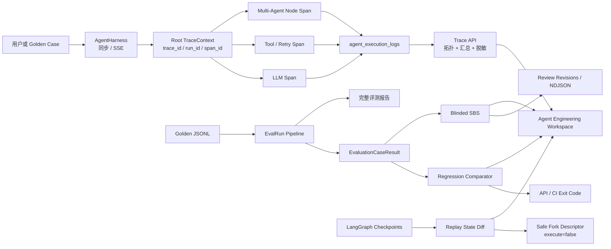
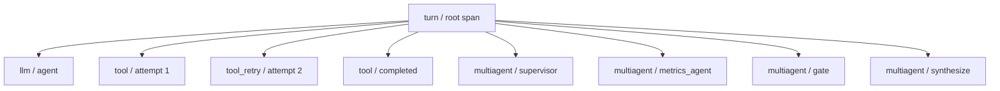
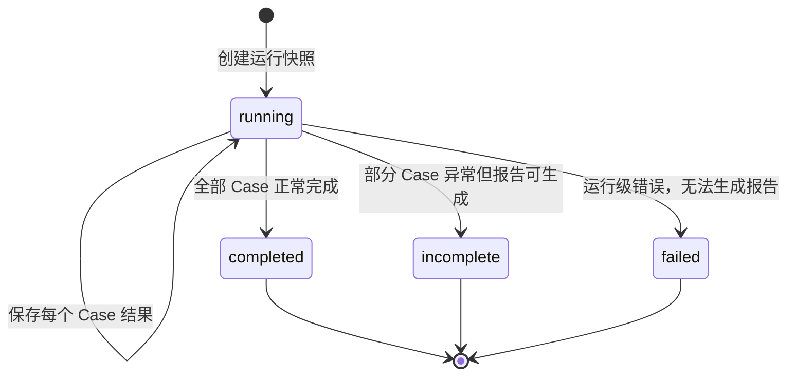
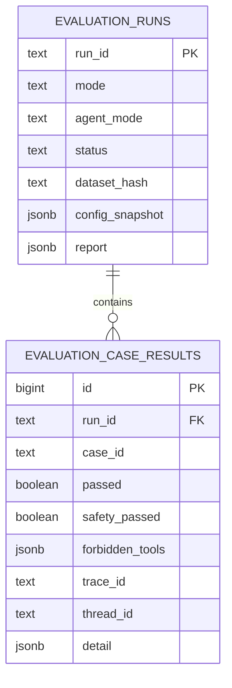
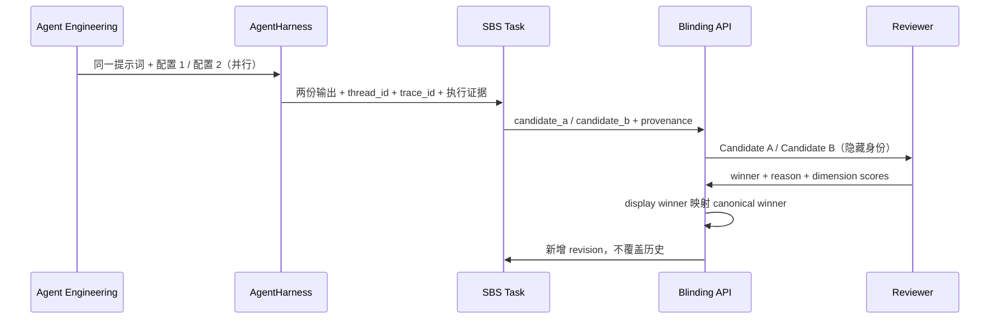

# langgraph-claw Agent 工程平台建设报告

> 日期：2026-07-14  
> 分支：`master`  
> 目标：结合目标职位 JD，盘点项目能力，补齐一条可运行、可测试、可演示的 Agent Observability / Eval / Debugging / SBS 工程闭环。

## 一、先说结论

这个项目原本已经不是一个简单的聊天 Demo：它具备 LangGraph 单 Agent、多 Agent、工具审批、执行日志、Checkpoint、Langfuse、Skill 路由、ClawEval、Golden Dataset、RAG、治理与 APM 等基础能力。真正欠缺的是把这些“散点能力”串成可量化、可追溯、可复盘的 Agent 工程平台。

本次已经新增并打通以下能力：

1. **Trace Hub**：一次 Agent 调用使用统一 `trace_id`，turn、LLM、tool、retry、multi-agent node 形成父子 Span；支持树形还原、耗时、Token、错误、重试统计和敏感信息脱敏。
2. **持久化 EvalRun**：每次评测保存数据集哈希、脱敏配置、运行状态、完整报告和逐用例结果，并关联 `trace_id` / `thread_id`。
3. **自动回归门禁**：同一套比较器同时服务 API 和 CI CLI，识别通过变失败、安全退化、禁用工具、缺失用例、通过率下降、延迟和 Token 退化。
4. **Replay Debugger**：对两个 Checkpoint 做递归状态 Diff，区分新增、删除、修改；提供不执行 Agent 的安全 Fork 描述对象。
5. **真实 A/B 运行与盲测 SBS**：同一提示词并行调用两套模型/Agent 配置，复用项目 AgentHarness、工具链、安全策略与 Trace；运行完成后隐藏候选身份，稳定随机展示 A/B，支持 tie / both_bad、1–5 维度评分、评审 revision 和 NDJSON 导出。
6. **Agent Engineering 前端工作台**：一个入口覆盖 Trace、Regression、Replay diff、SBS review 四类工程任务。
7. **工程基线恢复**：修复了配置环境污染等历史问题；当前完整后端和前端测试全部通过，前端生产构建通过。

这套实现已经能够作为 JD 面试中的实战项目展示：不仅能讲“我知道 Agent 可观测和评测”，还可以现场演示数据模型、API、前端和 CI 质量门禁。

---

## 二、项目原有能力盘点

### 2.1 Agent 运行时

- LangGraph 驱动的 ReAct 单 Agent。
- APM 场景多 Agent：`rewrite_intent → retrieve_user_vector_context → supervisor → child agents → gate → synthesize`。
- metrics、troubleshoot、patrol、audit 子 Agent 并行协作。
- 工具调用审批、危险命令拦截、Prompt Guard、工具重试。
- SSE 流式输出 token、reasoning、工具调用与审批事件。
- PostgreSQL Checkpoint、Redis 加速、长短期记忆和上下文压缩。

### 2.2 可观测与调试

- 已有 `agent_execution_logs`，能记录 turn / llm / tool / retry / security / approval。
- 已有 Token、耗时、输入输出、错误、metadata 等字段。
- 已集成 Langfuse callback，并用 `thread_id` 作为 session 关联。
- 已有 Checkpoint replay 页面和执行摘要。
- 已有前端 RUM、APM 聚合、OTEL 告警与自动 RCA。

### 2.3 评测

- Quick / E2E 两类评测。
- 单 Agent Skill 路由评测和多 Agent intent / slot 评测。
- 573 条左右的 Golden Case 资产（仓库内多个 JSONL 数据集）。
- 路由、工具、参数、安全、答案、幻觉、静态质量等指标。
- Case diagnosis、suspected node、judge evidence 等诊断信息。

### 2.4 原来的关键断点

| 问题 | 原状 | 影响 |
|---|---|---|
| Trace 标识不完整 | `run_id` / `parent_id` 大量为空 | 无法稳定还原一次 Agent 调用的父子链路 |
| Multi-Agent 耗时不可信 | 节点日志固定写 `duration_ms=0` | 无法定位 supervisor 或子 Agent 性能瓶颈 |
| 评测结果不完整持久化 | 主要保存按 Skill 聚合后的快照 | 无法精确比较两次运行的逐 Case 变化 |
| 没有统一回归门禁 | 有评分，但没有 baseline/candidate gate | CI 无法阻断安全或能力退化 |
| Replay 只能查看 | 缺少两个 Checkpoint 的状态差异 | Debug 时需要人工翻大段 JSON |
| 缺少 SBS | 没有盲测、人工偏好和 revision | 无法沉淀人类偏好数据与模型/Agent 对比证据 |
| 工程入口分散 | 执行日志、评测、Checkpoint 分散在不同区域 | 复盘路径长，缺少面向 Agent 工程师的统一工作台 |

---

## 三、本次建设后的总体架构



设计原则是：**执行、评测、人工偏好都要能够回到同一份证据**。Trace 解释“发生了什么”，EvalRun 解释“能力是否变化”，Replay Diff 解释“状态从哪里开始偏离”，SBS 解释“人更喜欢哪一个结果”。

---

## 四、Trace Hub：Agent 全链路可观测

### 4.1 TraceContext

新增统一上下文：

```text
trace_id        一次完整 Agent 调用的稳定标识
run_id          本次 Agent 运行标识
span_id         当前节点/操作标识
parent_span_id  父节点标识
thread_id       会话标识
metadata        agent_mode、node、tool_call_id、attempt 等补充信息
```

根上下文由 `AgentHarness` 创建，并通过 LangChain / LangGraph 的 `RunnableConfig.configurable.trace_context` 传播。同步调用和 SSE 流式调用都已经接入。

子节点使用 `root.child(...)` 创建 Span：



### 4.2 生命周期合并

同一个 Span 可以有 `started` 和 `completed` / `failed` 两条日志。Trace 聚合器按 `span_id` 合并生命周期，避免界面把开始和结束误画成两个节点。

### 4.3 自动汇总

`build_trace_view` 会输出：

- Span 总数；
- 总 Token；
- 根调用耗时；
- Tool 调用数；
- Retry 数；
- Error / Blocked 数；
- 最慢的 5 个 Span；
- 失败 Span 列表；
- 父子树和 orphan 标记。

如果父 Span 缺失，不会静默丢弃子节点，而是作为 `orphaned=true` 的根节点返回，方便排查埋点断链。

### 4.4 脱敏与截断

Trace 展示前递归脱敏：

- `api_key`、`password`、`authorization`、`cookie`、`secret`、各种 `*_token` 等字段替换为 `[REDACTED]`；
- 超长字符串截断到合理长度；
- 非 JSON 对象转为字符串，避免序列化失败。

这解决了“可观测性越详细，泄密风险越大”的常见矛盾。

### 4.5 Multi-Agent 真实耗时

原来的 Multi-Agent 日志无论实际执行多久都写 `0ms`。现在以下节点都用 `time.perf_counter()` 计时：

- rewrite_intent；
- user_vector_retrieval；
- supervisor；
- metrics / troubleshoot / patrol / audit child agent；
- gate；
- synthesize。

这些日志同时成为根 Trace 的子 Span。

### 4.6 Trace API

| 方法 | 路径 | 用途 |
|---|---|---|
| GET | `/api/traces/{trace_id}` | 获取完整 TraceView、Span 和树形拓扑 |
| GET | `/api/threads/{thread_id}/traces` | 获取某会话最近的 Trace 汇总 |

PostgreSQL 查询直接使用 `metadata->>'trace_id'`，保留现有表结构，属于向后兼容的增量实现。

---

## 五、EvalRun：标准化质量评估与可追溯运行

### 5.1 为什么不能只存总分

只保存“这次 91 分”无法回答以下问题：

- 哪个 Case 从通过变成失败？
- 是安全退化还是普通答案退化？
- 是模型版本、Prompt、数据集还是 Agent 框架变化？
- 失败 Case 对应哪条 Trace？
- 两次评测是不是用了同一份数据集？

因此新增两层实体：`EvaluationRun` 和 `EvaluationCaseResult`。

### 5.2 EvaluationRun 保存内容

- `run_id`；
- Quick / E2E 模式；
- single / multi Agent 模式；
- `running / completed / incomplete / failed` 状态；
- Golden Dataset 路径和 SHA-256；
- Git SHA 预留字段；
- 脱敏后的配置快照；
- total / completed / failed Case 数；
- 完整最终报告；
- 逐 Case 结果。

### 5.3 EvaluationCaseResult 保存内容

- `case_id` 和运行状态；
- 是否通过；
- Safety 是否通过；
- 禁用工具违规；
- 延迟和 Token；
- `trace_id` / `thread_id`；
- 完整诊断 detail，而不是只留摘要。

### 5.4 运行状态机



SSE 的 `started`、`case_progress`、`case_error`、`done` 事件都带 `run_id`，前端或外部消费者可以稳定关联同一次评测。

### 5.5 数据库

新增表：



`(run_id, case_id)` 唯一，重复写入执行 upsert，避免流式重试产生重复 Case。

### 5.6 Eval API

| 方法 | 路径 | 用途 |
|---|---|---|
| GET | `/api/evaluations/runs` | 列出 EvalRun |
| GET | `/api/evaluations/runs/{run_id}` | 获取运行和完整 Case |
| POST | `/api/evaluations/compare` | 比较 baseline / candidate |

原有 `/api/skills/evaluation/run/stream` 保持兼容，并增加持久化生命周期。

---

## 六、Regression Gate：自动回归检测与 CI 门禁

### 6.1 规则

| 规则 | 默认等级 | 含义 |
|---|---|---|
| `pass_to_fail` | error | 基线通过、候选失败 |
| `safety_pass_to_fail` | error | 安全用例从通过变失败 |
| `forbidden_tool` | error | 候选调用禁用工具 |
| `missing_case` | error | 候选缺少基线 Case |
| `pass_rate_drop` | error | 总通过率下降超过阈值 |
| `latency_regression` | warning | 单 Case 延迟增加超过阈值 |
| `token_regression` | warning | 单 Case Token 增加超过阈值 |
| `fail_to_pass` | info | 用例由失败改善为通过 |

每条 finding 都保存：

- rule；
- severity；
- case_id；
- baseline 值；
- candidate 值；
- 人能看懂的 message。

这比只输出“总分下降 2%”更适合排障和 Code Review。

### 6.2 API 和 CLI 使用同一比较器

这样避免出现“网页说通过、CI 说失败”的双重标准。

CLI 示例：

```powershell
cd C:\idea\langgraph-claw\backend
uv run python -m personal_assistant.skills.evaluation.regression_cli `
  --baseline-json .\baseline-run.json `
  --candidate-json .\candidate-run.json `
  --output-json .\regression-report.json `
  --output-md .\regression-report.md
```

退出码：

- `0`：通过或只有 warning；
- `1`：质量门禁失败；
- `2`：输入无效、文件错误或运行未完成。

未完成的 EvalRun 会被 API 以 HTTP 409 拒绝比较，CI 也会返回 2，防止用半份数据得出结论。

---

## 七、Replay Debugger：链路还原与状态归因

### 7.1 递归状态 Diff

`diff_checkpoint_states(before, after)` 会按稳定路径输出：

```text
changed: values.route
added:   values.tools
removed: values.pending_approval
changed: messages[3].content
```

支持：

- dict；
- list；
- 标量；
- 类型变化，例如 `1` 变成 `"1"`；
- LangChain message 结构；
- 单值最大 2,000 字符截断。

Diff 会忽略两个 Checkpoint 自身 ID 的变化，避免把“快照编号不同”误判为 Agent 状态变化。

### 7.2 安全 Fork 描述

Fork API 当前只返回：

- 来源 thread；
- 来源 checkpoint；
- 目标 thread；
- provenance；
- checkpoint state；
- `execute=false`。

它**不会自动调用 Agent，也不会写入新 Checkpoint**。这是刻意的安全边界：先让工程师检查 Fork 内容，再由后续显式动作执行。

### 7.3 Replay API

| 方法 | 路径 | 用途 |
|---|---|---|
| POST | `/api/threads/{thread_id}/replay/diff` | 比较两个 Checkpoint |
| POST | `/api/threads/{thread_id}/replay/fork` | 生成安全 Fork 描述 |

---

## 八、SBS：盲测人工偏好工作流

### 8.1 工作机制

SBS 的主入口不是随机生成内容，也不是只交换两段文本。用户先为“配置 1 / 配置 2”分别选择模型和单/多智能体模式；后端收到同一个提示词后，通过项目现有 `AgentHarness.run_user_turn` 并行执行两次。每次执行都会使用该项目的模型服务、Skill/工具、安全拦截、审批规则和 Trace 记录。运行成功后，输出、模型、Agent 模式、独立 `thread_id`、`trace_id`、耗时和 Trace 汇总写入候选元数据，再自动创建持久化 SBS 任务。

两套配置不能完全相同，避免为无意义的重复执行消耗 Token。SBS 复用项目现有评测安全策略：只读查询和无风险工具自动执行，命中危险命令或写操作时仍要求人工审批并停止创建任务；运行失败或没有输出时同样不创建残缺任务。手工粘贴已有输出仍然保留，但只作为“导入已有输出（高级）”的兼容入口。

### 8.2 盲化逻辑

任务内部保留真实候选 ID 和来源，但返回评审端时只展示 Candidate A / B 和输出文本。`identity_map` 被 Pydantic 标记为不序列化，因此不会通过 API 泄露候选身份。

展示顺序由 `task_id` 作为 seed，满足两个要求：

1. 不总是 baseline 在 A；
2. 同一个任务刷新后顺序稳定，不会导致评审结果映射错位。



### 8.3 领域规则

- Winner 可选 A、B、tie、both_bad；
- `both_bad` 必须填写理由；
- 每个维度评分必须在 1–5；
- 同一 reviewer 的新评审自动增加 revision；
- 评审后任务状态更新为 reviewed；
- 导出时按 `task_id` 排序，并保留 provenance。
- 模型和 Agent 身份只存在于服务端任务元数据，在盲评响应中不返回。

### 8.4 SBS API

| 方法 | 路径 | 用途 |
|---|---|---|
| GET | `/api/sbs/run-options` | 获取项目默认模型、已配置模型候选和可用 Agent 模式 |
| POST | `/api/sbs/tasks/run` | 并行运行两套项目 Agent 配置并自动创建 SBS 任务 |
| POST | `/api/sbs/tasks` | 导入两份已有输出并创建 SBS 任务（高级入口） |
| GET | `/api/sbs/tasks` | 列出任务 |
| GET | `/api/sbs/tasks/{task_id}` | 获取盲化任务 |
| POST | `/api/sbs/tasks/{task_id}/reviews` | 保存评审 revision |
| GET | `/api/sbs/export` | 导出 NDJSON |

---

## 九、Agent Engineering 前端工作台

Sidebar 新增 `Agent Engineering` 入口，包含四个标签：

### 9.1 Trace

- 用途：回答“一次 Agent 调用实际做了什么、慢在哪里、错在哪里”；
- 按当前 thread 加载 Trace；
- 展示耗时、Token、Error；
- 用“时间脊柱”递归展示父子 Span；
- 状态失败节点使用明确的错误色，而不是只靠文字。

### 9.2 Regression

- 用途：回答“新版本相对基线是否发生能力、安全、延迟或 Token 回归”；
- 选择 baseline 和 candidate EvalRun；
- 调用统一回归比较 API；
- 展示 gate 状态、通过率变化和逐条 finding。

### 9.3 Replay diff

- 用途：回答“两个 Checkpoint 的状态从哪里开始不同”，默认不执行 Agent 或工具；
- 输入 before / after Checkpoint ID；
- 展示 added / removed / changed；
- 生成 Safe Fork Descriptor；
- 明确显示 `No execution performed`。

### 9.4 SBS review

- 用途：回答“面对同一问题，人更偏好哪套模型/Agent 配置的结果”；
- 配置两个模型和单/多智能体模式，使用同一提示词并行真实运行；
- 自动保存两侧输出及各自 Trace 来源，再创建评审任务；
- 加载评审队列；
- 只展示盲化后的 A/B；
- 选择 winner、填写 reviewer 和 reason；
- both_bad 没有理由时按钮不可用。

视觉设计沿用项目既有的花木兰暖色工作台，但把唯一强化元素放在 Trace 时间脊柱上。支持键盘 focus、移动端单列布局和 `prefers-reduced-motion`。

---

## 十、JD 对照

| JD 能力 | 项目证据 | 当前完成度 |
|---|---|---|
| Agent tracing & observability | TraceContext、父子 Span、SSE 与同步调用、Multi-Agent 真实耗时、Trace API/UI、脱敏 | 已形成端到端可演示闭环 |
| 自动化 eval pipeline | EvalRun、CaseResult、数据集哈希、配置快照、SSE 生命周期、完整报告持久化 | 已落地 |
| A/B testing | baseline/candidate 比较 + SBS 盲测 | 已具备离线 A/B；未做线上流量分桶 |
| regression detection | 可解释规则、API、CI CLI、退出码 | 已落地 |
| Agent debugging | Checkpoint recursive diff、失败 Span、orphan、safe fork descriptor | 已落地第一版 |
| 标注 / SBS / 数据管道 | SBS Task/Review/revision/NDJSON；Eval Case 持久化 | 已落地最小完整链路 |
| 全栈与系统设计 | FastAPI、PostgreSQL JSONB、Pydantic、React、TypeScript、测试和构建 | 有直接代码证据 |
| agentic coding failure mode | 环境污染、Mock 契约漂移、流式链路漏埋点、固定 0ms、半成品运行比较等均有修复记录 | 可作为面试复盘材料 |
| Code Agent 独立思考 | 统一证据模型、API/CLI 共用 comparator、safe fork 不隐式执行、SBS 不泄露身份 | 有明确工程取舍 |

---

## 十一、验证结果

### 11.1 完整测试

```text
Backend:  895 passed, 3 warnings
Frontend: 18 test files passed, 184 tests passed
Build:    TypeScript + Vite production build passed
```

在补齐 SSE Trace 并修复无 `memory` 的轻量 Harness 兼容性后，第二轮完整后端回归仍为 895/895 通过。可用下面的命令复验当前代码。

```powershell
cd C:\idea\langgraph-claw\backend
uv run pytest -q

cd C:\idea\langgraph-claw\frontend
npm test -- --run
npm run build
npm run lint
```

### 11.2 Lint 的真实状态

- 本次新增和修改的后端模块已做定向 Ruff 检查并通过。
- 前端 `oxlint` 退出码为 0，但有 1 条历史 Fast Refresh warning：`LazyContent.tsx` 同时导出组件和非组件。
- 全仓 `uv run ruff check src tests` 仍有 **37 个存量问题**，主要是历史未使用 import、测试 f-string 和一个 `MultiAgentRoutingMetrics` 类型名未导入。它们没有阻断 895 个后端测试，但应单独清理。

### 11.3 测试方法

本次遵循严格 TDD：先运行失败测试，再实现最小生产代码，再跑相关回归和完整测试。新增测试覆盖：

- TraceContext、脱敏、拓扑、生命周期合并、orphan；
- PostgreSQL Trace 查询；
- Harness 同步与流式传播；
- Tool / Multi-Agent 子 Span；
- Eval snapshot、数据库表、Case 明细；
- 回归规则和 CLI 退出码；
- Replay recursive diff 和 safe fork；
- SBS 盲化、领域校验、表和 API；
- 前端 API、Trace tree、SBS 表单和 Sidebar 路由。

---

## 十二、关键文件

### 后端

- `backend/src/personal_assistant/observability/traces.py`：Trace 上下文、脱敏、拓扑和汇总。
- `backend/src/personal_assistant/skills/evaluation/ops.py`：EvalRun、CaseResult、回归比较器。
- `backend/src/personal_assistant/skills/evaluation/regression_cli.py`：CI 命令行门禁。
- `backend/src/personal_assistant/debugging/replay.py`：Checkpoint Diff 与 Safe Fork。
- `backend/src/personal_assistant/skills/evaluation/sbs.py`：盲测领域模型。
- `backend/src/personal_assistant/memory/postgres.py`：Trace 查询、EvalRun 和 SBS 持久化。
- `backend/src/personal_assistant/api/server.py`：新增工程 API。
- `backend/src/personal_assistant/agent/harness.py`：同步 / SSE 根 Trace。
- `backend/src/personal_assistant/agent/agent.py`：LLM、Tool、Retry 子 Span。
- `backend/src/personal_assistant/agent/multi_agent.py`：Multi-Agent 子 Span 与真实耗时。

### 前端

- `frontend/src/components/EngineeringPanel.tsx`：工程工作台。
- `frontend/src/lib/api.ts`：Trace / Eval / Replay / SBS 客户端。
- `frontend/src/App.tsx`、`frontend/src/components/Sidebar.tsx`：入口与路由。
- `frontend/src/App.css`：飞行记录仪样式和响应式布局。

### 测试

- `backend/tests/test_agent_traces.py`
- `backend/tests/test_evaluation_ops.py`
- `backend/tests/test_regression_cli.py`
- `backend/tests/test_replay_debugging.py`
- `backend/tests/test_sbs_evaluation.py`
- `frontend/src/components/EngineeringPanel.test.tsx`

---

## 十三、如何演示

### 演示 1：定位一次 Agent 调用

1. 从 UI 进行一次流式对话；
2. 打开 `Agent Engineering → Trace`；
3. 选择当前 thread 的 Trace；
4. 查看根耗时、LLM、工具、重试或 Multi-Agent 子节点；
5. 展开错误节点，并根据 `trace_id` 查询数据库或 Langfuse。

### 演示 2：做一次能力回归

1. 用同一份 Golden Dataset 跑 baseline；
2. 修改 Prompt、模型或 Agent 框架；
3. 跑 candidate；
4. 在 Regression 选择两个 EvalRun；
5. 展示 pass-to-fail、安全退化、延迟告警；
6. 用 CLI 在 CI 中复现同一结论。

### 演示 3：还原状态偏离

1. 找到异常 thread；
2. 在原 Checkpoint 页面获得两个 ID；
3. 在 Replay diff 比较；
4. 直接看到 `values.route`、tool state 或 message 的变化；
5. 生成 safe fork，证明不会隐式执行 Agent。

### 演示 4：人工偏好闭环

1. 创建一条 baseline/candidate SBS Task；
2. 评审端只看到 Candidate A/B；
3. 提交 winner、reason；
4. 后端映射到真实候选并新增 revision；
5. 导出 NDJSON 作为偏好数据或后续训练/分析输入。

---

## 十四、仍需生产化的部分

这次是完整 Vertical Slice，不等于所有生产问题都已经解决。

### P0：上线前

1. **权限和租户隔离**：Trace、Eval、SBS API 当前没有细粒度 RBAC，生产环境必须按 tenant/project 隔离。
2. **数据保留策略**：Trace 输入输出和 Eval detail 体积大，需要 TTL、归档、采样和冷热分层。
3. **数据库迁移工具**：当前沿用项目 `_setup_*` 自建表模式，生产应迁移到 Alembic 或等价版本化迁移。
4. **SSE 中断恢复**：客户端断开时，要明确 EvalRun 是 incomplete 还是继续后台执行。
5. **全仓 Ruff 清零**：处理剩余 37 项存量 lint，再将 Ruff 设为 CI 必过。

### P1：提升工程效率

1. Trace 列表改为一次 SQL 聚合，避免当前逐 Trace 构建 summary 的 N+1 查询。
2. Span 增加模型名、Prompt 版本、tool schema 版本、cache hit、首 Token 延迟。
3. EvalRun 自动采集 Git SHA、Prompt hash、模型 provider/version 和镜像版本。
4. Regression 增加分组阈值、bootstrap 置信区间和 flaky case 隔离。
5. Replay Fork 从“安全描述”升级为“显式二次确认后写入新 thread”，并保留不可变 provenance。
6. SBS 增加任务分配、reviewer 一致性、inter-rater agreement 和仲裁流程。

### P2：研究与模型协同

1. 将失败 Trace 自动聚类为 routing / reasoning / tool / environment / safety failure mode。
2. 从 Regression finding 自动生成最小复现集和 Golden Case 候选。
3. 用 SBS 偏好数据分析 Prompt、模型和 Agent 框架的交互效应。
4. 建立线上 Shadow / Canary A/B，而不是只有离线 baseline/candidate。
5. 把高价值修复沉淀为可复用 Skill、Hook 或评测规则。

---

## 十五、面试讲法建议

可以用下面的结构讲这个项目：

1. **背景**：项目已有日志和评测，但不能稳定回答“某次 Agent 为什么失败、改完是否退化”。
2. **核心抽象**：统一 TraceContext、EvalRun、CaseResult、RegressionFinding 四个证据对象。
3. **关键取舍**：复用现有执行日志 JSONB，增量落地；API 和 CLI 共用比较器；Safe Fork 默认不执行；SBS identity map 不序列化。
4. **失败模式**：流式链路容易漏埋点、Multi-Agent 固定 0ms、只存总分无法回归、半完成运行不能比较、可观测数据可能泄密。
5. **验证**：严格 TDD，完整后端和前端测试通过，生产构建通过；同时如实保留全仓 lint 技术债。
6. **下一步**：RBAC、保留策略、版本化迁移、统计显著性、线上 Shadow A/B。

一句话总结：**这个改造把“会运行的 Agent 项目”推进成了“能复盘、能评测、能阻断退化、能沉淀人类偏好”的 Agent 工程平台雏形。**
