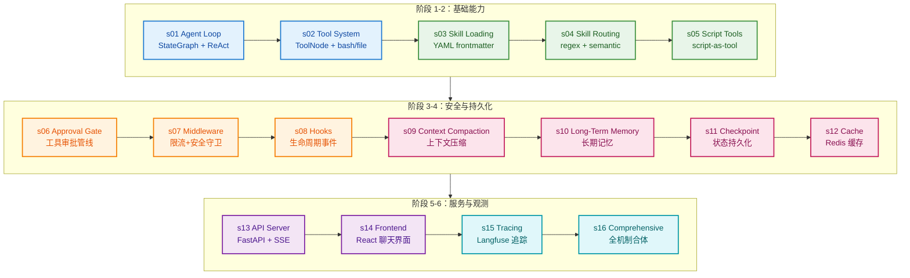

# langgraph-claw 教学课程

从零理解 LangGraph Agent Harness —— 以一个真实的 Personal Assistant 项目为标本。

## Harness 工程：模型是驾驶者，Harness 是载具

Agency（感知、推理、行动的能力）来自模型训练，不是来自外部代码编排。但一个能干活
的 agent 产品，需要模型和 harness 缺一不可。

**模型做决策。Harness 执行。模型做推理。Harness 提供上下文。**

langgraph-claw（花木兰 Agent）是一个基于 LangGraph 构建的 Personal Assistant——
单 Agent 工作台，具备技能系统、审批管线、中间件链、上下文压缩、长期记忆、
checkpoint 持久化、缓存加速、流式 API 和 React 前端。

本课程以它为标本，逐层拆解一个真实 LangGraph Agent Harness 的完整架构。与
[learn-claude-code](https://github.com/shareAI-lab/learn-claude-code) 的
"从零构建 harness"不同，本课程是**"从真实项目逆向"**——每个机制都对应项目中
可运行的真实代码。

## 花木兰隐喻

> 唧唧复唧唧，木兰当户织。不闻机杼声，唯闻女叹息。
>
> 东市买骏马，西市买鞍鞯，南市买辔头，北市买长鞭。

花木兰不是一支军队。她是一个人完成整场战役：侦察、准备、执行、复盘。

langgraph-claw 的设计哲学也是如此：一个 agent，四个阶段——

- **东市 — 骏马**：任务准备（路由技能、加载知识）
- **西市 — 鞍鞯**：上下文组装（系统提示、记忆注入）
- **南市 — 辔头**：执行控制（审批、中间件、工具调用）
- **北市 — 长鞭**：事后复盘（审计日志、执行追踪、效果评估）

## 学习路径

```
阶段1: 核心循环 (s01-s02)  →  让 Agent 能动手
阶段2: 技能系统 (s03-s05)  →  让 Agent 能扩展
阶段3: 安全控制 (s06-s08)  →  给 Agent 边界
阶段4: 记忆持久化 (s09-s12) →  让 Agent 能记住
阶段5: 服务界面 (s13-s14)  →  让 Agent 可交互
阶段6: 观测总结 (s15-s16)  →  让 Agent 可观测
```



## 全部章节

| 章节 | 主题 | 关键概念 | 源码位置 |
|------|------|---------|---------|
| [s01](./s01_agent_loop/) | Agent Loop | StateGraph, nodes, edges, ReAct | `agent/agent.py` |
| [s02](./s02_tool_system/) | Tool System | ToolNode, bash/file/read/write | `tools/basic.py` |
| [s03](./s03_skill_loading/) | Skill Loading | YAML frontmatter, SkillRegistry | `skills/loader.py` |
| [s04](./s04_skill_routing/) | Skill Routing | Regex triggers, semantic search | `agent/router.py` |
| [s05](./s05_script_tools/) | Script Tools | Script-as-tool, dynamic binding | `skills/script_tool.py` |
| [s06](./s06_approval_gate/) | Approval Gate | Tool approval pipeline | `agent/approval.py` |
| [s07](./s07_middleware/) | Middleware & Guards | Rate/Call/Loop limits, security | `agent/harness.py` |
| [s08](./s08_hooks/) | Hook System | PreToolUse/PostToolUse | `agent/hook.py` |
| [s09](./s09_context_compaction/) | Context Compaction | Summarization, transcript | `memory/compaction.py` |
| [s10](./s10_long_term_memory/) | Long-Term Memory | .memory dir, MEMORY.md | `memory/long_term.py` |
| [s11](./s11_checkpoint/) | Checkpoint | Redis-first, state persistence | `checkpoint/redis_first.py` |
| [s12](./s12_cache/) | Cache System | Redis cache, TTL, noop | `cache/redis_cache.py` |
| [s13](./s13_api_server/) | API Server | FastAPI, SSE streaming | `api/server.py` |
| [s14](./s14_frontend/) | Frontend Chat | React, tool approval UI | `frontend/src/` |
| [s15](./s15_tracing/) | Tracing | Langfuse, execution logs | `tracing.py` |
| [s16](./s16_comprehensive/) | Comprehensive Agent | 全机制合体 | `agent/harness.py` |

## 每章结构

每章一个目录，包含：

```
sXX_topic/
├── README.md    # 中文完整叙事：问题 → 解决方案 → 工作原理 → 变更内容 → 试一试
├── code.py      # 独立可运行的简化实现（s14 前端章除外）
└── images/      # SVG 流程图（可选）
```

每章的 `code.py` 是一个**独立可运行**的 Python 脚本——你可以单独运行任意一章，
它不依赖其他章节的代码。从 s01 的最小 LangGraph 循环到 s16 的完整 agent，
代码逐步叠加机制，但始终自包含。

## 快速开始

```sh
cd course
pip install langgraph langchain-core langchain-openai python-dotenv

# 复制并编辑环境变量
cp ../backend/.env.example .env
# 编辑 .env 填入你的 LLM_API_KEY 和 LLM_MODEL

# 运行任意章节
python s01_agent_loop/code.py
python s08_hooks/code.py
python s16_comprehensive/code.py

# 运行测试
python -m pytest tests/ -v
```

## 与 learn-claude-code 的关系

| 维度 | learn-claude-code | langgraph-claw 教学 |
|------|-------------------|---------------------|
| 教学方式 | 从零构建 harness | 逆向真实项目 |
| Agent 框架 | 基于 Anthropic API 原始循环 | 基于 LangGraph 框架 |
| 章节数 | 20 章 | 16 章 |
| 核心循环 | `while stop_reason == "tool_use"` | `StateGraph` + 条件边 |
| 工具系统 | 手写 tool dispatch | LangGraph `ToolNode` |
| 技能系统 | 简单文件读取 | YAML frontmatter + registry + hot-plug |
| 安全模型 | 内联检查 | 中间件链 + 审批管线 + 守卫 |
| 记忆系统 | 无 | 上下文压缩 + 长期记忆 + checkpoint |
| 前端 | 无 | React 聊天界面 + 审批 UI |
| 观测性 | 无 | Langfuse 追踪 + 执行日志 + 审计 |

两个课程互补：**先学 build**（learn-claude-code：从零构建），**再学 architecture**
（本课程：拆解真实项目）。前者教你造轮子，后者教你看懂工厂。

## 姊妹教程

- **[learn-claude-code](https://github.com/shareAI-lab/learn-claude-code)** —
  Harness 工程入门：从零构建 Claude Code 风格的 agent harness（20 章）
- **[claw0](https://github.com/shareAI-lab/claw0)** —
  常驻式 Agent Harness：心跳、定时任务、IM 多通道、记忆、Soul 人格
- **[Kode Agent CLI](https://github.com/shareAI-lab/Kode-cli)** —
  开源 Coding Agent CLI（`npm i -g @shareai-lab/kode`）

## 许可证

MIT

---

**Agency 来自模型。Harness 让 agency 落地。造好 Harness，模型会完成剩下的。**
