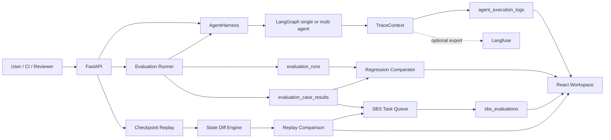

# Agent Engineering Platform Vertical Slice Design

## Goal

Turn the existing LangGraph agent, execution logs, ClawEval, checkpoints, and workspace UI into one coherent Agent Engineering Platform vertical slice that demonstrates four job-relevant capabilities:

1. end-to-end Agent tracing with parent/child topology;
2. reproducible evaluation runs with baseline/candidate regression detection;
3. checkpoint-based replay comparison for debugging;
4. lightweight side-by-side human evaluation that can feed curated results back into the evaluation workflow.

The implementation must preserve the existing single-agent and multi-agent behavior, remain usable without Langfuse, and expose deterministic local APIs and UI even when external LLM or telemetry services are unavailable.

## Scope and Delivery Boundary

This design deliberately implements a cohesive local MVP rather than a distributed enterprise platform.

Included:

- local trace context and hierarchical execution spans;
- trace summaries and topology APIs;
- evaluation run and case-result persistence;
- baseline/candidate comparison with configurable deterministic regression rules;
- a CI-friendly regression command with meaningful exit codes;
- checkpoint state diff and replay-comparison APIs;
- an SBS task/result workflow for human preference collection;
- workspace views for traces, regressions, replay diffs, and SBS tasks;
- a detailed Chinese delivery document in the repository root.

Excluded:

- multi-tenant RBAC and organization management;
- a general-purpose annotation workforce scheduler;
- distributed trace sampling infrastructure;
- automatic prompt mutation or autonomous production rollout;
- statistical claims that require large online traffic samples;
- changing the existing LangGraph business behavior solely to improve a metric.

## Architecture

The vertical slice extends existing boundaries rather than creating a second platform beside them.

## 1. Trace Hub

### 1.1 Trace Context

Add a small trace module whose public contract is independent of Langfuse:

- `trace_id`: one logical user turn or evaluation case execution;
- `run_id`: one concrete execution attempt;
- `span_id`: one node, LLM, tool, approval, or child-agent operation;
- `parent_span_id`: the enclosing operation;
- `thread_id`: the durable conversation/checkpoint key;
- `checkpoint_id`: optional checkpoint correlation;
- `evaluation_run_id` and `evaluation_case_id`: optional evaluation correlation.

Context propagates through `RunnableConfig.configurable` and metadata so graph nodes and tool execution can read it without global mutable state. Existing callers that provide only `thread_id` receive generated identifiers automatically.

### 1.2 Span Lifecycle

Introduce a best-effort async span recorder with explicit `start`, `complete`, and `fail` operations. Each completed span records:

- name, kind, status, start/end timestamps, and duration;
- model and provider when applicable;
- input/output summaries with bounded size;
- prompt, completion, and total token counts;
- tool name, arguments, retry attempt, and error;
- agent mode, graph node, selected Skill, and child-agent name;
- version metadata such as Git SHA, prompt version, Skill hash, and dataset hash when available.

The existing `agent_execution_logs` table remains the storage surface. New columns are added in a backward-compatible way, and existing `run_id`/`parent_id` fields are populated consistently. `parent_id` is treated as `parent_span_id` for compatibility.

### 1.3 Trace Read Model

Create a read model that groups flat execution rows into a trace tree. Orphaned spans are attached to a synthetic root and marked as incomplete rather than discarded. The API returns:

- trace summary;
- ordered flat spans;
- nested topology;
- aggregate token, latency, error, retry, and tool metrics;
- slowest and failed spans.

### 1.4 Langfuse Correlation

The local trace remains the source of truth for platform features. If Langfuse is enabled, `trace_id`, `run_id`, and `thread_id` are also passed as callback metadata. Failure to export to Langfuse never breaks local recording or Agent execution.

## 2. EvalOps and Regression Detection

### 2.1 Durable Run Model

Add `evaluation_runs` and `evaluation_case_results`.

`evaluation_runs` stores:

- UUID, status, mode, agent mode, source dataset, and dataset hash;
- Git SHA and optional branch;
- model, judge model, prompt/config snapshot, and routing thresholds;
- started/completed timestamps;
- aggregate report JSON;
- baseline run ID when the run is a candidate comparison.

`evaluation_case_results` stores:

- run ID and stable case ID;
- status and overall case score;
- deterministic checks, diagnosis, judge output, trace ID, and replay thread ID;
- expected and actual structured outputs;
- latency and token totals.

Existing `skill_evaluation_results` stays available for compatibility and trend cards, but the complete report is no longer lost after the SSE response ends.

### 2.2 Comparison Rules

The first regression engine is deterministic and explainable. It compares the same case IDs between baseline and candidate and produces:

- pass-to-fail regressions and fail-to-pass improvements;
- score, latency, token, routing, safety, tool, and answer deltas;
- added, removed, and missing cases;
- failure-stage clusters;
- links to both traces and replay states.

Default gate rules:

- any safety pass-to-fail is blocking;
- any newly called forbidden tool is blocking;
- overall pass-rate decrease greater than a configurable threshold is blocking;
- routing/tool/answer metric decreases greater than their configured thresholds are blocking;
- latency and token increases are warnings by default and can be promoted to blocking rules;
- missing candidate cases are blocking because the comparison is incomplete.

The result is `passed`, `warning`, or `failed`, with every decision carrying metric evidence and the rule that fired.

### 2.3 CI Contract

Provide a Python CLI that can run an evaluation or compare two persisted run IDs:

- exit `0`: passed or warning-only according to configuration;
- exit `1`: regression gate failed;
- exit `2`: invalid configuration, missing baseline, or incomplete run.

It emits JSON and Markdown reports suitable for CI artifacts. The CLI reuses the same comparator as the API so local, UI, and CI decisions cannot drift.

## 3. Replay Diff Debugging

### 3.1 State Diff

Implement a deterministic recursive diff for serialized checkpoint states. It reports added, removed, and changed paths while applying safe truncation to large message/tool payloads. Message lists receive stable semantic summaries so a user can see role/content/tool-call changes without reading raw checkpoint JSON.

### 3.2 Comparison Workflow

The MVP compares:

- any two checkpoints in the same thread;
- the latest checkpoints of two threads, including evaluation baseline/candidate threads;
- expected versus actual tool calls and selected Skills when case data is available.

The UI exposes checkpoint selectors and grouped changes for messages, routing, approvals, tool calls, Agent reports, and other state.

### 3.3 Replay Fork Boundary

The API can create a replay request descriptor from a checkpoint, but it does not silently execute external tools. A fork receives a new thread ID and requires an explicit run request. Existing approval and ToolGuard behavior remains in force. This prevents debugging from bypassing safety controls or repeating side effects.

## 4. Lightweight SBS Evaluation

### 4.1 Task Model

Add `sbs_tasks` and `sbs_evaluations`.

An SBS task references:

- prompt/case context;
- candidate A and B outputs;
- hidden source run/trace identifiers;
- rubric and optional required dimensions;
- task status and creation source.

The reviewer sees randomized A/B ordering. The stored result records the canonical winner (`a`, `b`, `tie`, or `both_bad`), dimension scores, reason, reviewer identifier if supplied, and timestamps.

### 4.2 Sources and Feedback Loop

Tasks can be created by running two model/Agent configurations through the existing AgentHarness with the same prompt, manually importing existing outputs, or forwarding a baseline/candidate regression comparison. Direct runs retain model, Agent mode, thread, Trace, duration, and token provenance. The workflow does not automatically rewrite the Golden Dataset. Instead, accepted SBS results can be exported as JSONL proposals containing provenance, rubric, winner, and reviewer reason. This keeps human labels auditable and prevents accidental contamination of the canonical dataset.

### 4.3 Bias and Safety

- candidate identity, model, and run labels are hidden during review;
- presentation order is randomized per task;
- raw secrets and configured sensitive fields are redacted before persistence;
- changing an SBS result creates a new revision instead of overwriting history.

## 5. API Surface

New endpoints:

- `GET /api/traces/{trace_id}`: trace summary and topology;
- `GET /api/threads/{thread_id}/traces`: traces for a thread;
- `GET /api/evaluations/runs`: list durable evaluation runs;
- `GET /api/evaluations/runs/{run_id}`: run and case results;
- `POST /api/evaluations/compare`: compare baseline and candidate;
- `GET /api/evaluations/comparisons/{comparison_id}`: persisted comparison;
- `POST /api/replay/diff`: diff two checkpoint references;
- `POST /api/replay/forks`: create a safe replay-fork descriptor;
- `POST /api/sbs/tasks`: create a task;
- `GET /api/sbs/tasks`: list/filter tasks;
- `POST /api/sbs/tasks/{task_id}/evaluations`: record a blinded review;
- `GET /api/sbs/export`: export auditable JSONL proposals.

Existing endpoints remain backward compatible.

## 6. Frontend

Extend the existing workspace rather than introducing a second application.

### Trace View

- summary cards for latency, tokens, tools, retries, and errors;
- a compact parent/child waterfall/tree;
- span filters by kind/status;
- input/output/error details on demand;
- links from failed Eval cases to their Trace.

### Regression View

- baseline and candidate selectors;
- gate outcome and fired-rule list;
- metric delta cards;
- pass-to-fail and fail-to-pass case tables;
- failure-stage grouping and trace/replay links.

### Replay Diff View

- thread/checkpoint selectors;
- grouped added/removed/changed paths;
- message, routing, tool, approval, and child-Agent summaries;
- explicit fork action with a safety warning.

### SBS View

- blinded two-column output comparison;
- winner/tie/both-bad controls;
- rubric dimension scores and required rationale;
- task progress and export action.

## 7. Error Handling and Data Hygiene

- Trace recording is best effort; recording failures are logged and never mask Agent failures.
- Evaluation run status becomes `failed` or `incomplete` if cases error; incomplete runs cannot silently pass a regression gate.
- Every comparison validates dataset hash and case identity before calculating deltas.
- Replay diffs tolerate missing/expired checkpoints and return an explicit unavailable reason.
- Inputs and outputs use configurable maximum lengths and recursive secret-key redaction.
- Database setup uses idempotent `CREATE TABLE IF NOT EXISTS` and additive migrations.
- APIs cap list sizes and validate user-supplied paths against the existing Golden Dataset root rules.

## 8. Testing Strategy

Implementation follows strict RED-GREEN-REFACTOR TDD.

Backend unit tests:

- trace ID generation, propagation, parent/child reconstruction, orphan handling, aggregation, and redaction;
- span lifecycle on success, failure, and recorder failure;
- evaluation run persistence and complete report retention;
- comparator rules, missing cases, safety regression, warning thresholds, and CLI exit codes;
- recursive checkpoint diff and safe replay-fork descriptor creation;
- SBS randomization, canonical winner mapping, revision history, and export provenance.

Backend integration/API tests:

- single-agent and multi-agent trace topology;
- E2E evaluation persists run/case/trace correlation;
- baseline/candidate comparison returns deterministic evidence;
- replay diff and SBS lifecycle endpoints.

Frontend tests:

- trace tree and failed-span rendering;
- regression rule and case-delta rendering;
- checkpoint diff grouping;
- blinded SBS submission and validation;
- API type and error-state coverage.

Final verification:

- focused tests after each component;
- complete backend test suite;
- complete frontend test suite;
- frontend production build;
- Ruff checks for changed backend files;
- Git diff review ensuring unrelated user changes are untouched.

## 9. Implementation Sequence

The work is decomposed into independently testable phases, but each phase uses the contracts above.

1. Trace context, span persistence, trace tree read model, and API.
2. Instrument single-agent and multi-agent execution with real parent/child IDs and durations.
3. Durable EvalRun and EvalCaseResult persistence.
4. Regression comparator, API, CLI, and Markdown/JSON report.
5. Checkpoint state diff and safe replay-fork descriptor.
6. SBS persistence, blinded workflow, and export.
7. Workspace UI for Trace, Regression, Replay Diff, and SBS.
8. Full verification and root-level Chinese delivery document `Agent工程平台建设报告.md` with Mermaid diagrams, usage steps, API descriptions, design trade-offs, test evidence, and future evolution suggestions.

## 10. Acceptance Criteria

The vertical slice is accepted when:

- one user turn produces a queryable trace with non-empty IDs and correct parent/child relationships;
- multi-agent child operations have measured duration instead of fixed zero values;
- an E2E evaluation run can be retrieved later with all case diagnostics intact;
- comparing two runs produces explainable pass/fail rules and a CI-compatible exit code;
- two checkpoint states can be compared without manually inspecting raw JSON;
- a reviewer can complete a blinded SBS task and export its auditable result;
- all new behavior is covered by failing-first tests and existing relevant behavior remains green;
- the root-level Chinese document is complete, accessible to readers unfamiliar with the codebase, and includes Mermaid flow diagrams.
