# OpenTelemetry Astronomy Shop 技术方案文档

> **版本**：v2.2.0 | **日期**：2026-07-06 | **基准**：[open-telemetry/opentelemetry-demo](https://github.com/open-telemetry/opentelemetry-demo)

---

## 目录

1. [项目概览](#1-项目概览)
2. [系统架构](#2-系统架构)
3. [微服务拓扑](#3-微服务拓扑)
4. [可观测性栈](#4-可观测性栈)
   - 4.3 [监测实现：从用户请求到告警的全链路](#43-监测实现从用户请求到告警的全链路)
5. [AI Agent 子系统](#5-ai-agent-子系统)
6. [langgraph-claw 对接方案](#6-langgraph-claw-对接方案)
7. [告警体系](#7-告警体系)
8. [部署拓扑](#8-部署拓扑)
9. [数据流与关键路径](#9-数据流与关键路径)
10. [运维与故障处理](#10-运维与故障处理)
11. [名词术语表](#11-名词术语表)

---

## 1. 项目概览

### 1.1 定位

本项目是 OpenTelemetry 官方 **Astronomy Shop Demo** 的深度定制分支，定位为：

- **可观测性演示**：展示 OpenTelemetry 在 15+ 个多语言微服务中的全链路追踪、指标、日志能力
- **AI 辅助运维验证**：集成 LangChain/LangGraph Agent，验证 AI 驱动的自然语言交互和自动化运维场景
- **langgraph-claw 数据源**：作为 [langgraph-claw](https://github.com/anthropics/langgraph-claw) 的上游遥测生产者，提供 Kafka 批量遥测 + AlertManager 即时告警两条数据通道

### 1.2 核心改造点（相比上游）

| 改造项 | 说明 | 文件 |
|--------|------|------|
| **Agent 服务** | LangChain ReAct Agent + FastAPI，支持 LLM 对话式操作商店 | `src/agent/` |
| **MCP 服务** | Model Context Protocol 工具暴露，langchain_mcp_adapters 集成 | `src/mcp/` |
| **Chatbot UI** | Gradio 聊天界面，用户可直接与 Agent 对话 | `src/chatbot/` |
| **Kafka 遥测导出** | OTel Collector 全量导出 span/metric/log 到 Kafka | `src/otel-collector/otelcol-config-extras.yml` |
| **AlertManager** | P0/P1 告警 webhook 直推 langgraph-claw | `compose.alerts.yaml`, `src/alertmanager/` |
| **Prometheus 告警规则** | P0-P3 四级分级告警（SLO 锚定） | `src/prometheus/prometheus-rules.yml` |
| **SLO 定义** | 15 个服务的 Tier 分级 + P95/可用性 SLO | `src/prometheus/slo-targets.yml`（规划中） |

### 1.3 技术栈矩阵

| 类别 | 技术 | 用途 |
|------|------|------|
| 容器编排 | Docker Compose（分层 `-f`） | 本地/开发部署 |
| 微服务语言 | Go, .NET, Java, Python, C++, Ruby, Rust, JS, PHP | 多语言演示 |
| 消息队列 | Kafka | 遥测批量导出 + 业务事件 |
| 数据库 | PostgreSQL 17, Valkey 9 | 持久化 + 缓存 |
| 代理 | Envoy (frontend-proxy) | 边缘路由 |
| Agent 框架 | LangChain + LangGraph（预构建 ReAct） | AI 工具调用 |
| MCP 框架 | FastMCP (mcp 官方) | MCP 工具暴露 |
| LLM 客户端 | langchain_openai (ChatOpenAI) + LiteLLM | 多模型兼容 |
| 可观测性 SDK | Traceloop + OpenTelemetry OTLP | Agent/MCP 遥测 |
| Web UI | Gradio 4.x | Chatbot 界面 |

---

## 2. 系统架构

### 2.1 顶层架构图

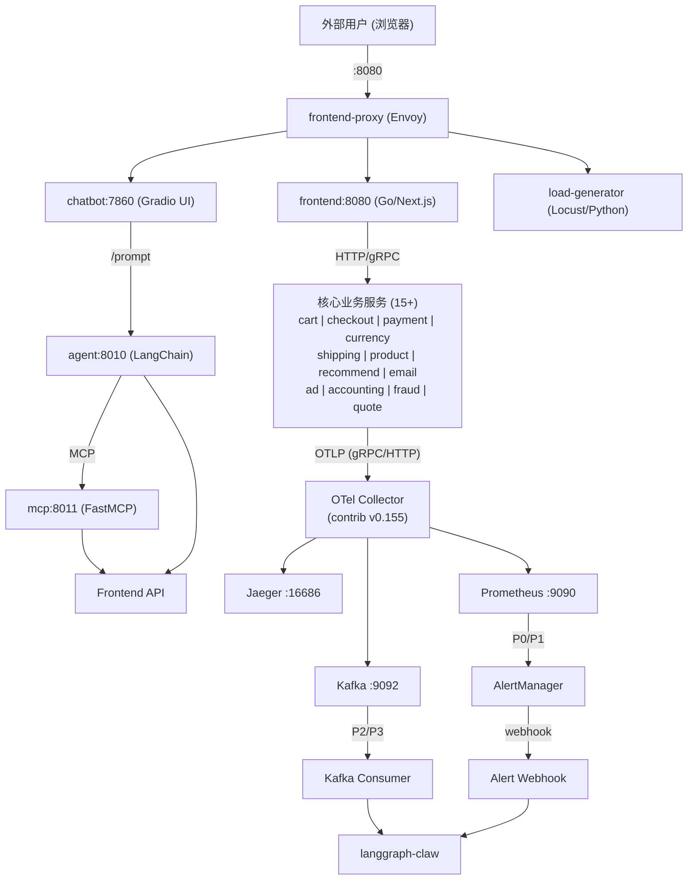

### 2.2 部署文件分层

项目使用 Docker Compose 分层 `-f` 模式，按需组合：

```
compose.yaml                # 核心微服务（始终需要）
compose.full.yaml           # Kafka + accounting + fraud-detection
compose.observability.yaml  # OTel Collector + Prometheus + Jaeger + Grafana
compose.agent.yaml          # Agent + MCP + Chatbot（AI 子系统）
compose.alerts.yaml         # AlertManager + Prometheus 告警规则（本分支新增）
```

**常用启动组合**：

```bash
# 完整栈（含 AI + Kafka + 告警）
docker compose -f compose.yaml -f compose.full.yaml \
               -f compose.observability.yaml -f compose.agent.yaml \
               -f compose.alerts.yaml up

# 最小可观测性栈
docker compose -f compose.yaml -f compose.observability.yaml up
```

---

## 3. 微服务拓扑

### 3.1 服务清单与责任

| 服务 | 语言 | 端口 | Tier | 职责 | 关键依赖 |
|------|------|------|------|------|----------|
| **frontend-proxy** | Envoy | 8080 | 0 | 边缘代理、路由 | frontend |
| **frontend** | Go/Next.js | 8080 | 0 | Web 前端 SSR + API 聚合 | cart, product-catalog, checkout 等 |
| **cart** | .NET | 7070 | 1 | 购物车管理 | Valkey |
| **checkout** | Go | 5050 | 1 | 结账编排（saga） | cart, payment, shipping, email, Kafka |
| **payment** | JS/Node | 50051 | 1 | 支付处理 | — |
| **product-catalog** | Go | 3550 | 1 | 商品目录 | PostgreSQL |
| **currency** | C++ | 7001 | 2 | 货币转换 | — |
| **shipping** | Go/Rust | 50050 | 2 | 物流报价 | — |
| **recommendation** | Python | 9001 | 2 | 商品推荐 | product-catalog |
| **email** | Ruby | 6060 | 2 | 邮件发送 | — |
| **ad** | Java | 9555 | 2 | 广告投放 | — |
| **accounting** | .NET | — | 3 | 订单记账（Kafka 消费） | Kafka, PostgreSQL |
| **fraud-detection** | Java/Kotlin | — | 3 | 风控检测（Kafka 消费） | Kafka |
| **quote** | PHP | 8090 | 3 | 运费报价 | — |
| **image-provider** | — | 8081 | — | 商品图片 | — |
| **flagd** | Go | 8013 | — | 特性开关 (OpenFeature) | — |

### 3.2 跨服务通信方式

- **同步通信**：gRPC (checkout→payment, checkout→shipping) + HTTP REST (frontend→其他)
- **异步通信**：Kafka (checkout→accounting, checkout→fraud-detection)
- **缓存**：Valkey (cart 服务购物车数据)
- **持久化**：PostgreSQL (product-catalog 商品, accounting 订单)

---

## 4. 可观测性栈

### 4.1 遥测流水线

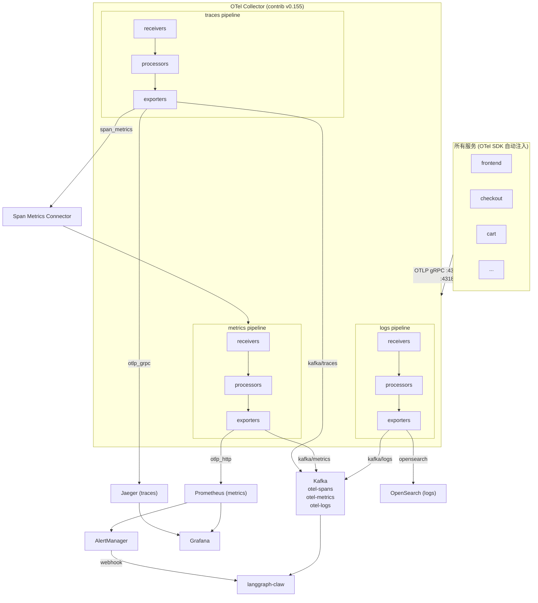

### 4.2 关键组件说明

#### OTel Collector (`otelcol-config-extras.yml`)

本项目的核心定制点——在不修改上游配置文件的前提下，通过 extras 层插入 Kafka exporter：

- **3 个 Kafka topics**：`otel-spans`, `otel-metrics`, `otel-logs`
- **编码格式**：`otlp_proto`（保持 OTLP 二进制格式，零二次序列化）
- **压缩**：`snappy`（减少网络传输开销）
- **重要**：Collector 合并 YAML 时数组是 REPLACE 语义，所以 extras 中必须显式重复上游 exporter 名称以保留现有可观测性栈

#### Prometheus (`prometheus-config.yaml` + `prometheus-rules.yml`)

- 通过 OTLP receiver 从 Collector 接收指标
- 15+ 个 `promote_resource_attributes` 确保 K8s/VM 部署标识可用
- `out_of_order_time_window: 30m` 容忍乱序样本
- 告警规则挂载：`/etc/prometheus/prometheus-rules.yml`
- AlertManager 地址：`alertmanager:9093`

### 4.3 监测实现：从用户请求到告警的全链路

以一个具体的用户下单请求为例，说明遥测数据如何生成、流转，最终触发告警。

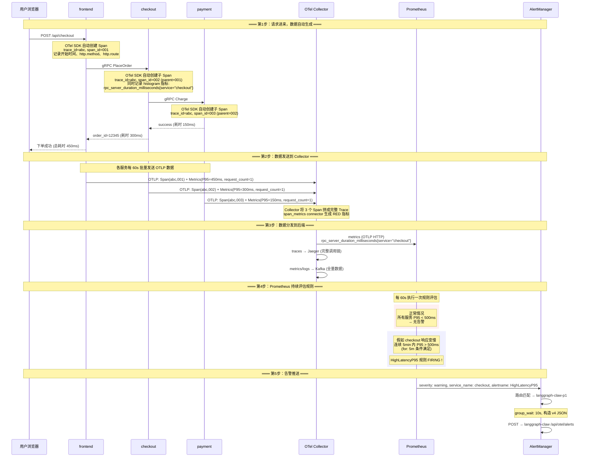

**第1步：数据是怎么产生的？——不用手工写代码**

每个微服务启动时自动加载对应语言的 OTel SDK（Java agent、Python SDK、Go SDK 等）。SDK 以**零侵入**方式注入：

```
应用代码                            OTel SDK 自动做的事
─────────                          ─────────────────
app.post("/checkout", handler)  →  创建 Span(trace_id, span_id, parent_id)
                                  记录 http.method=POST, http.route=/checkout
                                  记录开始时间戳

handler 调用 gRPC               →  注入 trace_id 到 gRPC metadata
                                  创建子 Span(parent=当前 Span)

handler 执行完成                 →  计算耗时: end - start
                                  生成 histogram 指标:
                                    rpc_server_duration_milliseconds_count{...} += 1
                                    rpc_server_duration_milliseconds_bucket{le=100} += ...
                                  如有错误:
                                    rpc_server_duration_milliseconds_count{status=error} += 1
```

- **Traces**（调用链）：每个请求自动串成一条 trace，包含所有跨服务调用
- **Metrics**（指标）：每个请求自动记录响应时间、状态码，按服务名聚合
- **Logs**（日志）：应用自身的日志也被 OTel SDK 关联上 trace_id

**第2步：Collector 做什么？——统一收、加工、转发**

Collector 是整个遥测系统的**唯一入口和中转站**：

| 动作 | 说明 |
|------|------|
| **收** | 启动 OTLP receiver（gRPC :4317, HTTP :4318），接收所有服务的遥测 |
| **加工** | `span_metrics` connector 把 Span 自动转成 RED 指标（Rate/Error/Duration），避免服务侧重复计算 |
| **转发** | 同一份数据同时发送到 Jaeger（存 trace）、Prometheus（存 metric）、OpenSearch（存 log）、Kafka（全量导出） |

**第3步：Prometheus 怎么"监测"？——不是主动轮询，是持续做数学题**

Prometheus 不主动探测服务是否正常。它做的事情很简单：

```
循环 (每 60 秒) {
    取出 prometheus-rules.yml 中的每条规则
    执行 PromQL 表达式
    如果结果不为空，且持续时间 >= for 窗口 {
        → 触发告警 (FIRING)
    }
}
```

以 `HighLatencyP95` 为例，规则表达式是：

```promql
histogram_quantile(0.95,
  sum(rate(http_server_duration_milliseconds_bucket[5m])) by (le, service_name)
) > 500
```

翻译成人话：**"拿过去 5 分钟的数据，按服务名分组，算每个服务的 P95 延迟；如果有任何服务的 P95 超过 500ms，且持续了 5 分钟，你就是告警。"**

Prometheus 并不知道"checkout 正常该多快"——它只做数学运算。SLO 阈值（200ms, 500ms）是运维人员根据业务经验写在规则里的。

**第4步：从"数值超标"到"有人知道"**

```
数值超标           → Prometheus 规则 FIRING
规则有 severity    → AlertManager 知道是 P0/P1/P2/P3
AlertManager 有 URL → 知道推给谁
langgraph-claw 收到 → 知道要干什么（RCA / 巡检 / 审计）
```

全链路不需要人工干预——服务写代码时引入 SDK，运维配规则，Collector 负责搬运，Prometheus 负责计算，AlertManager 负责推送，langgraph-claw 负责分析。

---

## 5. AI Agent 子系统

这是本项目区别于上游的最大定制点——一个完整的 AI Agent 子系统，实现自然语言与微服务应用的交互。

### 5.1 架构总览

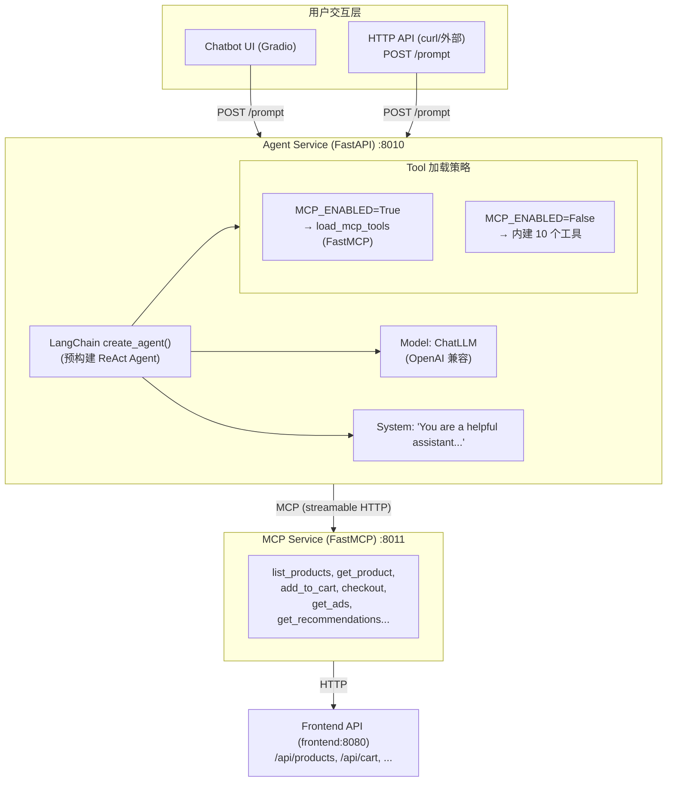

### 5.2 Agent 服务 (`src/agent/`)

**技术栈**：

| 组件 | 选型 | 说明 |
|------|------|------|
| Web 框架 | FastAPI + Uvicorn | 异步 HTTP 服务 |
| Agent 框架 | `langchain.agents.create_agent` | 预构建 ReAct Agent |
| LLM 客户端 | `langchain_openai.ChatOpenAI` | OpenAI 兼容协议，支持任意后端 |
| 模型路由 | LiteLLM（隐式） | `LLM_BASE_URL` 配置即可接入 Azure/Claude/本地 |
| MCP 集成 | `langchain_mcp_adapters.tools.load_mcp_tools` | 从 MCP session 动态加载工具 |
| 可观测性 | Traceloop SDK + OTLP | agent workflow 级别的全链路追踪 |
| LLM 回放 | VCR (fixtures/vcr_cassettes/) | 录制/回放 LLM 响应，省 Token |

**核心流程**：

```python
# agents.py —— 简化后的核心逻辑

class Agent:
    def __init__(self):
        self.app = FastAPI(lifespan=self.lifespan)
        self.app.post("/prompt")(self.handle_prompt)

    async def lifespan(self, app):
        # 启动时根据 MCP_ENABLED 决定工具来源
        if MCP_ENABLED:
            self.mcp_server = MCPClient()
            await self.mcp_server.connect_to_mcp_server(mcp_url)

    @workflow(name="astronomy_shop_agent_workflow")
    async def run_agent(self, input_prompt, history):
        model = ChatLLM()      # OpenAI 兼容客户端
        tools = await self.get_tool_list()  # 10 个商店操作工具
        agent = create_agent(model, tools=tools, system_prompt="...")
        result = await agent.ainvoke(
            {"messages": history + [user_message]},
            config={"recursion_limit": 25},
        )
        return {"response": result}
```

**工具集**（`src/shared/tools.py`）：

| 工具 | 类型 | 说明 |
|------|------|------|
| `list_products` | 读 | 列出所有商品 |
| `get_product(id)` | 读 | 获取商品详情 |
| `get_ads(category)` | 读 | 获取促销广告 |
| `get_recommendations(id)` | 读 | 商品推荐 |
| `get_supported_currencies` | 读 | 支持货币列表 |
| `get_shipping_quote(...)` | 读 | 运费报价 |
| `add_to_cart(user, product, qty)` | 写 | 加入购物车 |
| `get_cart(user)` | 读 | 查看购物车 |
| `empty_cart(user)` | 写 | 清空购物车 |
| `checkout(person)` | 写 | 下单结账 |

所有工具通过 HTTP 调用 `frontend:8080` 的 API，工具签名包含完整的类型注解和 docstring，供 LLM 理解调用语义。

### 5.3 ChatLLM —— 多模型兼容层 (`src/agent/src/agents/llm.py`)

```python
class ChatLLM(ChatOpenAI):
    def __init__(self, **kwargs):
        model_name = os.getenv("LLM_MODEL", "default")
        # 支持任意 OpenAI-compatible 后端
        kwargs.setdefault("openai_api_base", os.getenv("LLM_BASE_URL"))
        kwargs.setdefault("model", model_name)
        # TLS 可选关闭（仅开发环境）
        kwargs["http_async_client"] = httpx.AsyncClient(verify=LLM_TLS_VERIFY)
        super().__init__(**kwargs)
```

**支持的模型示例**：
- `azure/gpt-5.5`（Azure OpenAI）
- `claude-opus-4-7`（Anthropic Claude，通过 LiteLLM 代理）
- 任意 OpenAI-compatible 本地模型（vLLM、Ollama 等）

### 5.4 MCP 集成 (`src/agent/src/agents/mcp_client.py`)

Agent 与 MCP 服务的通信基于 **MCP Streamable HTTP** 协议：

```python
class MCPClient:
    async def connect_to_mcp_server(self, url):
        # 1. 建立 streamable HTTP 连接
        stream_context = streamablehttp_client(url=url)
        read, write, _ = await self.exit_stack.enter_async_context(stream_context)
        # 2. 创建 MCP client session
        session_context = ClientSession(read, write)
        self.session = await self.exit_stack.enter_async_context(session_context)
        # 3. 初始化会话（协商协议版本和能力）
        await self.session.initialize()
```

**两种工具加载模式对比**：

| 维度 | 内建模式 (`MCP_ENABLED=False`) | MCP 模式 (`MCP_ENABLED=True`) |
|------|-------------------------------|------------------------------|
| 工具定义 | `src/shared/tools.py` 直接导入 | FastMCP 通过 `/mcp` 端点暴露 |
| 工具加载 | `langchain.tools.tool()` 手动包装 | `langchain_mcp_adapters.tools.load_mcp_tools()` 自动发现 |
| 工具发现 | 编译时确定 | 运行时动态发现（`tools/list` → `tools/call`） |
| 适用场景 | 快速开发、单进程调试 | 工具解耦、独立部署、标准化协议 |
| 服务依赖 | 无 | 依赖 `mcp:8011` |

### 5.5 Chatbot 服务 (`src/chatbot/`)

- **框架**：Gradio 4.x
- **功能**：将 Agent 的 `/prompt` API 包装为聊天 UI
- **默认路径**：`http://localhost:7860/chatbot`
- **预设问题**：3 个示例问题按钮（商品列表、货币查询、促销查询）
- **会话管理**：每次示例问题点击清空历史开始新对话；文本框输入保留历史

---

## 6. langgraph-claw 对接方案

这是本项目最重要的定制——将 opentelemetry-demo 改造为 langgraph-claw 的**上游遥测数据源**，支撑 AI 驱动的自动化根因分析（RCA）。

### 6.1 双通道分流设计

P0/P1 和 P2/P3 走两条不同的数据通道，原因如下：

**P0/P1 → Prometheus 规则引擎 → AlertManager Webhook（秒级送达）**

1. **Prometheus 专为告警而生**：内置 PromQL 规则评估引擎，每 60s 扫描一次规则表达式，`for` 子句控制触发前的等待窗口。这是业界最成熟的指标告警框架。
2. **AlertManager 专为路由而生**：支持按 label 分组（`group_by`）、去重（`group_wait`）、抑制、静默、重复间隔控制——这些是告警路由的必备能力，Collector 不具备。
3. **P0/P1 需要即时性**：`ServiceDown` 需要 30s 内触发 RCA。如果走 Kafka，受 poll interval 和 batch size 影响，端到端延迟至少 1-2 分钟。Webhook 是 HTTP POST，AlertManager 在告警触发后 0-10s 即可送达。
4. **P0/P1 判定靠预定义阈值**：`up==0`、`5xx>50%`、`P95>500ms` 是确定性的阈值比对，不需要原始 span 数据，PromQL 完全胜任。

**P2/P3 → OTel Collector → Kafka（分钟级批量）**

1. **Collector 拥有全量原始数据**：P2/P3 需要趋势分析（deriv 导数）、关联分析（span+metric+log 联合）、完整性检查（span 属性缺失统计），这些需要消费原始 OTLP 数据，Prometheus 的聚合指标不够。
2. **Kafka 提供持久化和回放**：P3 审计数据需要 30 天回溯对比，Kafka 的日志式存储天然支持，Prometheus TSDB 受 retention 限制。
3. **P2/P3 容忍延迟**：趋势分析 5 分钟一批、审计 30 分钟一批即可，不需要秒级响应。批量消费摊销 LLM 调用成本。
4. **不经过 Prometheus 规则引擎中转**：Collector 直接写 Kafka 省去一次遥测格式转换（OTLP→Prometheus→PromQL→告警），数据保真度更高。

核心原则：**谁产生数据，谁就负责导出**——Prometheus 产生告警事件，走 webhook；Collector 拥有全量遥测，走 Kafka。

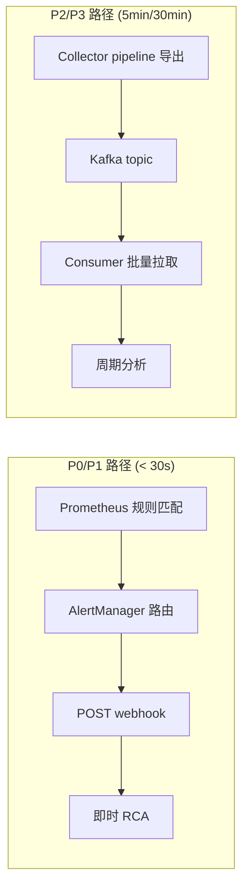

### 6.2 数据通道架构

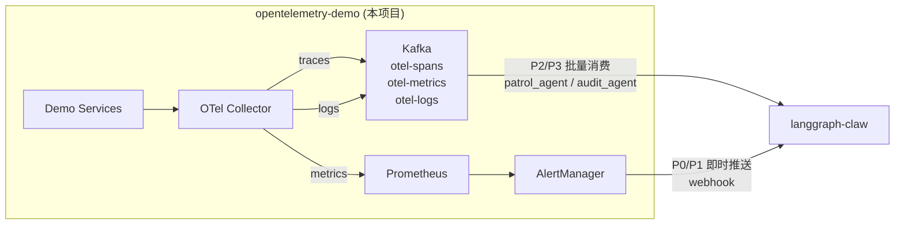

### 6.3 通道一：Kafka 批量遥测 (P2/P3)

#### 数据格式

| Topic | 信号类型 | 编码 | 消费方 | 处理频率 |
|-------|---------|------|--------|---------|
| `otel-spans` | Trace Span | OTLP Proto | `kafka_consumer.py` | P2 每 5min / P3 每 30min |
| `otel-metrics` | Metric 数据点 | OTLP Proto | `kafka_consumer.py` | P2 每 5min / P3 每 30min |
| `otel-logs` | Log 记录 | OTLP Proto | `kafka_consumer.py` | P3 每 30min |

#### Collector 配置

```yaml
# otelcol-config-extras.yml（完整内容）
exporters:
  kafka/traces:
    brokers: [${KAFKA_ADDR}]
    topic: otel-spans
    encoding: otlp_proto
    compression: snappy

  kafka/metrics:
    brokers: [${KAFKA_ADDR}]
    topic: otel-metrics
    encoding: otlp_proto
    compression: snappy

  kafka/logs:
    brokers: [${KAFKA_ADDR}]
    topic: otel-logs
    encoding: otlp_proto
    compression: snappy

service:
  pipelines:
    traces:
      exporters: [debug, otlp_grpc/jaeger, span_metrics, kafka/traces]
    metrics:
      receivers: [docker_stats, http_check/frontend-proxy, host_metrics, nginx, otlp, redis, postgresql, span_metrics, kafkametrics]
      exporters: [debug, otlp_http/prometheus, kafka/metrics]
    logs:
      exporters: [debug, opensearch, kafka/logs]
```

#### langgraph-claw 侧约定

- Kafka consumer 需使用 OTLP protobuf 解码器解析消息
- 消费端按 `service.name` 分片并行消费
- `patrol_agent` 消费 `severity: info` (P2)，`audit_agent` 消费 `severity: none` (P3)

### 6.4 通道二：AlertManager Webhook 即时推送 (P0/P1)

#### 路由策略

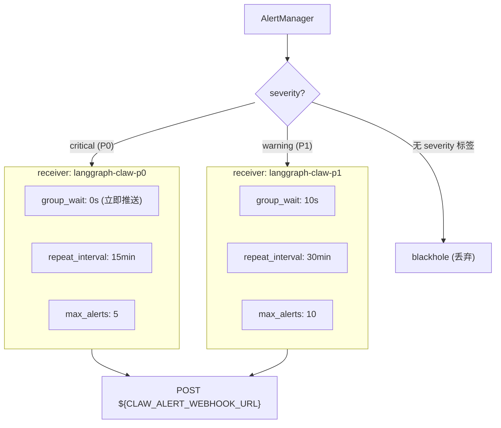

#### Webhook Payload 格式

AlertManager 发送标准 **v4 格式**到 `POST /api/otel/alerts`：

```json
{
  "receiver": "langgraph-claw-p0",
  "status": "firing",
  "alerts": [
    {
      "status": "firing",
      "labels": {
        "alertname": "ServiceDown",
        "severity": "critical",
        "service_name": "frontend"
      },
      "annotations": {
        "summary": "frontend is DOWN",
        "description": "Service frontend has been down for more than 1 minute.",
        "slo_reference": "availability_slo per slo-targets.yml"
      },
      "startsAt": "2026-07-06T10:00:00Z",
      "endsAt": "0001-01-01T00:00:00Z",
      "generatorURL": "http://prometheus:9090/..."
    }
  ],
  "groupLabels": {"alertname": "ServiceDown"},
  "commonLabels": {"alertname": "ServiceDown", "severity": "critical", "service_name": "frontend"},
  "commonAnnotations": {"summary": "frontend is DOWN"},
  "externalURL": "http://alertmanager:9093",
  "version": "4"
}
```

#### langgraph-claw 侧约定

| 字段 | 用途 | 示例 |
|------|------|------|
| `alerts[].labels.severity` | 分级路由 (`critical`/`warning`/`info`/`none`) | `critical` |
| `alerts[].labels.service_name` | 定位出错服务，触发关联 trace/metric 拉取 | `frontend` |
| `alerts[].labels.alertname` | 告警类型，决定 RCA 策略 | `ServiceDown`, `HighLatencyP95` |
| `alerts[].annotations.summary` | 人类可读摘要，进入 RCA 报告 | `frontend is DOWN` |
| `alerts[].startsAt` | 告警起始时间，确定 trace 查询时间窗口 | `2026-07-06T10:00:00Z` |

### 6.5 Webhook 推送实现全链路

完整的告警推送和接收链路：

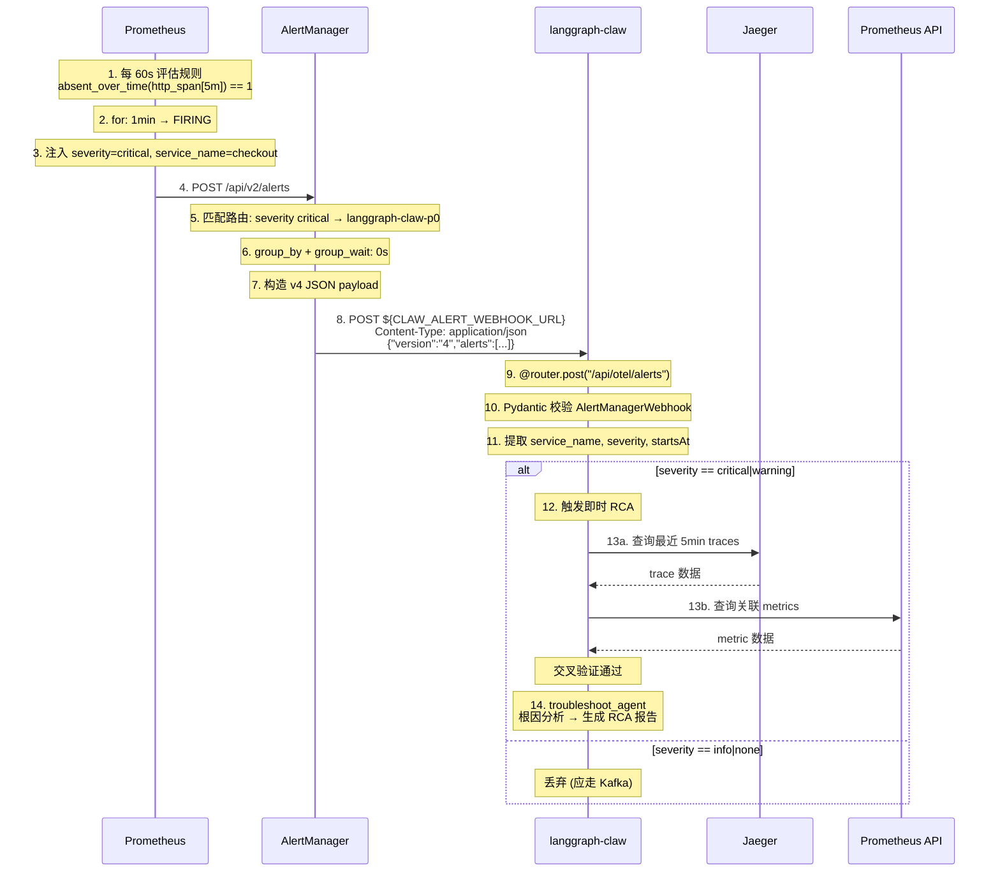

**langgraph-claw 侧接收模型（Python Pydantic）**：

```python
from pydantic import BaseModel
from datetime import datetime

class Alert(BaseModel):
    status: str                        # "firing" | "resolved"
    labels: dict                       # {"alertname":"ServiceDown", "severity":"critical", ...}
    annotations: dict                  # {"summary":"...", "description":"..."}
    startsAt: datetime
    endsAt: datetime
    generatorURL: str

class AlertManagerWebhook(BaseModel):
    version: str                       # "4"
    receiver: str                      # "langgraph-claw-p0"
    status: str                        # "firing" | "resolved"
    alerts: list[Alert]
    groupLabels: dict
    commonLabels: dict                 # 跨告警公共标签
    commonAnnotations: dict
    externalURL: str
```

### 6.6 多信号交叉验证

为避免误报消耗 LLM Token，langgraph-claw 收到 P0/P1 告警后会执行交叉验证：

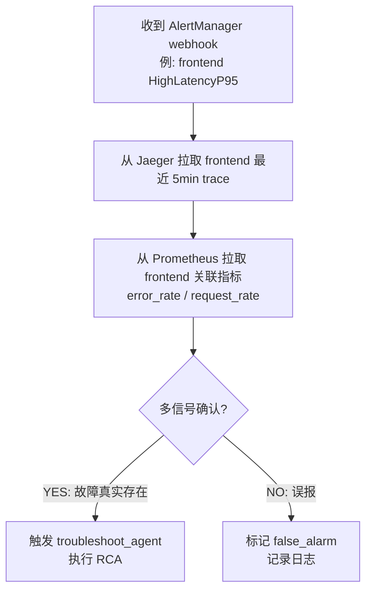

### 6.7 双方对接点清单

| 对接点 | opentelemetry-demo 侧 | langgraph-claw 侧 | 约定 |
|--------|----------------------|-------------------|------|
| **Kafka topic** | `otel-spans`, `otel-metrics`, `otel-logs` | `kafka_consumer.py` 消费 | 名称固定，硬编码 |
| **Kafka broker** | `kafka:9092`（容器内） | 需配置外部地址 | 环境变量传递 |
| **OTLP 序列化** | `otlp_proto` | OTLP protobuf 解码 | 保持 OTLP 原生格式 |
| **Webhook URL** | `http://<claw>:8000/api/otel/alerts` | `POST /api/otel/alerts` | URL 通过 `.env` 的 `CLAW_ALERT_WEBHOOK_URL` 配置 |
| **Severity 标签** | `critical` / `warning` / `info` / `none` | P0/P1 即时 + P2/P3 Kafka | 值必须完全一致 |
| **service_name 标签** | Prometheus 规则中标注 | 用于自动拉取对应服务遥测 | 标签名统一 |
| **Webhook 格式** | AlertManager v4 标准 | `AlertManagerWebhook` pydantic | 标准格式 |

### 6.8 环境配置

```bash
# .env 中的关键配置
KAFKA_ADDR=kafka:9092
CLAW_ALERT_WEBHOOK_URL=http://192.168.5.107:8000/api/otel/alerts  # langgraph-claw 地址

# AlertManager 配置中引用环境变量
# alertmanager.yml → ${CLAW_ALERT_WEBHOOK_URL}
```

---

## 7. 告警体系

### 7.1 分级定级方法

告警分级的核心逻辑：**影响面 × 确定性 × 时效性** 三个维度交叉判定。

**维度一：影响面（blast radius）**

| 影响程度 | 判定标准 | 典型场景 | 映射级别 |
|----------|---------|---------|---------|
| 用户直接受损 | 所有用户或全部请求受影响 | 服务不可用、50%+请求500 | P0 |
| 用户可感知 | 部分用户/部分请求劣化 | P95延迟翻倍、错误率异常 | P1 |
| 尚未影响用户 | 仅统计趋势异常 | 延迟导数上升但未破SLO | P2 |
| 无即时影响 | 治理/合规/容量 | 资源水位、SLO合规漂移 | P3 |

**维度二：确定性（certainty）**

| 确定性 | 判定方式 | 示例 |
|--------|---------|------|
| 确定故障 | 绝对值阈值（`up==0`、`5xx>50%`）| ServiceDown, High5xxRate |
| 确定异常 | 基于SLO倍数的阈值（`P95 > SLO×2`）| HighLatencyP95, HighErrorRate |
| 统计推断 | 导数/趋势/变化率（`deriv > 0.01`）| LatencyTrendRising, MemoryLeak |
| 合规校验 | 长窗口聚合（`30d可用性 < 99.9%`）| SLOComplianceDrift |

**维度三：时效性（urgency）**

| 响应要求 | 通道 | 处理方 |
|----------|------|--------|
| < 30s | AlertManager webhook | troubleshoot_agent（即时） |
| 每 5min | Kafka batch | patrol_agent（周期巡检） |
| 每 30min | Kafka batch | audit_agent（后台审计） |

**分级决策流程**：

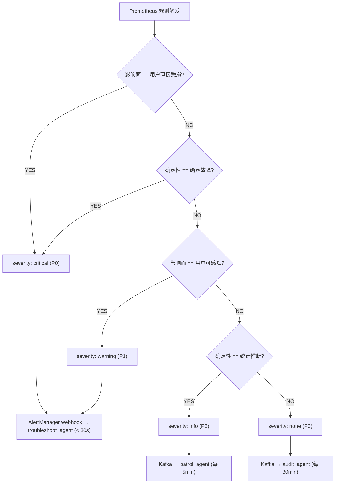

**severity 标签是分级唯一标识**，贯穿 Prometheus → AlertManager → langgraph-claw 全链路：

```yaml
# PromQL 规则中注入 severity 标签（示例）
- alert: ServiceDown
  labels:
    severity: critical    # ← 这个标签决定整条链路的处理策略
```

```yaml
# AlertManager 根据 severity 匹配路由
routes:
  - match_re:
      severity: critical
    receiver: langgraph-claw-p0    # 零等待 → webhook
```

```python
# langgraph-claw 根据 severity 分发 agent
if severity in ("critical", "warning"):
    await troubleshoot_agent.run(alert)
elif severity == "info":
    await patrol_agent.enqueue(alert)   # 走 Kafka 周期队列
elif severity == "none":
    await audit_agent.enqueue(alert)
```

### 7.2 四级分级模型

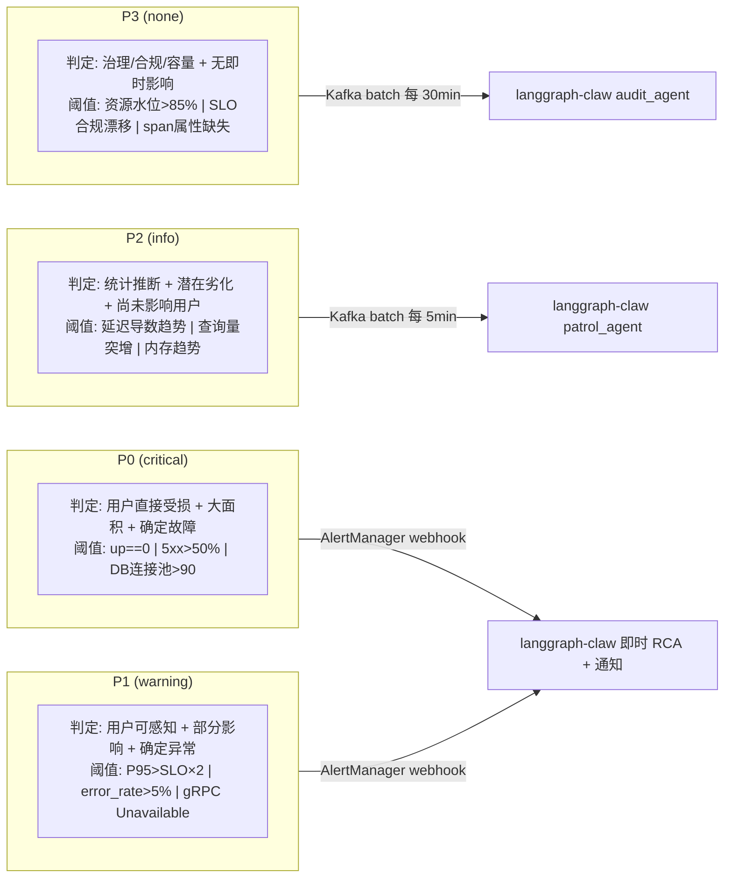

### 7.3 告警规则清单

| 级别 | 规则名 | 触发条件 | for | 说明 |
|------|--------|---------|-----|------|
| **P0** | `ServiceDown` | `absent_over_time(http_span[5m])` | 1m | 服务无遥测输出 |
| **P0** | `High5xxRate` | 5xx > 50% | 2m | 半数请求失败 |
| **P0** | `DatabaseConnectionPoolExhausted` | `postgresql_backends > 90` | 1m | DB连接池接近耗尽 |
| **P1** | `HighLatencyP95` | P95 > 500ms | 5m | 延迟严重劣化（覆盖Tier 1/2） |
| **P1** | `HighLatencyP95Severe` | P95 > 1000ms (15m窗口) | 10m | 延迟持续劣化（覆盖Tier 3） |
| **P1** | `HighErrorRate` | 4xx+5xx > 5% | 5m | 错误率异常升高 |
| **P1** | `CircuitBreakerOpen` | gRPC Unavailable | 1m | 断路器打开（3种状态码格式） |
| **P2** | `LatencyTrendRising` | `deriv(P95[1h:5m]) > 0.5ms/min` | 15m | 延迟趋势上升 |
| **P2** | `SlowQueryIncrease` | `tup_fetched > 1000/s` | 10m | DB查询量突增 |
| **P2** | `MemoryLeakEarlyWarning` | `deriv(mem[1h:5m]) > 0.01/min` | 30m | 疑似内存泄漏 |
| **P3** | `ResourceWatermarkCPU` | CPU > 85% | 30m | CPU资源水位 |
| **P3** | `ResourceWatermarkMemory` | Mem > 85% | 30m | 内存资源水位 |
| **P3** | `SLOComplianceDrift` | 30d 可用性 < 99.9% | 1h | SLO合规漂移 |
| **P3** | `SpanAttributeCompleteness` | span 缺失 http.route | 1h | 可观测性数据质量 |

### 7.4 SLO 锚定（规划中）

告警阈值以服务 SLO 为锚点，通过 `slo-targets.yml` 集中管理：

| Tier | 服务 | P95 SLO | 可用性 SLO | Error Budget |
|------|------|---------|-----------|-------------|
| 0 (用户面) | frontend, frontend-proxy | 100-200ms | 99.9-99.95% | 0.05-0.1% |
| 1 (核心交易) | checkout, cart, payment, product-catalog | 200-500ms | 99.9-99.95% | 0.05-0.1% |
| 2 (支撑) | recommendation, ad, shipping, currency, email | 300-1000ms | 99.5-99.9% | 0.1-0.5% |
| 3 (后台) | accounting, fraud-detection, quote | 1000-2000ms | 99.0-99.5% | 0.5-1.0% |

---

## 8. 部署拓扑

### 8.1 物理部署（本地开发）

```mermaid
flowchart TB
    subgraph Host["Docker Host (Windows 11 / macOS / Linux)"]
        subgraph Network["Network: opentelemetry-demo_default"]
            Proxy["frontend-proxy:8080 (Envoy)"]
            Frontend["frontend:8080 (Go/Next.js)"]
            Agent["agent:8010 (Python/LangChain)"]
            MCP["mcp:8011 (Python/FastMCP)"]
            Chatbot["chatbot:7860 (Python/Gradio)"]
            Cart["cart:7070 (.NET)"]
            Checkout["checkout:5050 (Go)"]
            Payment["payment:50051 (JS)"]
            Other["... (其他 12+ 服务)"]
            KafkaSvc["kafka:9092 (KRaft)"]
            DB["astronomy-db:5432 (PostgreSQL 17)"]
            ValkeySvc["valkey-cart:6379 (Valkey 9)"]
            CollectorSvc["otel-collector:4317/4318"]
            PromSvc["prometheus:9090"]
            JaegerSvc["jaeger:16686"]
            GrafanaSvc["grafana:3000"]
            AlertMgrSvc["alertmanager:9093"]
            OpenSearchSvc["opensearch:9200"]
        end
    end

    subgraph ClawHost["langgraph-claw (宿主机) :8000"]
        ClawAPI["POST /api/otel/alerts"]
        ClawConsumer["Kafka Consumer → kafka:9092"]
    end

    AlertMgrSvc -->|"webhook"| ClawAPI
    KafkaSvc --> ClawConsumer
```

### 8.2 内存需求估算

| 服务组 | 服务数 | 估算内存 |
|--------|--------|---------|
| 核心业务 | 12 | ~3 GB |
| 基础设施 (DB/Kafka/Valkey) | 3 | ~2 GB |
| 可观测性 (Collector/Prometheus/Jaeger/ES) | 5 | ~3 GB |
| AI 子系统 (Agent/MCP/Chatbot) | 3 | ~1.5 GB |
| **总计** | **23** | **~10 GB** |

建议开发机至少 16 GB 内存。

---

## 9. 数据流与关键路径

### 9.1 用户对话流

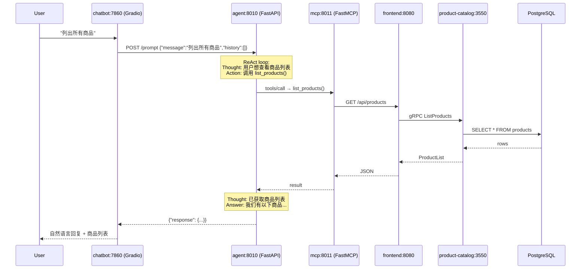

全程通过 Traceloop + OTLP 生成 4-5 个 span：
- `astronomy_shop_agent_workflow`（父 span）
  - `langchain.agent`（LLM 推理）
  - `langchain.tool.list_products`（工具调用）
  - `mcp.tools/call`（MCP 调用）
  - `HTTP GET /api/products`（HTTP 出站）

### 9.2 P0 告警即时响应流

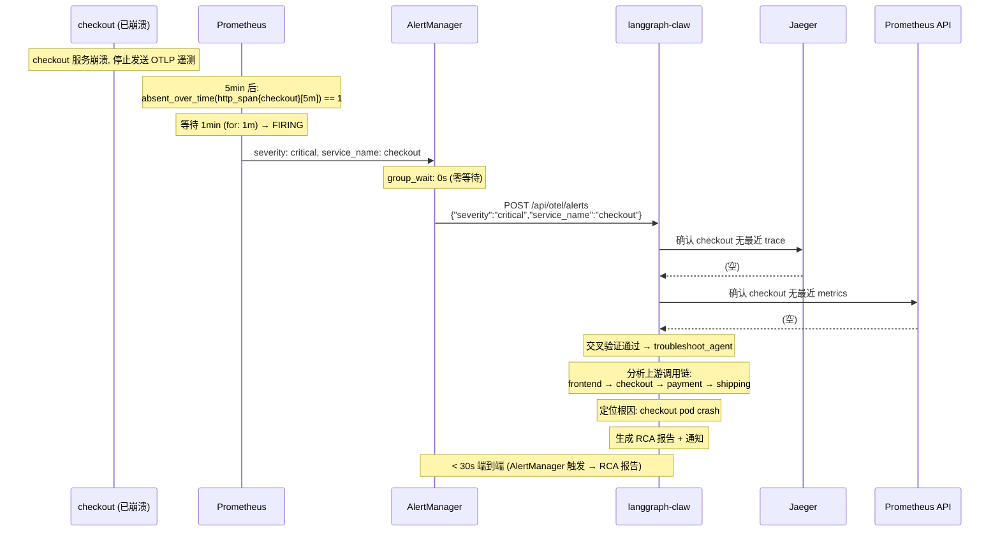

### 9.3 P2 趋势分析流

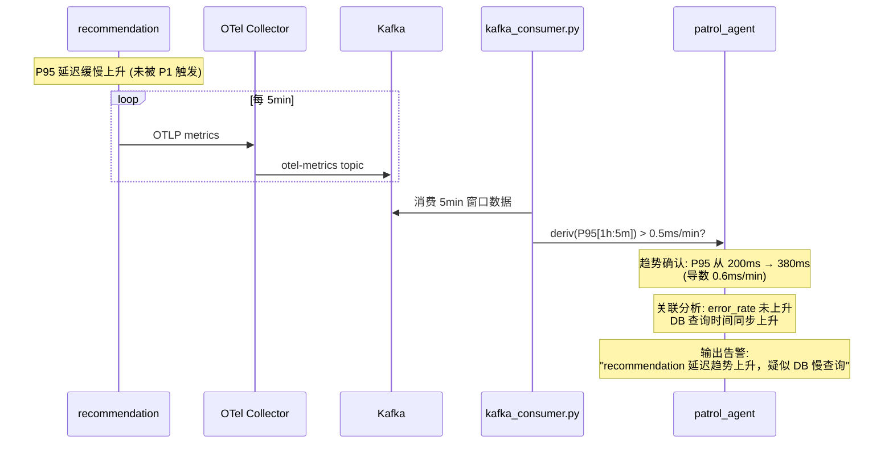

---

## 10. 运维与故障处理

### 10.1 LLM 配置故障

| 症状 | 原因 | 解决 |
|------|------|------|
| `POST /prompt` 返回 500 | LLM 不可达 / API Key 错误 | 检查 `LLM_BASE_URL`, `LLM_MODEL`, `API_KEY` |
| TLS 证书错误 | 自签名证书 | 开发环境设置 `LLM_TLS_VERIFY=False` |
| Agent 响应慢 | LLM 推理延迟 | 检查 `GRAPH_RECURSION_LIMIT`（默认 25），模型负载 |

### 10.2 MCP 连接故障

| 症状 | 原因 | 解决 |
|------|------|------|
| Agent 工具列表为空 | MCP 服务未启动 | `docker compose up mcp` |
| `load_mcp_tools` 超时 | MCP streamable HTTP 连接失败 | 检查 `MCP_ENDPOINT`、`MCP_PORT` |
| MCP 工具调用失败 | frontend API 不可达 | 检查 `APPLICATION_ENDPOINT` |

### 10.3 Kafka 遥测导出故障

| 症状 | 原因 | 解决 |
|------|------|------|
| Topic 无数据 | Kafka 服务未启动或 Collector 未加载 extras | 确认 `compose.full.yaml` + `otelcol-config-extras.yml` |
| Collector OOM | Kafka exporter 内存压力 | 启用 `compression: snappy`，调整 `batch` 配置 |
| 消息堆积 | langgraph-claw 消费慢 | 消费端按 service 分片并行 |

### 10.4 告警风暴防护

| 机制 | 配置 | 说明 |
|------|------|------|
| AlertManager `group_wait` | P0: 0s, P1: 10s | P0 立即发，P1 聚合去重 |
| AlertManager `repeat_interval` | P0: 15min, P1: 30min | 同一告警不重复推送 |
| `max_alerts` | P0: 5, P1: 10 | 限制单次推送数量 |
| langgraph-claw 令牌桶 | 每服务每分钟最多 1 次 RCA | 防止单服务告警风暴 |
| langgraph-claw 交叉验证 | Jaeger + Prometheus 多信号确认 | 误报不触发 RCA |

### 10.5 验证命令参考

```bash
# 检查 Kafka topics
docker exec kafka kafka-topics --bootstrap-server localhost:9092 --list | grep otel

# 检查 Prometheus 规则加载状态
curl -s http://localhost:9090/api/v1/rules | jq '.data.groups[] | {name: .name, rules: [.rules[].name]}'

# 检查 AlertManager 状态
curl -s http://localhost:9093/api/v2/status | jq

# 检查 Agent 服务健康
curl -X POST http://localhost:8010/prompt \
  -H 'Content-Type: application/json' \
  -d '{"message":"Hello","history":[]}'

# 消费一条 Kafka span 消息确认格式
docker exec kafka kafka-console-consumer \
  --bootstrap-server localhost:9092 \
  --topic otel-spans --max-messages 1
```

---

## 11. 名词术语表

### 可观测性

| 术语 | 全称 | 说明 |
|------|------|------|
| **OTel** | OpenTelemetry | CNCF 可观测性标准框架，本项目的基础设施 |
| **OTLP** | OpenTelemetry Protocol | OTel 的原生遥测传输协议（gRPC/HTTP + Protobuf） |
| **Trace / Span** | 分布式追踪 | 一次请求在多个服务间的完整调用链（Trace = 多个 Span 的树） |
| **P95 / P99** | 95th / 99th Percentile | 延迟分位数——P95=200ms 表示 95% 的请求在 200ms 内完成。比平均值更能反映尾部延迟 |
| **RED** | Rate / Error / Duration | 服务监控三要素：请求速率、错误率、请求耗时 |
| **SLO** | Service Level Objective | 服务等级目标——服务承诺的性能指标上限（如 "P95 < 200ms"） |
| **SLI** | Service Level Indicator | 服务等级指标——SLO 的实际测量值（如 "当前 P95 = 180ms"） |
| **Error Budget** | 错误预算 | SLO 允许的最大故障时间（如 99.9% 可用性 = 每月最多 43 分钟不可用） |
| **Exemplar** | 范例 | 关联到具体 trace 的指标样本点——从 metric 图表直接跳转到对应 trace |
| **Histogram** | 直方图指标 | Prometheus 指标类型，记录数值分布（如延迟分桶），支持 `histogram_quantile(0.95, ...)` |
| **Cardinality** | 基数 | 指标 label 组合的唯一值数量。高基数（如 `http.route` + `user_id`）会导致存储爆炸 |

### 告警与运维

| 术语 | 全称 | 说明 |
|------|------|------|
| **RCA** | Root Cause Analysis | 根因分析——从告警信号追溯到故障根因的全过程 |
| **P0-P3** | Priority 0-3 | 本项目的四级告警分级。P0=服务不可用，P3=治理合规 |
| **severity** | 告警严重级别 | Prometheus label，值 `critical`/`warning`/`info`/`none`，贯穿全链路 |
| **AlertManager** | Prometheus AlertManager | 告警管理组件——接收 Prometheus 告警，去重、分组、路由、静默 |
| **Webhook** | HTTP 回调 | AlertManager 将告警以 HTTP POST JSON 格式推送到外部系统 |
| **group_wait** | 分组等待 | AlertManager 参数——同一 group 的告警等待 N 秒聚合后发送 |
| **repeat_interval** | 重复间隔 | AlertManager 参数——同一告警 N 小时内不重复推送 |
| **Flapping** | 告警振荡 | 告警在 firing ↔ resolved 之间快速切换，通常由阈值过于敏感导致 |
| **False Alarm** | 误报 | 告警触发但实际无故障——本项目通过 langgraph-claw 交叉验证过滤 |

### AI / Agent

| 术语 | 全称 | 说明 |
|------|------|------|
| **LLM** | Large Language Model | 大语言模型——GPT-5.5、Claude Opus 4 等 |
| **ReAct** | Reasoning + Acting | Agent 模式——LLM 交替进行推理（Thought）和行动（Action），直到完成任务 |
| **LangChain** | — | Python Agent 框架——提供 `create_agent()` 预构建 ReAct 组件 |
| **LangGraph** | — | LangChain 生态的状态图编排引擎——管理 Agent 的工具调用循环和递归深度 |
| **MCP** | Model Context Protocol | Anthropic 提出的 AI 工具调用标准协议——`tools/list` → `tools/call` |
| **FastMCP** | — | MCP 的 Python 快速实现框架——本项目用于构建 MCP 服务端 |
| **Traceloop** | — | LLM 可观测性 SDK——自动为 LangChain/LangGraph 调用生成 OTel span |
| **VCR** | — | 录制/回放模式——缓存 LLM 请求-响应对，开发调试时省 Token |
| **RAG** | Retrieval-Augmented Generation | 检索增强生成——不直接相关，但常与 Agent 模式搭配 |

### 基础设施

| 术语 | 全称 | 说明 |
|------|------|------|
| **KRaft** | Kafka Raft | Kafka 4.x 的内置共识协议——替代 ZooKeeper，简化部署 |
| **Envoy** | — | 高性能 L7 代理——本项目用作前端边缘网关（`frontend-proxy`） |
| **Valkey** | — | Redis 的开源分支——本项目 cart 服务的缓存后端 |
| **OpenFeature** | — | CNCF 特性开关标准——本项目通过 flagd 实现灰度发布和故障注入 |
| **Docker Compose -f** | — | 分层 Compose 文件合并——`-f compose.yaml -f compose.full.yaml` 叠加服务 |
| **Snappy** | — | Google 开发的快速压缩算法——Kafka exporter 使用以减少网络带宽 |

### langgraph-claw 对接专用

| 术语 | 说明 |
|------|------|
| **troubleshoot_agent** | langgraph-claw 的 P0/P1 即时故障排查 agent——收到 webhook 后执行 RCA |
| **patrol_agent** | langgraph-claw 的 P2 趋势巡检 agent——每 5min 消费 Kafka 分析趋势 |
| **audit_agent** | langgraph-claw 的 P3 审计 agent——每 30min 消费 Kafka 检查合规和容量 |
| **kafka_consumer.py** | langgraph-claw 的 Kafka 消费模块——订阅 otel-spans/metrics/logs topic |
| **Multi-signal Cross Validation** | 多信号交叉验证——收到告警后查询 Jaeger + Prometheus 确认故障真实存在 |
| **Token Budget** | LLM Token 预算——RCA 每次消耗的 token 量，交叉验证过滤误报以控制成本 |

---

## 附录 A：文件变更清单

```
opentelemetry-demo/
├── .env                                  # 修改：新增 CLAW_ALERT_WEBHOOK_URL
├── compose.alerts.yaml                   # 新增：AlertManager 服务 + Prometheus 补丁
├── src/
│   ├── agent/                            # 新增：AI Agent 服务
│   │   ├── Dockerfile
│   │   ├── run.py
│   │   ├── requirements.txt
│   │   └── src/agents/
│   │       ├── agents.py                 # FastAPI + LangChain ReAct Agent
│   │       ├── llm.py                    # OpenAI 兼容 LLM 客户端 + VCR
│   │       ├── mcp_client.py             # MCP Streamable HTTP 客户端
│   │       └── patch_vcr.py              # VCR 录制/回放
│   ├── mcp/                              # 新增：MCP 工具服务
│   │   ├── Dockerfile
│   │   ├── run.py
│   │   └── src/mcp_server/
│   │       └── astronomy_shop_mcp_server.py  # FastMCP 服务
│   ├── chatbot/                          # 新增：Chatbot UI
│   │   ├── Dockerfile
│   │   ├── run.py
│   │   └── src/chat_interface/
│   │       └── chat_interface.py         # Gradio 聊天界面
│   ├── shared/tools.py                   # 新增：10 个商店操作工具（Agent & MCP 共用）
│   ├── alertmanager/                     # 新增
│   │   └── alertmanager.yml              # AlertManager 路由配置
│   ├── otel-collector/
│   │   └── otelcol-config-extras.yml     # 修改：Kafka exporter + pipeline 扩展
│   └── prometheus/
│       ├── prometheus-config.yaml        # 修改：rule_files + alerting 配置
│       └── prometheus-rules.yml          # 新增：P0-P3 四级告警规则
├── otel.md                               # 新增：langgraph-claw 对接设计文档
└── 技术方案文档.md                        # 本文档
```

## 附录 B：关键环境变量速查

| 变量 | 默认值 | 作用域 | 说明 |
|------|--------|--------|------|
| `LLM_BASE_URL` | — | Agent | LLM API 地址 |
| `LLM_MODEL` | `azure/gpt-5.5` | Agent | 模型名称（影响 VCR 文件名） |
| `API_KEY` | — | Agent | LLM API 密钥 |
| `USE_VCR` | `True` | Agent | 是否使用 VCR 回放 |
| `LLM_TLS_VERIFY` | `True` | Agent | LLM TLS 证书验证 |
| `MCP_ENABLED` | `False` | Agent | 是否启用 MCP 工具模式 |
| `MCP_ENDPOINT` | `mcp` | Agent | MCP 服务地址 |
| `MCP_PORT` | `8011` | Agent/MCP | MCP 服务端口 |
| `GRAPH_RECURSION_LIMIT` | `25` | Agent | Agent 递归深度限制 |
| `AGENT_PORT` | `8010` | Agent | Agent HTTP 端口 |
| `CHATBOT_PORT` | `7860` | Chatbot | Chatbot UI 端口 |
| `APPLICATION_ENDPOINT` | `frontend:8080` | Agent/MCP | 前端 API 地址 |
| `KAFKA_ADDR` | `kafka:9092` | Collector | Kafka broker 地址 |
| `CLAW_ALERT_WEBHOOK_URL` | `http://192.168.5.107:8000/api/otel/alerts` | AlertManager | langgraph-claw webhook |
| `OTEL_EXPORTER_OTLP_ENDPOINT` | `http://otel-collector:4317` | 全服务 | OTLP 导出地址 |

---

> **参考文档**：
> - 上游项目：[open-telemetry/opentelemetry-demo](https://github.com/open-telemetry/opentelemetry-demo)
> - 对接方案：[otel.md](./otel.md)
> - langgraph-claw 侧文档：`C:\idea\langgraph-claw\otel.md`
> - Agent 服务 README：[src/agent/README.md](./src/agent/README.md)
> - MCP 服务 README：[src/mcp/README.md](./src/mcp/README.md)
