# LangGraph Personal Assistant 技术方案报告

> **版本**: 0.2.0  
> **日期**: 2026-06-30  
> **状态**: 原型开发阶段  

---

## 目录

1. [项目概述](#1-项目概述)
2. [技术栈](#2-技术栈)
3. [系统架构](#3-系统架构)
4. [核心模块设计](#4-核心模块设计)
5. [Agent 工作流](#5-agent-工作流)
6. [安全体系](#6-安全体系)
7. [Skill 系统](#7-skill-系统)
8. [API 设计](#8-api-设计)
9. [前端架构](#9-前端架构)
10. [数据持久化](#10-数据持久化)
11. [部署与运行](#11-部署与运行)
12. [开发规范](#12-开发规范)

---

## 1. 项目概述

LangGraph Personal Assistant 是一个**可扩展的个人助理 Agent 原型系统**，采用 React 前端 + FastAPI/LangGraph 后端的全栈架构。核心定位为：

- **单 ReAct Agent**：基于 LangGraph 构建状态图驱动的推理-行动循环
- **工具调用审批机制**：所有 Agent 工具调用需要用户审批后方可执行
- **文件写入授权机制**：`write_file` 写入/追加请求必须经过用户审批，用户批准后可正常写入或更新工作区文件，同时保留路径越界保护
- **渐进式 Skill 系统**：通过 YAML frontmatter 声明技能的触发词、脚本和参数，运行时按需加载
- **多层安全守护**：Prompt 注入防护 + 工具命令安全扫描 + 调用中间件（频率/数量/循环检测）
- **审计追踪**：所有安全事件、审批决策持久化到 PostgreSQL，前端可查询
- **执行日志追踪**：完整 Agent 执行链路结构化记录（turn / skill_route / llm / tool / tool_retry / approval / security），含 token 用量、耗时、输入输出、错误信息，支持按事件类型筛选与重试链可视化；提供执行摘要 API 聚合关键指标
- **审计 SOP 技能**：内置 `audit-sop` Skill，定义 Agent 分析执行日志的标准操作流程，可生成结构化审计报告
- **Skill 评测与评分卡**：提供离线黄金用例集（Golden Dataset）路由评测、静态复杂度/行数/描述 token 评测，以及基于执行日志的运行时指标聚合；golden dataset 运行结果会写入 PostgreSQL，`/api/skills` 返回每个 Skill 的静态评分摘要和最新落库快照，前端列表和 Skill Evaluation 工作区优先展示最新评分
- **长短期记忆**：线程内短期记忆由 checkpoint 承载，长期记忆由 `.memory/` Markdown 索引和 PostgreSQL 共同保存；长期记忆反思在主回复完成后后台静默执行，命中时以前端右上角非阻塞确认通知呈现
- **上下文压缩**：上下文阈值为 1M token，超过 90% 或对话超过 20 轮后保留用户第一条输入、Agent 第一条和最后一条输出，用户 Approve/Deny 审批点击也计入轮次；中间过程替换为摘要，工具结果以 `tool_result_id` 引用并可从 PostgreSQL 反查
- **Redis 可选缓存**：对线程列表、执行日志/摘要、审计/工具错误查询和长期记忆 prompt 拼接结果做低风险缓存；PostgreSQL 与文件系统仍是权威存储，Redis 不可用时自动降级

## 2. 技术栈

### 后端

| 组件 | 技术选型 | 版本 | 用途 |
|------|----------|------|------|
| Web 框架 | FastAPI | ≥0.115 | REST API + SSE 流式响应 |
| 服务容器 | Uvicorn | ≥0.30 | ASGI 服务器 |
| Agent 框架 | LangGraph | ≥0.2 | 状态图驱动的 Agent 编排 |
| LLM SDK | langchain-deepseek (ChatDeepSeek) | - | LLM 调用（可配置 base_url 切换） |
| 消息/工具抽象 | langchain-core | ≥0.3 | 消息类型、工具定义 |
| 配置管理 | pydantic-settings | ≥2.4 | 环境变量驱动的配置 |
| 数据库 | PostgreSQL + psycopg | ≥3.2 | Checkpoint 持久化 + 审计日志 + 长期记忆 + 工具结果 |
| 缓存 | Redis / redis-py asyncio | ≥5.0 | 可选读缓存 + 长期记忆热数据缓存 |
| Checkpoint | langgraph-checkpoint-postgres | ≥2.0 | LangGraph 状态检查点 |
| 文件监听 | watchfiles | ≥0.24 | Skill 热加载 |
| 前端标记解析 | PyYAML | ≥6.0 | Skill SKILL.md frontmatter 解析 |
| 可观测性 | langfuse | ≥3.0 | LLM 调用 / 工具执行 / 图节点自动追踪 |

### 前端

| 组件 | 技术选型 | 版本 | 用途 |
|------|----------|------|------|
| UI 框架 | React | ^19.2 | 声明式 UI |
| 构建工具 | Vite | ^8.1 | 开发服务器 + 生产构建 |
| 类型系统 | TypeScript | ~6.0 | 静态类型检查 |
| 测试框架 | Vitest | ^4.1 | 单元/组件测试 |
| 组件测试 | @testing-library/react | ^16.3 | React 组件测试 |
| API Mock | MSW | ^2.14 | 请求拦截模拟 |
| Lint | oxlint | ^1.69 | 代码质量检查 |

## 3. 系统架构

### 3.1 整体架构

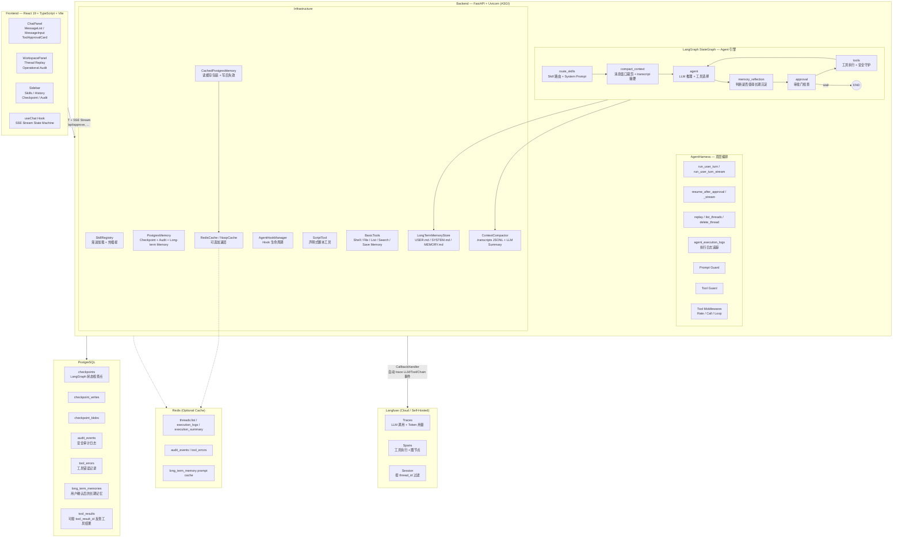

### 3.2 目录结构

```
langgraph-claw/
├── backend/
│   ├── pyproject.toml                     # 项目依赖与配置
│   ├── .env                              # 环境变量（不纳入版本控制）
│   └── src/personal_assistant/
│       ├── __init__.py
│       ├── __main__.py                   # uvicorn 启动入口
│       ├── config.py                     # 配置管理 (pydantic-settings)
│       ├── agent/
│       │   ├── agent.py                  # LangGraph 图编译
│       │   ├── harness.py               # AgentHarness + 安全守护 + 中间件
│       │   ├── state.py                  # AgentState 类型定义
│       │   ├── llm.py                    # LLM 构建 (ChatDeepSeek)
│       │   ├── router.py                # Skill 路由器
│       │   ├── approval.py              # 审批门 (ApprovalGate)
│       │   └── hook.py                  # Agent Hook 生命周期管理
│       ├── tracing.py                     # Langfuse 可观测性集成
│       ├── cache/
│       │   ├── base.py                   # AsyncCache 协议 + NoopCache
│       │   └── redis_cache.py            # RedisCache + build_cache 工厂
│       ├── api/
│       │   ├── server.py                # FastAPI 路由定义
│       │   └── schemas.py               # Pydantic 数据模型
│       ├── memory/
│       │   ├── postgres.py              # PostgreSQL Checkpoint + 审计 + 长期记忆表
│       │   ├── cached.py                # CachedPostgresMemory 读缓存与失效
│       │   ├── long_term.py             # USER/SYSTEM/MEMORY Markdown 长期记忆
│       │   └── compaction.py            # 上下文窗口压缩 + transcript JSONL
│       ├── skills/
│       │   ├── __init__.py              # Skill / SkillRegistry 导出
│       │   ├── base.py                  # Skill 数据类
│       │   ├── loader.py                # SkillRegistry (元数据扫描 + 加载)
│       │   ├── script_tool.py           # 声明式脚本工具工厂
│       │   ├── evaluation/              # Skill 评测：离线路由、静态指标、运行时聚合、评分卡与 CLI
│       │   ├── resolve-time/            # 日期时间解析 Skill
│       │   │   ├── SKILL.md             # Skill 声明（frontmatter + 指令）
│       │   │   └── scripts/
│       │   │       └── resolve_date.py  # 日期计算脚本
│       │   └── audit-sop/               # 审计 SOP Skill
│       │       └── SKILL.md             # 审计标准操作流程
│       └── tools/
│           ├── __init__.py
│           └── basic.py                 # 基础工具 (shell/file/list/search/save memory)
├── frontend/
│   ├── package.json
│   ├── vite.config.ts                   # Vite 配置（含 API 代理）
│   ├── tsconfig.json
│   └── src/
│       ├── main.tsx                     # React 入口
│       ├── App.tsx                      # 根组件 + 线程管理
│       ├── App.css                      # 全局样式
│       ├── components/
│       │   ├── ChatPanel.tsx            # 聊天面板编排
│       │   ├── Sidebar.tsx              # 侧边栏（Skills/History/Checkpoint/Audit）
│       │   ├── WorkspacePanel.tsx       # 工作区面板（Thread Replay + Operational Audit）
│       │   ├── MessageBubble.tsx        # 消息气泡（含推理卡片）
│       │   ├── MessageList.tsx          # 消息列表（自动滚动）
│       │   ├── MessageInput.tsx         # 输入区域
│       │   └── ToolApprovalCard.tsx     # 工具审批卡片
│       ├── hooks/
│       │   └── useChat.ts              # 聊天状态机（send/approve/deny + SSE）
│       ├── lib/
│       │   └── api.ts                   # 类型化 API 客户端 + SSE 解析
│       └── test/
│           └── setup.ts                 # Vitest 全局设置
├── docs/
│   └── superpowers/
│       ├── specs/                       # 设计文档
│       └── plans/                       # 实现计划
├── .claude/
│   ├── settings.json                    # Claude Code 配置
│   └── superharness/                    # Superharness 插件
├── CLAUDE.md                            # Claude Code 项目指令
├── AGENTS.md                            # Codex 项目指令
└── README.md
```

## 4. 核心模块设计

### 4.1 AgentHarness — 顶层编排器

`AgentHarness` 是面向 API 层和前端的主要接口，封装了：

| 方法 | 用途 |
|------|------|
| `run_user_turn(thread_id, message, llm_config)` | 同步模式：发送消息，返回完整响应 |
| `run_user_turn_stream(thread_id, message, llm_config)` | 流式模式：SSE 事件流（token / reasoning / approval / done） |
| `resume_after_approval(thread_id, approval_id, approved)` | 同步模式：审批后恢复 |
| `resume_after_approval_stream(thread_id, approval_id, approved)` | 流式模式：审批后恢复 |
| `replay(thread_id)` | 获取线程的全部 checkpoint 历史 |
| `list_threads(limit)` / `delete_thread(thread_id)` / `clear_threads()` | 线程管理 |
| `list_audit_events(thread_id, limit)` | 审计事件查询 |
| `list_tool_errors(thread_id, limit)` | 工具错误查询 |
| `list_execution_logs(thread_id, limit)` | 执行日志查询（按线程，时间升序） |
| `execution_log_summary(thread_id)` | 执行摘要聚合（总数/Token/错误/耗时等） |

**核心流程（流式）**：

1. **Prompt Guard**：在进入 LangGraph 之前扫描用户输入，命中安全规则直接返回拒绝消息
2. **图编译**：调用 `compile_agent()` 组装 StateGraph
3. **流式执行**：使用 `astream_events(v2)` 遍历事件
   - `on_chat_model_stream` → 提取 reasoning + token → 发送 SSE
   - 流结束后检查 `pending_approvals`
     - 有待审批 → 发送 `requires_approval` 事件
     - 无待审批 → 发送 `done` 事件

### 4.2 LangGraph 状态图 — Agent 引擎

Agent 的核心是一个带记忆和压缩节点的 LangGraph `StateGraph`：

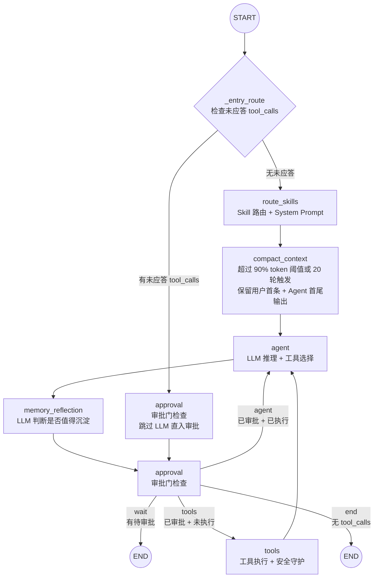

**状态定义** (`AgentState`)：

```python
class AgentState(TypedDict, total=False):
    messages: Annotated[list[AnyMessage], add_messages]  # LangGraph 消息归并
    selected_skills: list[str]                            # 本轮选中的 Skill
    allowed_tools: list[str]                              # 可用工具列表
    pending_approvals: list[dict[str, Any]]               # 待审批工具调用
```

### 4.3 记忆与上下文压缩

系统将记忆拆成三层：

1. **长期记忆**：`LongTermMemoryStore` 在工作区 `.memory/` 中维护 `USER.md`、`SYSTEM.md`、`MEMORY.md`。其中 `MEMORY.md` 是索引文件，每一行是一条 Markdown 链接，例如 `- [user-preference-tabs](user-preference-tabs.md) - User prefers tabs`。
2. **短期记忆**：沿用 LangGraph checkpoint，保存当前线程的消息、工具调用、审批状态和节点中间状态。
3. **压缩记忆**：`ContextCompactor` 在估算 token 超过 1M 阈值的 90%，或用户对话超过 20 轮后压缩上下文。轮次计算包含 HumanMessage 和用户 Approve/Deny 审批点击。压缩后保留用户第一条输入、Agent 第一条输出和最后一条输出，中间替换为结构化摘要，并把完整 transcript 写入 `.transcripts/` 供追溯。

`LongTermMemoryStore.read_all_cached()` 会在配置 Redis 时缓存 `.memory/*.md` 拼接后的系统提示片段。缓存 key 使用记忆目录和 Markdown 文件的路径、mtime、size 组成版本哈希，文件变更后自然 miss；Redis 不可用或未配置时走 `read_all()` 直读文件。

长期记忆沉淀不是静默写入：Agent 产生最终回复并把 `done` 事件返回前端后，`AgentHarness` 会调度后台记忆反思任务，由 LLM 判断本轮是否有稳定偏好、系统事实、项目决策或可复用上下文。若值得保存，LLM 只能发起 `save_conversation_memory` 工具调用；该调用写回同一线程的 pending approval，前端通过 `/api/threads/{thread_id}/pending-approvals` 短轮询获取后，在聊天区右上角展示非阻塞确认通知。用户仍可继续输入；只有用户 Approve 后才写入 Markdown 和 PostgreSQL `long_term_memories` 表。

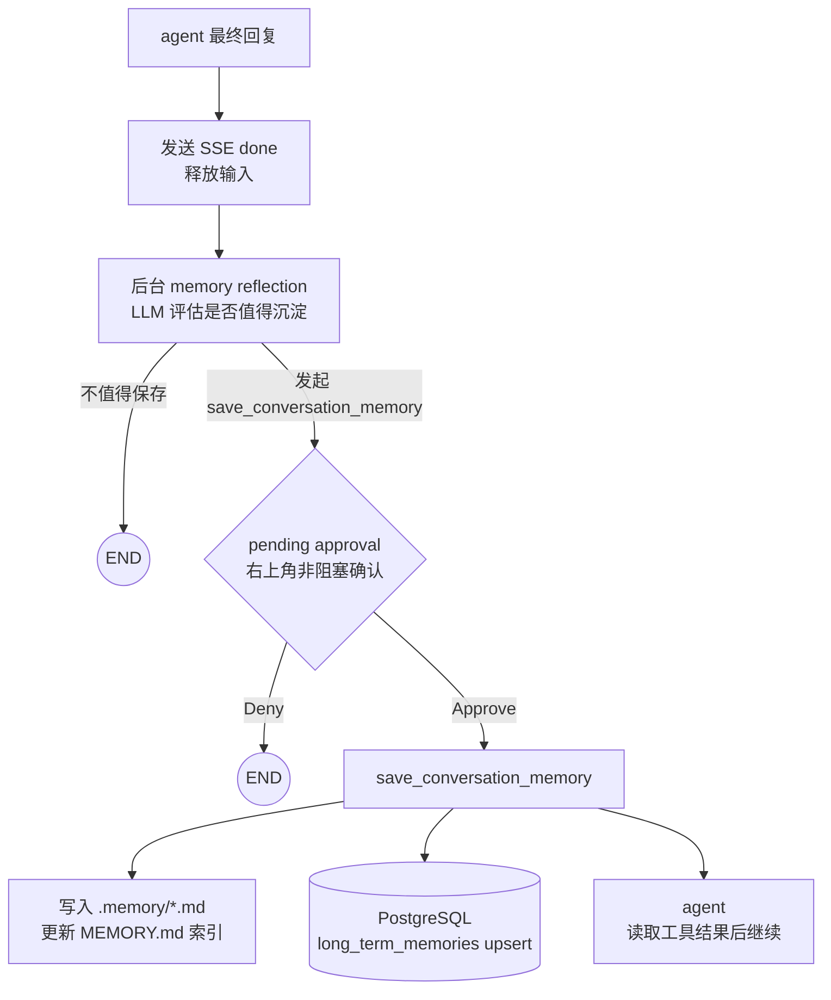

上下文压缩策略按成本从低到高逐级执行：

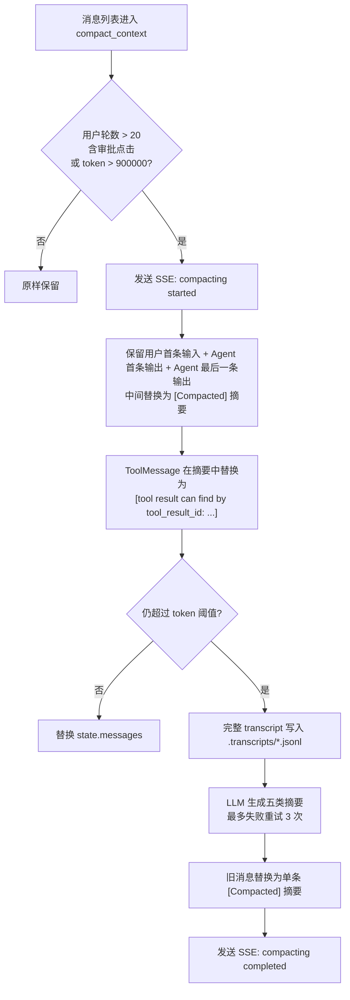

### 4.4 LLM 层

```python
def build_llm(settings: Settings, config: LLMConfig | None = None) -> ChatDeepSeek:
    return ChatDeepSeek(
        api_base=config.base_url or settings.llm_base_url,
        api_key=config.api_key or settings.llm_api_key,
        model=config.model or settings.llm_model,        # 默认 gpt-4.1-mini
        temperature=config.temperature or settings.llm_temperature,  # 默认 0.2
    )
```

- 使用 `langchain-deepseek` 的 `ChatDeepSeek`，兼容 OpenAI 协议
- 通过 `LLMConfig` 支持运行时覆盖（前端可传参切换模型）
- 默认模型 `gpt-4.1-mini`，温度 0.2

### 4.5 Skill 路由

`route_skills` 节点负责：

1. **关键词路由**：将用户输入与所有 Skill 的 `triggers`（YAML frontmatter 声明）进行子串匹配
2. **渐进加载**：仅对匹配的 Skill 调用 `registry.load_skill(name)` 加载完整内容
3. **System Prompt 构建**：仅生成选中 Skill 的概览与详细指令；未选中任何 Skill 时不注入 Skill 元数据
4. **状态注入**：将 `selected_skills` 写入 AgentState，后续节点据此过滤可用工具

```python
def _keyword_route(registry, user_text: str) -> list[str]:
    # 匹配逻辑：
    # 1. 有 triggers 的 Skill → 子串匹配（不区分大小写）
    # 2. 无 triggers 的 Skill → name + description 的词边界匹配（≥3 字符的 token）
```

当前实现已扩展为三层漏斗，并在语义召回后提供可选 rerank：

1. **Regex / triggers 层**：`router.py` 内置当前 Skill 的显式中英文正则规则，并保留 `SKILL.md` frontmatter `triggers` 与 name/description token fallback。该层命中后立即短路，不生成 embedding、不访问向量库、不调用 LLM。
2. **Semantic retrieval 层**：当第一层未命中且 `SKILL_ROUTING_SEMANTIC_ENABLED=true` 时，使用 `SkillEmbeddingProvider` 为用户 query 生成 embedding，并通过 `SkillVectorIndex` 召回 top-K 候选。默认实现包括进程内 `InMemorySkillVectorIndex` 和 Qdrant HTTP API 实现 `QdrantSkillVectorIndex`。
3. **Optional rerank 层**：当 `SKILL_ROUTING_RERANK_ENABLED=true` 时，使用本地 Ollama reranker 对召回候选做 query/passage pair 打分重排，并以 `SKILL_ROUTING_RERANK_THRESHOLD` 判断 top 候选是否直接命中。当前适配器会先检查 `/api/tags` 中该模型是否声明 `embedding` capability，避免不支持 `/api/embed` 的模型触发 Ollama 500；rerank 失败不会中断路由，会保留原语义召回候选继续降级。
4. **LLM judge 层**：当 top 候选低于当前阈值但仍有召回结果时，构造 `{"userInput": "...", "relatedFind": [...]}` 交给 LLM，并用本地 `LLMSkillRouteDecision` schema 校验 JSON 输出。若结构不合法，会把 `previousError` 与 `previousOutput` 传回 LLM 重试。该层可通过 `SKILL_ROUTING_LLM_MODEL` 使用独立模型（例如 `deepseek-v4-flash`），未配置时沿用主 `LLM_MODEL`。

语义路由或 rerank 失败（Ollama/Qdrant 不可用、collection 未准备好、网络异常等）不会中断对话；路由会安全降级为未选中 Skill 或进入 LLM judge，System Prompt 不再暴露任何未命中的 Skill 元数据。只有漏斗最终选中的 Skill 会进入本轮 System Prompt 和工具过滤范围，以降低 Skill 数量变多或描述相近时的误召回风险。

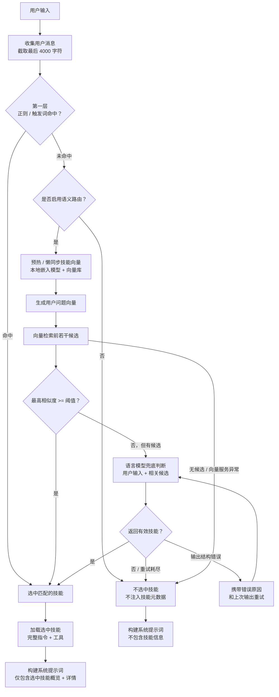

### 4.6 Langfuse 可观测性

系统通过 Langfuse 的 LangChain CallbackHandler 实现 **LLM 调用、工具执行和图节点转移的自动追踪**。Langfuse 是 opt-in 模式——仅在配置了 `LANGFUSE_PUBLIC_KEY` + `LANGFUSE_SECRET_KEY` 时启用，未配置则完全不加载。

**集成架构**：

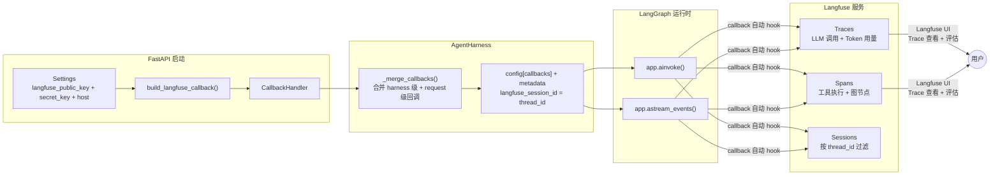

**核心模块** (`tracing.py`)：

| 函数 | 用途 |
|------|------|
| `build_langfuse_callback(settings)` | 工厂函数：Langfuse 启用时返回 CallbackHandler，否则返回 `None` |
| `_ensure_no_proxy(host)` | 自托管场景：将 Langfuse 主机加入 `NO_PROXY`，避免 OTEL span 被本地代理（Clash 等）拦截导致 trace 丢失 |

**工作流程**：

1. **服务器启动时**：`build_langfuse_callback(settings)` 检查配置
   - 未配置密钥 → 返回 `None`，不加载 langfuse 包
   - 已配置密钥 → 设置 `LANGFUSE_SECRET_KEY` / `LANGFUSE_HOST` 环境变量（Langfuse 4.x SDK 从环境变量读取），处理 NO_PROXY，创建 `CallbackHandler` 实例
2. **注入 AgentHarness**：CallbackHandler 以 `callbacks` 参数传入 `AgentHarness` 构造函数
3. **每次调用时**：`_merge_callbacks()` 合并 harness 级回调与 request 级回调，将 `thread_id` 映射为 `langfuse_session_id`，注入 `config["callbacks"]` 和 `config["metadata"]`
4. **LangChain/LangGraph 运行时**：CallbackHandler 自动 hook `on_llm_start` / `on_llm_end` / `on_tool_start` / `on_tool_end` / `on_chain_start` / `on_chain_end` 等事件，生成 Traces（含 Token 用量）、Spans 和 Sessions

**关键设计决策**：

- **Opt-in 默认关闭**：Langfuse 是可选的，未配置时零开销（`build_langfuse_callback` 返回 `None`，不 import langfuse）
- **自托管代理绕过**：自托管 Langfuse 实例通常在局域网内，本地 HTTP 代理（Clash / V2Ray）无法访问。`_ensure_no_proxy()` 自动将非 `cloud.langfuse.com` 的主机名加入 `NO_PROXY` 环境变量
- **Session 映射**：`thread_id` → `langfuse_session_id`，在 Langfuse UI 中可按会话过滤所有 trace
- **SDK 兼容**：Langfuse 4.x 要求 `secret_key` 和 `host` 通过环境变量传入（非构造函数参数），代码中对这两个值使用 `os.environ.setdefault` 注入

## 5. Agent 工作流

### 5.1 完整会话流程

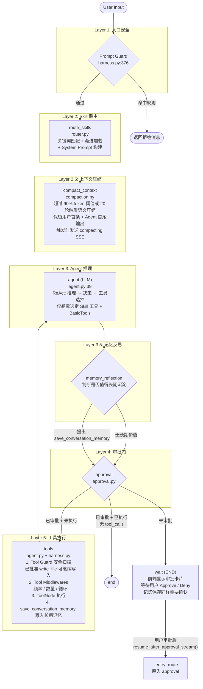

### 5.2 流式事件协议 (SSE)

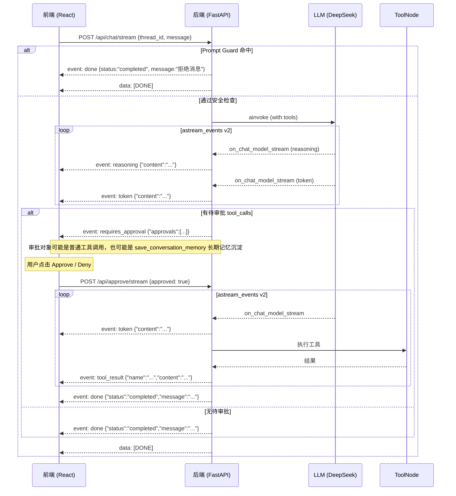

**SSE 事件格式参考**：

| 事件类型 | 方向 | 含义 |
|----------|------|------|
| `reasoning` | Server → Client | LLM 推理过程（DeepSeek thinking） |
| `compacting` | Server → Client | 上下文压缩开始/完成，前端展示 Compacting 卡片 |
| `token` | Server → Client | LLM 输出文本增量（打字机效果） |
| `requires_approval` | Server → Client | 工具调用需要用户审批 |
| `tool_result` | Server → Client | 工具执行结果（审批恢复流） |
| `done` | Server → Client | 本轮回复完成 |
| `error` | Server → Client | 异常消息 |
| `[DONE]` | Server → Client | SSE 流结束标记 |

## 6. 安全体系

### 6.1 三层防护架构

`write_file` 属于审批型写操作：创建、覆盖和追加都会先进入 `approval` 节点等待用户 Approve/Deny。用户批准后，工具执行前的 Tool Guard 不再因为待写入文本中包含命令示例而二次阻断该调用；真正落盘时仍由基础工具的 workspace 路径校验阻止越界写入。

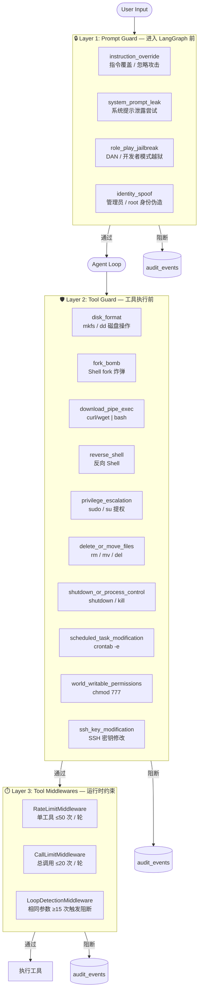

### 6.2 审计日志

所有安全事件持久化到 `audit_events` 表：

| 字段 | 说明 |
|------|------|
| `source` | `prompt` (提示词级别) 或 `tool` (工具级别) |
| `category` | 具体安全类别（如 `instruction_override`） |
| `severity` | `LOW` / `MEDIUM` / `HIGH` / `CRITICAL` |
| `reason` | 人类可读的阻断原因 |
| `subject` | 触发的消息摘要或工具名称 |
| `metadata` | JSONB 扩展数据（含 tool_call_id, args 等） |

### 6.3 执行日志追踪

Agent 在运行期间自动将每个关键步骤记录为结构化执行日志，持久化到 `agent_execution_logs` 表：

**事件类型** (`event_type`)：

| 类型 | 说明 | 记录时机 |
|------|------|----------|
| `turn` | 用户会话轮次 | 每轮开始/完成/失败时记录 |
| `skill_route` | Skill 触发词路由 | 流式模式中记录路由结果 |
| `llm` | LLM 调用 | 每次 LLM 推理完成（含 token 用量） |
| `tool` | 工具执行 | 工具调用完成或最终失败 |
| `tool_retry` | 工具重试 | 每次工具调用失败后重试 |
| `approval` | 工具审批操作 | 审批请求/同意/拒绝 |
| `security` | 安全事件 | Prompt Guard / Tool Guard 拦截 |

**事件状态** (`status`)：`started` / `completed` / `failed` / `blocked` / `retrying` / `approved` / `denied`

**记录位置**：
- `turn` 生命周期在 `AgentHarness.run_user_turn()` / `run_user_turn_stream()` 中记录
- `security` 事件在 Prompt Guard（入口安全）和 Tool Guard（工具执行前）中记录
- `tool` / `tool_retry` 在 `_execute_tool_calls_with_retry()` 中记录每次尝试和最终结果
- `approval` 在 `_record_tool_approval_requests()` / `_record_tool_approval_decision()` 中记录
- `llm` / `skill_route` 在流式事件处理循环中记录

**工具重试记录**：每个工具调用的失败和重试还单独记录到 `tool_errors` 表，包含 `tool_call_id`、`attempt`、`max_attempts`、`error_type`、`error_message`、`will_retry` 等字段，支持按线程或全局查询历史错误趋势。

**流式模式记录** (`run_user_turn_stream`)：
在 SSE 流式响应过程中，同时采集以下执行日志：
- `astream_events(v2)` 的 `on_chat_model_stream` 事件 → 提取 reasoning + token
- 流结束后从 `response_metadata.token_usage` 提取 token 用量并记录 `llm` 事件
- `on_tool_start` → 记录 `tool` started 事件
- `on_tool_end` → 记录 `tool` completed 事件
- `on_custom_event` → 记录 `skill_route` 事件（Skill 路由结果）

## 7. Skill 系统

### 7.1 两阶段渐进加载

**Phase 1 — 元数据扫描** (`scan_metadata()`):

- 扫描 `skills_dir` 下所有目录
- 解析 `SKILL.md` 的 YAML frontmatter 获取 name / description / triggers / scripts
- 不导入 `skill.py`，不构建脚本工具
- 记录 `source_mtime_ns` 和 `source_hash` 用于热加载检测

**Phase 2 — 按需加载** (`load_skill(name)`):

- 仅在 Skill 被 keyword route 匹配到时触发
- 读取完整 Markdown 指令内容
- 从 frontmatter `scripts` 声明构建脚本工具（`build_script_tool`）
- 导入 `skill.py` 中的 `TOOLS` 列表

### 7.2 SKILL.md 格式

```markdown
---
name: resolve-time
description: 日期时间解析技能
triggers:
  - 今天
  - 明天
  - today
scripts:
  - name: resolve_date_by_offset
    description: 按天数偏移计算日期
    command: ["python", "scripts/resolve_date.py", "offset", "{day_offset}", "{timezone}"]
    params:
      day_offset:
        type: integer
        description: 天数偏移
        required: true
      timezone:
        type: string
        default: Asia/Shanghai
---

# Skill 标题

详细的 Agent 行为指令...
```

### 7.3 脚本工具工厂

`ScriptTool` 将 frontmatter `scripts` 声明自动转换为 LangChain `StructuredTool`：

- **参数 Schema 生成**：从 `params` 定义动态生成 Pydantic model
- **占位符替换**：`{param}` → 实际值
- **Python 解释器解析**：`python`/`python3` → `sys.executable`
- **超时保护**：30 秒硬限制，防止脚本挂起
- **异步执行**：使用 `asyncio.to_thread` 避免阻塞事件循环
- **工作目录隔离**：子进程 cwd 设为 Skill 目录

### 7.4 热插拔

`SkillRegistry` 通过 `watchfiles` 监控 `skills_dir`，当 `SKILL.md` 变化时自动 `scan_metadata()`：

```python
def start_watching(self):
    # 后台线程监控 skills_dir，SKILL.md 变化时自动重新扫描
    # 已加载 Skill 的 source_mtime_ns / source_hash 不变则保留
    # 变化则重置为未加载状态，下次路由时重新加载
```

### 7.5 语义索引与 Qdrant 预热

语义路由是可选能力，由 `SKILL_ROUTING_SEMANTIC_ENABLED` 控制。开启后，系统使用 Ollama `bge-m3` 生成 embedding，并通过统一的 `SkillVectorIndex` 接口执行 Skill 召回；若同时开启 `SKILL_ROUTING_RERANK_ENABLED`，召回候选会再交给本地 Ollama `qllama/bge-reranker-v2-m3` 做重排：

- `InMemorySkillVectorIndex`：进程内缓存 Skill embedding，适合本地开发或无外部向量库场景。
- `QdrantSkillVectorIndex`：通过 Qdrant HTTP API 写入和检索 Skill embedding，API key 使用 `api-key` header。
- `OllamaBgeM3Reranker`：对 query 与候选 Skill 文档组成的 pair 调用 Ollama `/api/embed`，提取模型返回分数并按相关性重新排序；调用前会检查模型是否具备 `embedding` capability，失败时不影响原语义候选继续进入 LLM judge。

启动时 FastAPI lifespan 会调用 `warmup_skill_routing(settings, registry)`：

1. 构建 embedding provider（Ollama `bge-m3`）和 vector index（memory 或 qdrant）。
2. 对 Qdrant 模式，先调用 points scroll 读取已有 payload 中的 `skill_name` 与 `source_hash`。
3. 若 Qdrant 中已有相同 `source_hash`，跳过该 Skill，不重新生成 embedding。
4. 仅对新增或 `SKILL.md` 内容变化的 Skill 生成 embedding，并通过 upsert 写入 Qdrant。

Qdrant 同步过程会输出 INFO 日志，包含 collection 名称、待生成 embedding 的 Skill、最终 upsert 数量与跳过数量，便于确认 warmup 是否真的写入或命中缓存。

用户请求时仍保留懒同步兜底：如果启动预热失败，或启动后通过热插拔新增/修改 Skill，第一次进入语义路由时会再次尝试同步。每次请求只必须生成用户 query embedding；Skill embedding 不会在每轮对话重复生成。

Qdrant point payload 结构：

```json
{
  "skill_name": "resolve-time",
  "description": "日期时间解析技能",
  "source_hash": "sha1-of-SKILL.md"
}
```

### 7.6 Skill 评测与评分卡

Skill 评测模块位于 `personal_assistant.skills.evaluation`，目标是把 Skill 的“可发现、可执行、可维护、可观测”转化为可比较的量化指标。离线评测、运行时聚合和前端触发的 golden dataset 评测都汇总到同一套报告模型中；通过 API 运行的评测会写入 `skill_evaluation_results`，供后续列表和工作区持续展示。

**核心模型**：

- `GoldenSkillCase`：离线评测用例，包含 `id`、`query`、`expected_skills`，并预留 `expected_tool` / `expected_args` 用于后续参数抽取评测。
- `RoutingMetrics`：统计 `selection_accuracy`、`false_positive_rate`、`parameter_extraction_fidelity`。
- `StaticSkillMetrics`：统计描述 token、`SKILL.md` 行数、Python 行数、近似圈复杂度和工具数量。
- `RuntimeSkillMetrics`：统计工具调用数、成功率、重试率、P95/P99 延迟和单次调用 token 消耗。
- `SkillEvaluationReport`：统一的 JSON / Markdown 评分卡输出。

**离线评测流程**：

```powershell
cd backend
uv run python -m personal_assistant.skills.evaluation `
  --skills-dir src/personal_assistant/skills `
  --golden path/to/golden.jsonl `
  --output-json skill-eval.json `
  --output-md skill-eval.md
```

黄金用例集（Golden Dataset）每行一个 JSON：

```json
{"id":"weather-001","query":"Will it rain tomorrow?","expected_skills":["weather"]}
{"id":"negative-001","query":"Write a poem","expected_skills":[]}
```

离线评测会调用生产同款 `route_skill_names(...)`，因此能真实覆盖 regex / triggers、语义召回、可选 rerank 和 LLM judge 的组合行为。

**静态评分**：

`evaluate_static_skill(skill)` 从 `Skill` 元数据和文件系统计算：

- `description_tokens`：描述字段的 token 近似值，用于衡量描述是否精炼。
- `skill_md_lines` / `python_lines`：Skill 指令和代码规模。
- `max_cyclomatic_complexity`：基于 Python AST 的近似圈复杂度。
- `tool_count`：已加载工具或声明式脚本工具数量。

`score_static_metrics(...)` 将描述长度、复杂度和总行数归一化为 0 到 1 的静态分数。`/api/skills` 使用该分数生成每个 Skill 的轻量 `evaluation` 摘要，便于前端列表快速展示。

**评分计算模型**：

评测结果统一落在 `[0, 1]` 区间，前端按百分比展示。评分分为静态分、动态分、路由分和使用价值分四类组件，再按权重合成为 `overall_score`。

1. 静态打分 `S_static`

静态分只依赖 Skill 元数据和代码文件，适合在 `/api/skills` 列表中即时计算，用于发现描述过长、代码过大或复杂度过高的 Skill。

```text
description_score = 1                       if description_tokens <= 200
                  = 200 / description_tokens otherwise

complexity_score  = 1                              if max_cyclomatic_complexity <= 10
                  = 10 / max_cyclomatic_complexity otherwise

line_score        = 1                 if skill_md_lines + python_lines <= 500
                  = 500 / total_lines otherwise

S_static = (description_score + complexity_score + line_score) / 3
```

含义：
- `description_score` 衡量 Skill 描述是否足够精炼，目标阈值为 200 tokens。
- `complexity_score` 衡量代码控制流是否易测易维护，目标阈值为圈复杂度 10。
- `line_score` 是“500 行以内”经验规则的量化版本，统计 `SKILL.md` 与 Python 实现总行数。

2. 路由打分 `S_routing`

路由分来自 Golden Dataset。正例要求命中的 Skill 集合与期望集合完全一致，负例用于衡量误触发。

```text
selection_accuracy = positive_exact_matches / positive_total
false_positive_rate = false_positive_count / negative_total

S_routing = selection_accuracy * (1 - false_positive_rate)
```

当 Golden Dataset 只有正例或只有负例时，缺失指标记为 `None`，不参与总分加权。当前版本预留 `parameter_extraction_fidelity`，后续可在 golden case 中增加 `expected_tool` / `expected_args` 后纳入路由分。

3. 动态打分 `S_runtime`

动态分来自 `agent_execution_logs` 或同形状 trace，按工具名映射回 Skill。它衡量 Skill 真实运行时的稳定性，而不是静态质量。

```text
execution_success_rate = successful_tool_calls / tool_calls
retry_ratio = retry_count / tool_calls
retry_score = 1 - retry_ratio

S_runtime = execution_success_rate * 0.8 + retry_score * 0.2
```

当前动态分优先关注成功率和重试率：成功率权重 80%，重试稳定性权重 20%。`p95_latency_ms`、`p99_latency_ms` 和 `token_consumption_per_call` 已作为指标采集并输出到报告；为了避免不同 Skill 的业务形态差异过大，第一版暂不直接扣入 `S_runtime`，后续可按同步/异步 Skill 类型配置延迟阈值。

4. 使用价值分 `S_usage`

使用价值分用于避免“低频但静态很好”的 Skill 与“高频刚需且运行稳定”的 Skill 完全不可区分。当前实现用调用量做轻量归一化：

```text
S_usage = min(1, tool_calls / 10)
```

这不是单独的价值判断，只是综合分里的弱信号，权重较低。后续如果接入任务完成率、用户反馈或转人工率，可以替换为：

```text
S_usage = task_completion_rate * 0.5
        + positive_feedback_rate * 0.3
        + (1 - fallback_rate) * 0.2
```

5. 加权综合分 `overall_score`

默认权重：

| 组件 | 权重 | 说明 |
|------|------|------|
| `routing` | 0.4 | Skill 能否被正确选中，直接影响 Agent 是否走到正确能力 |
| `runtime` | 0.3 | Skill 被选中后是否稳定执行 |
| `static` | 0.2 | 描述、复杂度、行数等维护性和可理解性 |
| `usage` | 0.1 | 调用活跃度，作为业务价值的弱代理 |

综合分按可用组件重新归一化，避免某些评测输入缺失时把 Skill 错误打低：

```text
available_weight = sum(weight_i for component_i exists)
overall_score = sum(score_i * weight_i for component_i exists) / available_weight
```

示例：如果只做静态扫描，没有 Golden Dataset 和运行时日志，则 `available_weight = 0.2`，`overall_score = S_static`。如果运行了 Golden Dataset 但没有 runtime logs，则使用 `routing + static` 两项重新归一化：

```text
overall_score = (S_routing * 0.4 + S_static * 0.2) / 0.6
```

**运行时聚合**：

`evaluate_runtime_logs(registry, logs)` 消费现有 `agent_execution_logs` 形状的数据，通过工具名映射回 Skill，计算执行成功率、重试率、延迟分位数和 token 消耗。该能力复用现有执行日志，不需要新表；后续可以直接接入按线程日志、Langfuse 导出或批量离线 trace。

## 8. API 设计

### 8.1 REST 端点

| 方法 | 路径 | 说明 |
|------|------|------|
| GET | `/api/health` | 健康检查 |
| POST | `/api/chat` | 发送消息（同步） |
| POST | `/api/chat/stream` | 发送消息（SSE 流式） |
| POST | `/api/approve` | 审批工具调用（同步） |
| POST | `/api/approve/stream` | 审批工具调用（SSE 流式） |
| GET | `/api/threads` | 列出所有会话线程 |
| GET | `/api/threads/{thread_id}/replay` | 获取线程的 checkpoint 历史 |
| DELETE | `/api/threads/{thread_id}` | 删除线程及其审计日志 |
| DELETE | `/api/threads` | 清空所有线程 |
| GET | `/api/audit-events` | 查询审计事件（支持 thread_id 过滤） |
| GET | `/api/tool-errors` | 查询工具错误（支持 thread_id 过滤） |
| GET | `/api/threads/{thread_id}/execution-logs` | 查询执行日志（按线程，时间升序，limit=500） |
| GET | `/api/threads/{thread_id}/execution-summary` | 查询执行摘要（聚合统计） |
| GET | `/api/threads/{thread_id}/pending-approvals` | 查询线程当前 pending approval，用于后台记忆沉淀确认通知 |
| GET | `/api/skills` | 列出所有 Skill、加载状态、静态评测摘要及最新落库评测快照 |
| POST | `/api/skills/reload` | 强制重新加载所有 Skill |
| GET | `/api/skills/evaluation/latest` | 查询每个 Skill 最新一次落库评测快照 |
| POST | `/api/skills/evaluation/run` | 根据 Golden Dataset 路径运行评测、写入 `skill_evaluation_results` 并返回最新快照 |

### 8.2 数据模型

**ChatRequest**:
```json
{
  "thread_id": "uuid-string",
  "message": "用户输入",
  "llm": {"base_url": null, "model": null, "api_key": null, "temperature": null}
}
```

**ChatResponse**:
```json
{
  "thread_id": "uuid-string",
  "status": "completed | requires_approval",
  "message": "AI 回复文本",
  "approvals": [{"approval_id": "...", "tool_call_id": "...", "name": "shell_command", "args": {...}}]
}
```

**ExecutionLog**:
```json
{
  "id": 1,
  "created_at": "2026-06-30T...",
  "thread_id": "uuid-string",
  "run_id": null,
  "parent_id": null,
  "event_type": "llm | tool | tool_retry | approval | security | turn | skill_route",
  "status": "started | completed | failed | blocked | retrying | approved | denied",
  "name": "工具名/安全类别/审批ID",
  "input": {"消息或工具参数"},
  "output": {"LLM文本或工具结果"},
  "error": {"type": "...", "message": "..."},
  "duration_ms": 1234,
  "token_usage": {"prompt_tokens": 100, "completion_tokens": 200, "total_tokens": 300},
  "metadata": {"tool_call_id": "...", "attempt": 1, "severity": "HIGH"}
}
```

**ExecutionSummary**:
```json
{
  "thread_id": "uuid-string",
  "total_events": 42,
  "total_tokens": 15000,
  "prompt_tokens": 10000,
  "completion_tokens": 5000,
  "tool_calls": 8,
  "tool_errors": 2,
  "tool_retries": 3,
  "security_events": 1,
  "total_duration_ms": 45000
}
```

**SkillInfo**:
```json
{
  "name": "resolve-time",
  "description": "日期时间解析技能",
  "tool_names": ["resolve_date_by_offset"],
  "path": "backend/src/personal_assistant/skills/resolve-time",
  "loaded": false,
  "evaluation": {
    "overall_score": 0.93,
    "description_tokens": 18,
    "skill_md_lines": 42,
    "python_lines": 88,
    "max_cyclomatic_complexity": 4,
    "tool_count": 1
  }
}
```

## 9. 前端架构

### 9.1 组件树

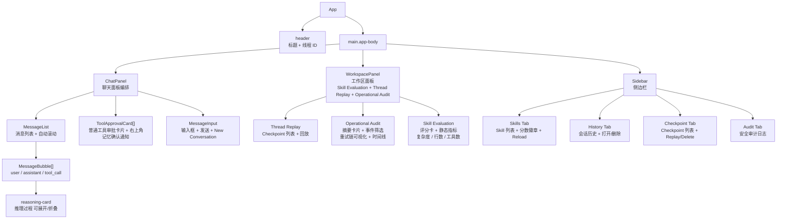

### 9.2 状态管理

`useChat` Hook 管理聊天核心状态机：

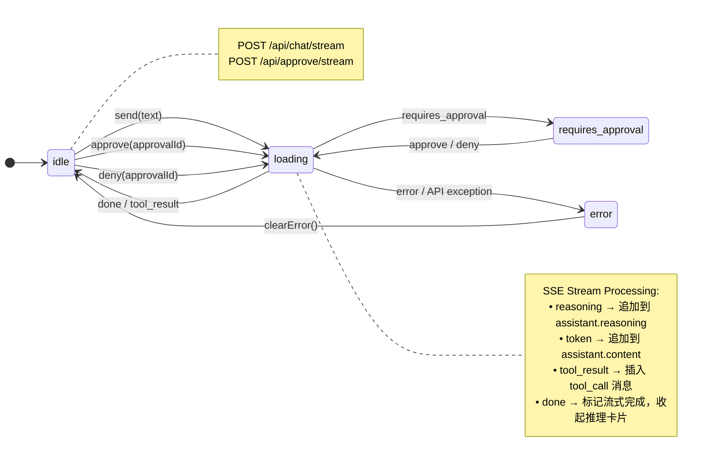

### 9.3 推理内容展示

- LLM 推理过程（DeepSeek thinking）以可折叠卡片形式展示在助手消息内
- 推理进行中时卡片展开显示，标题显示 "Thinking"
- 推理完成后自动折叠，标题显示 "Completed"，用户可点击展开/折叠
- `useChat` 的 `toggleReasoning(messageId)` 控制折叠状态

### 9.4 Operational Audit 工作区

`WorkspacePanel` 在 `panel="audit"` 模式下提供完整的执行日志审计界面：

**摘要指标卡片**：
- Total Tokens（含 Prompt / Completion 拆分）、Tool Calls、Errors、Retries、Duration
- 数据来源：`GET /api/threads/{thread_id}/execution-summary`

**事件类型筛选**：
- 6 个 Tab：All / LLM / Tool / Tool Retry / Security / Approval
- 按 `event_type` 字段前端过滤

**重试链可视化**：
- `buildRetryChains()` 函数将日志按 `metadata.tool_call_id` 聚合
- 每个重试链展示工具名称 + 每次 attempt 的状态（completed / failed / retrying）

**事件时间线**：
- 按 `created_at` 升序排列，每条事件可展开查看完整 JSON（Input / Output / Error / Metadata）
- 事件按 `event_type` + `status` 着不同样式

### 9.5 Skill Evaluation 工作区

`WorkspacePanel` 在 `panel="skills"` 模式下展示 Skill 评测页面，数据来源为 `GET /api/skills`：

**侧栏列表**：
- 每个 Skill 条目显示名称、描述、工具列表和评分百分比徽章；如果存在 `latest_evaluation`，优先显示最新落库评分，否则显示静态评分。
- 点击“军械”页签时，主工作区切换到 Skill Evaluation 页面，而不只停留在侧栏列表。

**主工作区评分卡**：
- 每个 Skill 一张评分卡，显示 `overall_score` 百分比与横向分数条。
- 指标包括 Description tokens、Complexity、Python lines、Tools。
- 支持输入 Golden Dataset 路径并点击“运行评测”，服务端执行后将评分写入 `skill_evaluation_results`，前端刷新并展示最新分数和来源。
- 布局使用可换行网格，在桌面端便于横向扫描，在窄屏下自动收缩为单列。

当前前端展示的是 `/api/skills` 返回的静态评测摘要和最新落库快照；运行时指标已在后端评测模块中具备聚合函数，后续可将线程日志或全局日志接入该页面，扩展为“静态评分 + golden dataset + 线上表现”的完整治理视图。

## 10. 数据持久化

### 10.1 PostgreSQL 数据库

**LangGraph Checkpoint 表**（由 `AsyncPostgresSaver` 自动管理）:

- `checkpoints` — 状态检查点（thread_id, checkpoint_id, parent_checkpoint_id, checkpoint JSONB, metadata JSONB）
- `checkpoint_writes` — 中间通道写入
- `checkpoint_blobs` — 大对象二进制存储

**审计事件表**（自定义）:

```sql
CREATE TABLE audit_events (
    id BIGSERIAL PRIMARY KEY,
    created_at TIMESTAMPTZ NOT NULL DEFAULT now(),
    thread_id TEXT,
    source TEXT NOT NULL,          -- 'prompt' | 'tool'
    category TEXT NOT NULL,        -- 安全类别
    severity TEXT NOT NULL,        -- LOW | MEDIUM | HIGH | CRITICAL
    reason TEXT NOT NULL,          -- 人类可读原因
    subject TEXT,                  -- 触发内容摘要
    metadata JSONB NOT NULL DEFAULT '{}'::jsonb
);

CREATE INDEX idx_audit_events_thread_created
ON audit_events (thread_id, created_at DESC);
```

**长期记忆表**（自定义）:

```sql
CREATE TABLE long_term_memories (
    slug TEXT PRIMARY KEY,
    title TEXT NOT NULL,
    summary TEXT NOT NULL,
    body TEXT NOT NULL,
    created_at TIMESTAMPTZ NOT NULL DEFAULT now(),
    updated_at TIMESTAMPTZ NOT NULL DEFAULT now()
);
```

`save_conversation_memory` 使用 `slug` 做幂等 upsert：同一条长期记忆再次沉淀时会更新标题、摘要、正文和 `updated_at`，避免重复索引。

**执行日志表**（自定义）:

```sql
CREATE TABLE agent_execution_logs (
    id BIGSERIAL PRIMARY KEY,
    created_at TIMESTAMPTZ NOT NULL DEFAULT now(),
    thread_id TEXT NOT NULL,
    run_id TEXT,
    parent_id TEXT,
    event_type TEXT NOT NULL,          -- turn | skill_route | llm | tool | tool_retry | approval | security
    status TEXT NOT NULL,             -- started | completed | failed | blocked | retrying | approved | denied
    name TEXT,                        -- 事件名称（工具名/安全类别/审批ID）
    input JSONB NOT NULL DEFAULT '{}'::jsonb,
    output JSONB NOT NULL DEFAULT '{}'::jsonb,
    error JSONB NOT NULL DEFAULT '{}'::jsonb,
    duration_ms INT,
    token_usage JSONB NOT NULL DEFAULT '{}'::jsonb,  -- prompt_tokens / completion_tokens / total_tokens
    metadata JSONB NOT NULL DEFAULT '{}'::jsonb       -- tool_call_id / attempt / severity 等
);

CREATE INDEX idx_execution_logs_thread_created
ON agent_execution_logs (thread_id, created_at ASC);
```

**Skill 评测结果表**（自定义）:

```sql
CREATE TABLE skill_evaluation_results (
    id BIGSERIAL PRIMARY KEY,
    created_at TIMESTAMPTZ NOT NULL DEFAULT now(),
    skill_name TEXT NOT NULL,
    overall_score DOUBLE PRECISION NOT NULL,
    routing_score DOUBLE PRECISION,
    runtime_score DOUBLE PRECISION,
    usage_score DOUBLE PRECISION,
    static_score DOUBLE PRECISION,
    source TEXT,
    report JSONB NOT NULL DEFAULT '{}'::jsonb
);

CREATE INDEX idx_skill_evaluation_results_skill_created
ON skill_evaluation_results (skill_name, created_at DESC, id DESC);
```

`POST /api/skills/evaluation/run` 会把每个 Skill 的 `SkillEvaluationResult` 写入该表。`GET /api/skills` 和 `GET /api/skills/evaluation/latest` 使用 `DISTINCT ON (skill_name)` 读取每个 Skill 最新一次快照，前端优先展示该分数。

**工具错误表**（自定义）:

```sql
CREATE TABLE tool_errors (
    id BIGSERIAL PRIMARY KEY,
    created_at TIMESTAMPTZ NOT NULL DEFAULT now(),
    thread_id TEXT,
    tool_call_id TEXT NOT NULL,
    tool_name TEXT NOT NULL,
    tool_args JSONB NOT NULL DEFAULT '{}'::jsonb,
    attempt INT NOT NULL,
    max_attempts INT NOT NULL,
    error_type TEXT NOT NULL,
    error_message TEXT NOT NULL,
    will_retry BOOLEAN NOT NULL DEFAULT false
);

CREATE INDEX idx_tool_errors_thread_created
ON tool_errors (thread_id, created_at DESC);
```

**工具结果表**（自定义）:

```sql
CREATE TABLE tool_results (
    tool_result_id TEXT PRIMARY KEY,
    thread_id TEXT,
    tool_name TEXT,
    content TEXT NOT NULL,
    metadata JSONB NOT NULL DEFAULT '{}'::jsonb,
    created_at TIMESTAMPTZ NOT NULL DEFAULT now(),
    updated_at TIMESTAMPTZ NOT NULL DEFAULT now()
);

CREATE INDEX idx_tool_results_thread_created
ON tool_results (thread_id, created_at DESC);
```

工具执行节点会把 `ToolMessage` 结果写入该表，默认使用 `tool_call_id` 作为 `tool_result_id`。上下文压缩时不把原始工具结果塞进摘要，而是写成 `[tool result can find by tool_result_id: ...]`，后续需要时可按该 ID 从 `tool_results` 反查原始结果。

### 10.2 文件化记忆与 Transcript

工作区默认生成两个目录：

- `.memory/`：长期记忆 Markdown 根目录。
  - `USER.md`：用户偏好和长期稳定信息入口。
  - `SYSTEM.md`：系统级约束或运行原则入口。
  - `MEMORY.md`：索引文件，每一行一条链接，格式为 `- [title](slug.md) - summary`。
  - `<slug>.md`：具体长期记忆正文，正文由 `memory_reflection` 节点要求保留五类信息。
- `.transcripts/`：上下文压缩前的完整对话 JSONL。每行记录一条 LangChain message 的 `type`、`content`，并在存在时保留 `tool_calls` 或 `tool_call_id`。

文件化记忆用于人工审阅和版本化，PostgreSQL 长期记忆表用于后续检索、排序和服务端查询扩展；PostgreSQL 工具结果表用于压缩摘要中的 `tool_result_id` 反查。

### 10.3 连接管理

`PostgresMemory` 使用 `psycopg_pool.AsyncConnectionPool` 管理连接池：

```python
class PostgresMemory:
    pool: AsyncConnectionPool       # 连接池
    checkpointer: AsyncPostgresSaver  # LangGraph checkpoint 适配器

    async def start(self)  → 打开连接池 + 初始化 checkpoint 表 + 创建审计表 + 创建执行日志表 + 创建工具错误表 + 创建长期记忆表 + 创建工具结果表
    async def stop(self)   → 关闭连接池
```

### 10.4 Redis 可选缓存层

Redis 由 `REDIS_URL` 启用，只作为可丢失的加速层。`server.py` 启动时创建 `RedisCache` 或 `NoopCache`，再用 `CachedPostgresMemory` 包装底层 `PostgresMemory`。所有权威写入仍先进入 PostgreSQL 或文件系统；缓存写入、删除、反序列化失败只记录日志并自动回退，不影响 API。

**缓存范围**：

| Key 命名空间 | 数据 | TTL |
|--------------|------|-----|
| `pa:v1:threads:list:{limit}` | 会话线程列表 | `CACHE_DEFAULT_TTL_SECONDS` |
| `pa:v1:execution_logs:{thread_id}:{limit}` | 线程执行日志 | `CACHE_LOG_TTL_SECONDS` |
| `pa:v1:execution_summary:{thread_id}` | 执行摘要聚合 | `CACHE_DEFAULT_TTL_SECONDS` |
| `pa:v1:audit_events:{thread_id_or_all}:{limit}` | 审计事件查询 | `CACHE_DEFAULT_TTL_SECONDS` |
| `pa:v1:tool_errors:{thread_id_or_all}:{limit}` | 工具错误查询 | `CACHE_DEFAULT_TTL_SECONDS` |
| `pa:v1:long_term_memory:{dir_hash}:{files_hash}` | 长期记忆 prompt 片段 | `CACHE_MEMORY_TTL_SECONDS` |

**失效策略**：

- `record_execution_log()` 后删除对应线程的 execution summary、execution logs，并删除 `threads:list:*` 保持侧边栏新鲜。
- `record_audit_event()` 后删除全局和线程级 audit events 缓存。
- `record_tool_error()` 后删除全局和线程级 tool errors 缓存。
- `delete_thread()` / `clear_threads()` 后删除线程列表及相关线程缓存。
- 长期记忆使用文件版本哈希自然失效，不依赖手动删除 key。

## 11. 部署与运行

### 11.1 环境变量

| 变量 | 默认值 | 说明 |
|------|--------|------|
| `DATABASE_URL` | PostgreSQL 连接串 | LangGraph checkpoint + 审计存储 |
| `LLM_BASE_URL` | `None` (使用 DeepSeek 默认) | LLM API 地址 |
| `OPENAI_API_KEY` | `None` | API 密钥 (兼容 OpenAI/DeepSeek) |
| `LLM_MODEL` | `gpt-4.1-mini` | 模型名称 |
| `LLM_TEMPERATURE` | `0.2` | 生成温度 |
| `SKILLS_DIR` | `backend/src/personal_assistant/skills` | Skill 目录路径 |
| `ASSISTANT_WORKSPACE_DIR` | 当前工作目录 | 工具执行沙箱根目录 |
| `LONG_TERM_MEMORY_DIR` | `<workspace>/.memory` | 长期记忆 Markdown 文件目录 |
| `TRANSCRIPT_DIR` | `<workspace>/.transcripts` | 上下文压缩 transcript JSONL 目录 |
| `CONTEXT_COMPACTION_MESSAGE_COUNT` | `20` | 触发上下文压缩的用户对话轮数，含 Approve/Deny 审批点击 |
| `CONTEXT_COMPACTION_TOKEN_THRESHOLD` | `1000000` | 上下文 token 阈值；超过 90% 时触发压缩 |
| `CACHE_ENABLED` | `true` | 是否启用可选缓存层；未配置 `REDIS_URL` 时自动退回 NoopCache |
| `REDIS_URL` | `None` | Redis 连接串，必须使用 `redis://` 或 `rediss://`，示例：`redis://redis.example.local:6379/0` |
| `CACHE_DEFAULT_TTL_SECONDS` | `10` | 线程列表、执行摘要、审计/工具错误等普通缓存 TTL |
| `CACHE_LOG_TTL_SECONDS` | `5` | 执行日志列表缓存 TTL |
| `CACHE_MEMORY_TTL_SECONDS` | `60` | 长期记忆拼接提示缓存 TTL |
| `SKILL_ROUTING_SEMANTIC_ENABLED` | `false` | 是否启用 regex → embedding 召回 → 可选 rerank → LLM judge 的 Skill 路由漏斗 |
| `SKILL_ROUTING_EMBEDDING_MODEL` | `bge-m3` | Ollama embedding 模型名称 |
| `SKILL_ROUTING_OLLAMA_BASE_URL` | `http://localhost:11434` | Ollama 服务地址；局域网部署时填写 bge-m3 / reranker 服务机器地址 |
| `SKILL_ROUTING_VECTOR_STORE` | `memory` | Skill embedding 存储后端：`memory` 或 `qdrant` |
| `SKILL_ROUTING_QDRANT_URL` | `None` | Qdrant HTTP 地址，例如 `http://<qdrant-host>:6333` |
| `SKILL_ROUTING_QDRANT_API_KEY` | `None` | Qdrant API key；后端通过 `api-key` header 发送 |
| `SKILL_ROUTING_QDRANT_COLLECTION` | `skill_routes` | Qdrant collection 名称，需提前创建并匹配 bge-m3 embedding 维度 |
| `SKILL_ROUTING_SIMILARITY_THRESHOLD` | `0.72` | 语义召回直接命中的相似度阈值 |
| `SKILL_ROUTING_TOP_K` | `3` | 语义召回候选数量，未启用 rerank 或 rerank 失败时低于阈值会交给 LLM judge |
| `SKILL_ROUTING_RERANK_ENABLED` | `false` | 是否在语义召回后启用本地 reranker 重排 |
| `SKILL_ROUTING_RERANK_MODEL` | `qllama/bge-reranker-v2-m3` | Ollama reranker 模型名称；当前适配器要求模型声明 `embedding` capability |
| `SKILL_ROUTING_RERANK_THRESHOLD` | `0.72` | rerank 后 top 候选直接命中的阈值 |
| `SKILL_ROUTING_RERANK_TOP_K` | `3` | 送入 reranker 的候选数量 |
| `SKILL_ROUTING_LLM_RETRY_COUNT` | `1` | LLM judge 结构化输出校验失败后的重试次数 |
| `SKILL_ROUTING_LLM_MODEL` | `None` | LLM judge 专用模型；不填则沿用主 `LLM_MODEL`，例如 `deepseek-v4-flash` |
| `LANGFUSE_PUBLIC_KEY` | `None` | Langfuse 公钥（可选，不填则禁用追踪） |
| `LANGFUSE_SECRET_KEY` | `None` | Langfuse 密钥（可选） |
| `LANGFUSE_HOST` | `https://cloud.langfuse.com` | Langfuse 实例地址（支持自托管） |

### 11.2 启动

```powershell
# Backend
cd backend
python -m venv .venv
.venv\Scripts\Activate.ps1
pip install -e .
$env:OPENAI_API_KEY="sk-..."
uvicorn personal_assistant.api.server:app --reload --host 0.0.0.0 --port 8000

# Frontend
cd frontend
npm install
npm run dev       # → http://localhost:5173，API 代理到 localhost:8000
```

## 12. 开发规范

### 12.1 工程纪律 (Superharness)

本项目采用 **superharness** 工程纪律框架：

- **TDD 强制**：先写失败测试（RED），再写最小实现（GREEN），最后重构
- **证据优先**：声明完成前必须运行验证命令并展示输出
- **根因分析**：遇到 Bug 遵循 4 步系统调试流程，禁止猜测式修补
- **计划驱动**：3 步以上的多步骤任务需先写实现计划
- **代码审查**：重要变更完成后进行审查，关键问题阻塞合并

### 12.2 测试

**后端**（pytest + pytest-asyncio）:
```bash
cd backend
uv run pytest -v
```

**前端**（Vitest + Testing Library）:
```bash
cd frontend
npm test
```

### 12.3 代码质量

- Python: `ruff` (line-length=100, target-version=py311)
- TypeScript: `oxlint` + `prettier`

---

## 附录：演进路线

| 阶段 | 内容 | 状态 |
|------|------|------|
| ✅ 基础 | ReAct Agent + FastAPI + PostgreSQL Checkpoint | 已完成 |
| ✅ 工具系统 | 基础工具 (shell/file/list/search) + Skill 脚本工具 | 已完成 |
| ✅ 安全 | Prompt Guard + Tool Guard + Middlewares + 审计 | 已完成 |
| ✅ 流式 | SSE 流式响应 + 推理过程展示 | 已完成 |
| ✅ 审批 | 工具调用审批门 + 前端审批卡片 | 已完成 |
| ✅ Hook | Agent 生命周期 Hook 管理器 | 已完成 |
| ✅ 记忆 | 长期记忆 Markdown/PostgreSQL + checkpoint 短期记忆 | 已完成 |
| ✅ 上下文压缩 | 1M token 阈值、90%/20轮触发 + 语义压缩 + tool_result_id 反查 + compacting SSE | 已完成 |
| ✅ 执行日志追踪 | agent_execution_logs + tool_errors 表 + 7 种事件类型 + 执行摘要 API + 前端 Operational Audit 面板 + audit-sop Skill | 已完成 |
| ✅ Langfuse 可观测性 | Langfuse CallbackHandler 自动追踪 LLM/工具/图节点 + 自托管代理绕过 + thread_id → session_id 映射 | 已完成 |
| ✅ Redis 可选缓存 | 读接口缓存 + 长期记忆 prompt 缓存 + 写后失效 + Noop 降级 | 已完成 |
| ✅ Skill 评测 | 离线黄金用例集（Golden Dataset）路由评测 + 静态评分 + 运行时日志聚合函数 + 评测结果落库 + `/api/skills` 最新评分摘要 + 前端 Skill Evaluation 运行与展示页面 | 已完成 |
| 🔲 认证 | 用户认证与多用户隔离 | 规划中 |
| 🔲 多 Agent | 多 Agent 协作 / Sub-agent 派生 | 规划中 |
| 🔲 MCP | Model Context Protocol 集成 | 规划中 |
| 🔲 持久化前端状态 | 前端多标签页状态同步 | 规划中 |
## Redis-first Checkpoint 存储补充

当 `REDIS_URL` 存在时，`PostgresMemory` 会把底层 `AsyncPostgresSaver` 包装为 `RedisFirstCheckpointSaver`。LangGraph 仍通过 `graph.compile(checkpointer=memory.checkpointer)` 接入，不改变图结构。checkpoint 写入顺序为：同步写 Redis、返回给 LangGraph、后台异步写 PostgreSQL；如果 Redis 写失败，则立即回退为同步写 PostgreSQL。

checkpoint serde 使用 MessagePack-oriented `JsonPlusSerializer`，并对超过阈值的字节 payload 做 zlib 压缩。Redis 保存近期 checkpoint envelope 和线程 zset 索引，`aget_tuple` / `alist` 优先从 Redis 读取；Redis miss、TTL 过期或 LRU 淘汰后回退 PostgreSQL。`CHECKPOINT_TTL_SECONDS` 同时用于 Redis key `EX` 和 PostgreSQL checkpoint 表清理。启动时会 best-effort 执行 `CONFIG SET maxmemory-policy allkeys-lru`，托管 Redis 禁止该命令时只记录 warning。

默认跳过确定性 checkpoint 写入节点 `route_skills,compact_context`，以减少重复状态写入；保留 `agent`、`tools`、`approval`、`memory_reflection` 等非确定性或影响外部状态的节点。可通过 `CHECKPOINT_SKIP_NODES` 调整跳过列表。运行日志中的 `source=input/loop` 表示 LangGraph checkpoint 来源，不等同于业务图节点；真实写入节点以 `write_node` 打印并用于跳过判断。
