# 意图路由系统详解

## 概述

本项目有两套独立的意图路由系统，通过 API 的 `agent_mode` 参数（`"single"` | `"multi"`）选择使用哪一套：

- **Single-agent 模式**：三层漏斗（正则 → 语义 → LLM），将用户输入路由到**具体 Skill**
- **Multi-agent 模式**：单层正则，将用户输入分类为**粗粒度意图**，再并行分发给 4 个 APM 子 Agent

两套系统共用 `AgentState`（`backend/src/personal_assistant/agent/state.py`），但在图结构、路由策略和输出方式上完全不同。

入口分发逻辑在 `harness.py:347-350`：

```python
app = (
    self._compile_multi_agent(llm_config)  # multi 模式
    if agent_mode == "multi"
    else self._compile_without_memory_reflection(llm_config)  # single 模式
)
```

---

## 模式总览

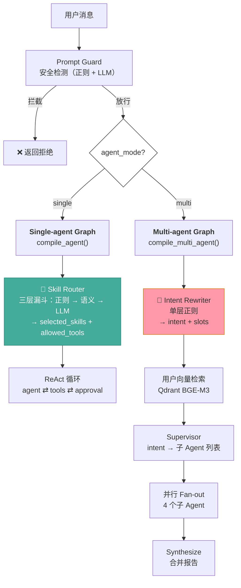

---

## 一、Single-agent 模式：Skill Router 三层漏斗

核心入口：`route_skill_names_with_trace()`（`router.py:786`）

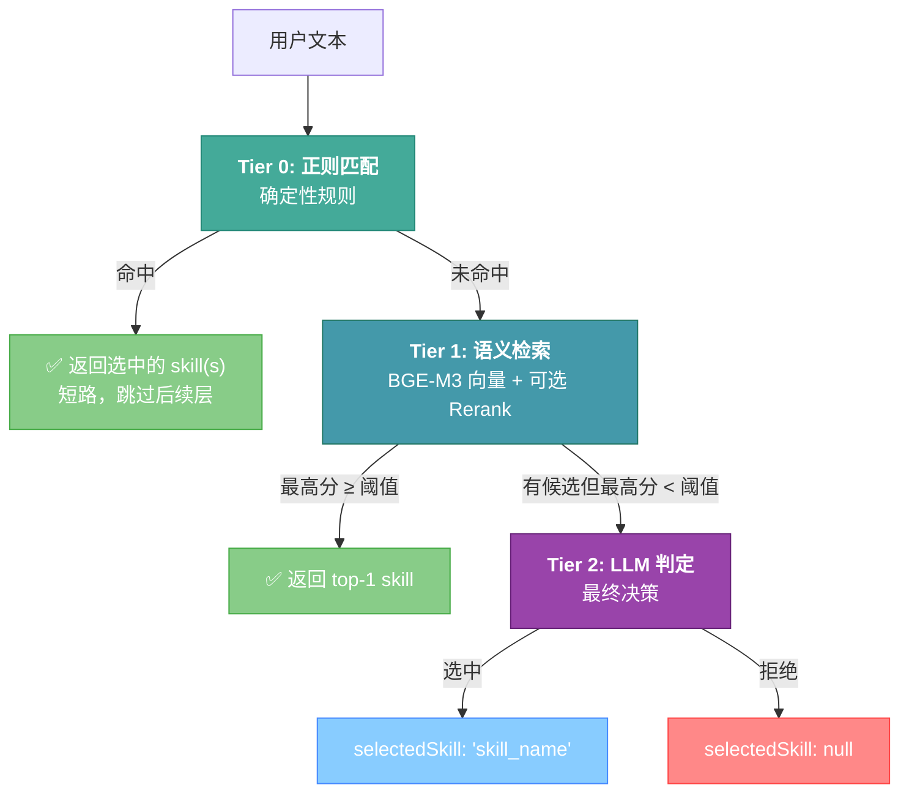

### 1.1 配置项

所有层级的行为由 `Settings` 控制（环境变量前缀 `SKILL_ROUTING_`）：

| 配置项 | 默认值 | 说明 |
|--------|--------|------|
| `SKILL_ROUTING_SEMANTIC_ENABLED` | `false` | 是否启用语义检索层（false 时只用正则） |
| `SKILL_ROUTING_EMBEDDING_MODEL` | `bge-m3` | Ollama embedding 模型名 |
| `SKILL_ROUTING_OLLAMA_BASE_URL` | `http://localhost:11434` | Ollama 服务地址 |
| `SKILL_ROUTING_SIMILARITY_THRESHOLD` | `0.72` | 语义匹配的余弦相似度阈值 |
| `SKILL_ROUTING_TOP_K` | `3` | 语义检索返回的候选数 |
| `SKILL_ROUTING_VECTOR_STORE` | `in_memory` | 向量存储后端：`in_memory` 或 `qdrant` |
| `SKILL_ROUTING_QDRANT_URL` | — | Qdrant 服务地址 |
| `SKILL_ROUTING_QDRANT_COLLECTION` | — | Qdrant 集合名 |
| `SKILL_ROUTING_RERANK_ENABLED` | `false` | 是否启用重排序 |
| `SKILL_ROUTING_RERANK_MODEL` | `qllama/bge-reranker-v2-m3` | Reranker 模型名 |
| `SKILL_ROUTING_RERANK_THRESHOLD` | — | Rerank 后的阈值（不设则沿用 similarity_threshold） |
| `SKILL_ROUTING_RERANK_TOP_K` | — | 送入 Reranker 的候选数（不设则全部） |
| `SKILL_ROUTING_LLM_MODEL` | — | LLM 判定用的模型（不设则用主 LLM） |
| `SKILL_ROUTING_LLM_RETRY_COUNT` | `1` | LLM 判定 JSON 解析失败后的重试次数 |

### 1.2 Single-agent 完整 LangGraph 流程

Skill Router 是图的第一个节点。路由完成后进入 ReAct 循环：

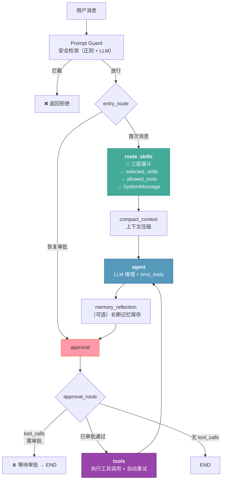

### 1.3 Tier 0: 正则确定性匹配

**位置**：`_deterministic_route()`（`router.py:1095`）

完全本地执行，不涉及网络或模型推理。命中即短路返回。

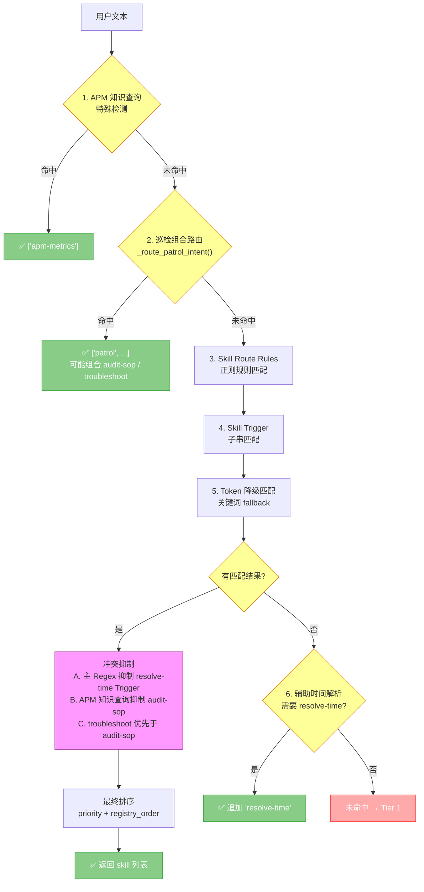

#### 匹配策略详解

**1. APM 指标知识查询特殊检测**

专门识别"什么是/怎么定义/怎么采集"类知识型查询，避免路由到 troubleshoot：

```
英文: (what is|define|definition|collect|instrument|metric) + (apm|lcp|cls|inp|fid|apdex|error rate)
中文: (什么是|怎么定义|怎么采集|指标) + (APM|LCP|CLS|INP|FID|Apdex|error rate|成功率|转化率)
```

**2. 巡检组合路由**（`_route_patrol_intent()`）

巡检是复合场景，支持多 skill 组合：

| 场景 | 匹配条件 | 返回 |
|------|---------|------|
| 纯巡检 | patrol 正则命中 | `["patrol"]` |
| 巡检 + 审计 | patrol + audit-sop 同时命中 | `["patrol", "audit-sop"]` |
| 巡检 + 排障 | patrol + troubleshoot 同时命中 | `["patrol", "troubleshoot"]` |
| 跨线程治理审计 | 跨线程/多个会话 + 业务治理 | `["audit-sop"]`（抑制 patrol） |

**3. 预定义 Skill Route Rules**（`_SKILL_ROUTE_RULES`，15+ 条规则）

| Skill | 规则 ID | 匹配模式示例 | 优先级 |
|-------|---------|-------------|--------|
| `weather` | `weather.basic` | `weather`, `forecast`, 天气, 气温, 下雨 | 20 |
| `weather` | `weather.air_quality` | `aqi`, `air quality`, 空气质量, 雾霾 | 20 |
| `weather` | `weather.temperature_detail` | 温差, 体感温度, 多少度 | 20 |
| `weather` | `weather.outdoor_suitability` | 适合(跑步/出门/户外) | 20 |
| `resolve-time` | `time.explicit_date_question` | 今天/明天/下周/农历/春节… | 10 |
| `find-skills` | `find_skills.discovery` | `find skill`, `install skill`, 找技能 | 50 |
| `patrol` | `patrol.health_check` | `patrol`, `health check`, 巡检, 告警规则 | 30 |
| `troubleshoot` | `troubleshoot.rca` | `troubleshoot`, `root cause`, `RCA`, 排障 | 30 |
| `troubleshoot` | `troubleshoot.api_performance` | `api`+`latency`/`timeout`, 排查+API+性能 | 30 |
| `apm-metrics` | `apm.metrics` | `LCP`, `CLS`, `INP`, `Web Vitals`, 指标定义 | 30 |
| `audit-sop` | `audit.execution` | `audit`, `SLA`, `compliance`, 审计, 合规 | 30 |

**4. Skill Trigger 匹配**：Skill 作者显式声明的触发短语，子串匹配，优先级 80（高于正则规则）。

**5. Token 降级匹配**：从 skill 的 name + description 中提取 ≥3 字符的 token（排除 stopwords），在用户文本中搜索。

**6. 辅助时间解析**：当已匹配 `weather` + `troubleshoot` 且用户查询包含相对未来日期（"明天"、"下周"）时，自动追加 `resolve-time`。

#### 冲突抑制规则

| 规则 | 条件 | 行为 |
|------|------|------|
| A | weather/audit-sop/troubleshoot 通过 regex 命中 | 抑制 resolve-time 的 trigger 匹配（避免"今天"等模糊词误触发） |
| B | APM 知识查询 + apm-metrics 命中 | 移除 audit-sop 和 troubleshoot-runbook |
| C | audit-sop 与 troubleshoot 同时命中 + 非治理审计查询 | 抑制 audit-sop，保留 troubleshoot |

#### 最终排序

每个 skill 只保留优先级最高（数字最小）的匹配，按 `(priority, registry_order)` 排序输出。

### 1.4 Tier 1: 语义向量检索

**位置**：`route_skill_names_with_trace()` 中段（`router.py:827-964`）

当正则层未命中时进入。需要网络调用（Ollama），但不需要 LLM 推理。

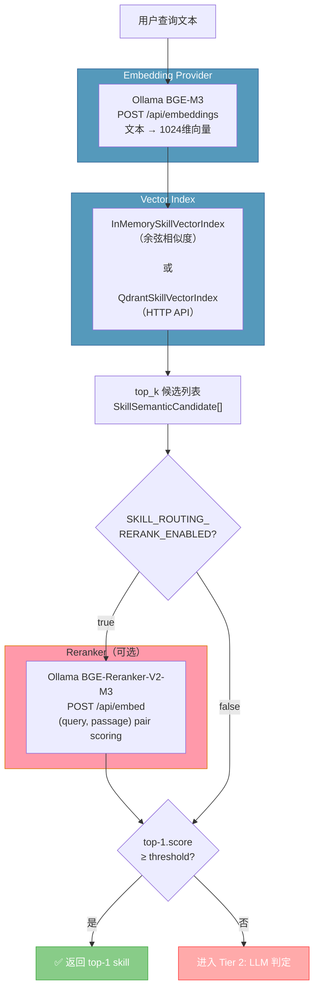

#### Embedding Provider

`OllamaBgeM3EmbeddingProvider`：调用 `POST {ollama}/api/embeddings`，模型 `bge-m3`，输出 1024 维浮点向量。BGE-M3 原生支持中英文混合，适合 skill 描述中的多语言场景。

#### 向量索引

- **InMemory 模式**（默认）：启动时 warmup 生成所有 skill 的 embedding 并缓存。检索时计算余弦相似度。
- **Qdrant 模式**（生产推荐）：通过 HTTP API 管理向量，支持增量同步（`source_hash` 对比，只更新变更的 skill）。

Skill 语义文档由 `{skill.name}\n{skill.description}\n{triggers}` 拼接而成。

#### Reranker（可选）

`OllamaBgeM3Reranker`：pair scoring 方式，将 `query: ...\npassage: ...` 送入模型。分数超出 `[0, 1]` 时 sigmoid 归一化。初始化时通过 `/api/tags` 检查模型 embedding capability。

#### 阈值判定

语义层只选 **top-1** skill——top-1 之后的相似度衰减很快，多选会引入噪音。

### 1.5 Tier 2: LLM 判定器

**位置**：`_llm_route_with_trace()`（`router.py:1398-1495`）

语义候选存在但最高分低于阈值时，由 LLM 做最终判定。

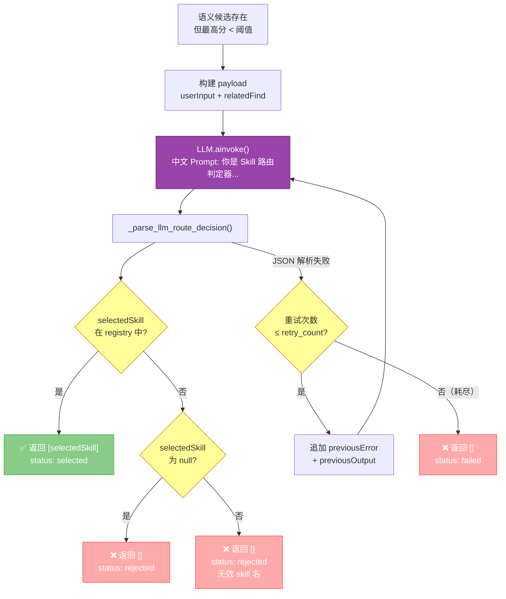

#### Prompt 设计

```
你是 Skill 路由判定器。请只在 relatedFind 中选择一个确实适合处理 userInput 的 skill；
如果没有足够把握，selectedSkill 返回 null。
必须只返回 JSON，不要返回 Markdown，不要解释。
JSON 字段固定为 selectedSkill、confidence、reason。
```

输出模型 `LLMSkillRouteDecision`：

```python
class LLMSkillRouteDecision(BaseModel):
    selectedSkill: str | None = None
    confidence: float = 0.0
    reason: str = ""
```

解析支持 dict、JSON 字符串、Markdown 代码块、AIMessage.content 等多种格式。解析失败时追加错误信息到 payload 后重试。

### 1.6 Skill 集合

| Skill 名称 | 类别 | 核心能力 |
|-----------|------|---------|
| `weather` | 业务 | 天气查询（wttr.in），实时/预报/空气质量/紫外线 |
| `resolve-time` | 工具 | 日期时间解析，农历、工作日、节假日 |
| `find-skills` | 元能力 | 搜索和安装新 skill |
| `patrol` | APM | 自动化巡检规则管理、健康检查 |
| `troubleshoot` | APM | 前端 APM 事故根因分析（RCA） |
| `apm-metrics` | APM | 指标定义/解读/采集方法 |
| `audit-sop` | APM | Agent 执行日志审计、SLA 合规检查 |

---

## 二、Multi-agent 模式：APM 意图路由

核心入口：`rewrite_query_and_slots()`（`multi_agent.py:22-54`）

Multi-agent 模式只服务 APM 可观测性场景，路由策略是**单层纯正则**——不调用 LLM，不使用 embedding。意图识别结果驱动后续 4 个子 Agent 的并行调度。

### 2.1 Multi-agent 完整 Graph 流程

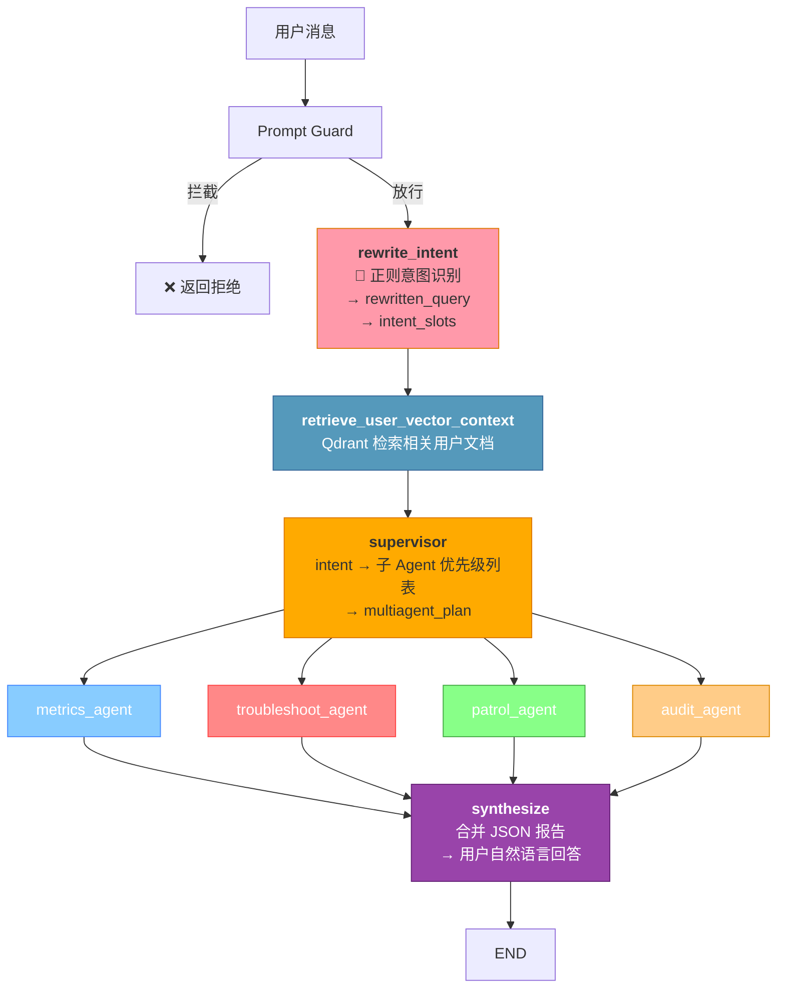

关键特征：
- **线性 DAG**，非循环图（与 single-agent 的 ReAct 循环不同）
- 4 个子 Agent **全并行**执行（不是条件分支——每条边都存在）
- supervisor 的 plan 是**推荐优先级**而非硬过滤

### 2.2 rewrite_intent（意图识别核心）

`rewrite_query_and_slots()`（`multi_agent.py:22-54`）是 Multi-agent 模式路由的**唯一入口函数**。它是一个纯函数（无副作用、无异步、无网络调用），完成四项工作：**Query 规范化** → **意图分类** → **指标提取** → **实体提取**，全部通过正则和字符串操作实现。

#### Query 规范化

```python
def rewrite_query_and_slots(query: str) -> dict[str, Any]:
    normalized = " ".join(query.split())   # 合并连续空白字符
    lowered = normalized.lower()           # 大小写归一化（仅用于正则匹配）
```

当前规范化策略很简单——只做空白压缩。`rewritten_query` 保留原始大小写，`lowered` 仅用于正则匹配。这为未来扩展（如拼写纠错、同义词替换、中文繁简转换）预留了空间。

返回结构中同时保留 `original_query` 和 `rewritten_query`，下游节点可以按需使用：

| 字段 | 用途 |
|------|------|
| `original_query` | 保留用户原始输入的完整信息，用于 trace 和执行日志 |
| `rewritten_query` | 规范化后的查询，传递给 supervisor、子 Agent、synthesize 作为统一输入 |

#### 意图槽位 (Slots) 完整定义

Slots 是 Multi-agent 路由的核心数据结构，承载了从用户查询中提取的所有结构化信息。下游的 supervisor、子 Agent、synthesize 全部依赖这些槽位做决策和推理。

```python
# AgentState 中的槽位字段 (state.py:16-17)
class AgentState(TypedDict, total=False):
    rewritten_query: str           # 规范化后的查询文本
    intent_slots: dict[str, Any]   # 意图槽位字典

# rewrite_query_and_slots() 返回的完整结构
{
    "original_query": str,         # 用户原始输入（保留原始空白和大小写）
    "rewritten_query": str,        # 规范化查询（" ".join(query.split())）
    "slots": {
        "domain": str,                      # "apm" | "general"
        "intent": str,                      # "troubleshoot" | "patrol" | "audit" | "metrics" | "general"
        "metrics": list[str],               # 提取的 APM 指标名，如 ["p99", "lcp"]
        "entities": list[str],              # 提取的实体标识符，如 ["payment-service"]
        "requires_user_vector_context": bool, # 是否需要检索用户历史文档（当前恒为 True）
    },
}
```

**各槽位详解**：

| 槽位 | 类型 | 提取方式 | 下游消费者 | 说明 |
|------|------|---------|-----------|------|
| `domain` | `str` | `_looks_like_apm()` 正则检测 | supervisor | `"apm"` 表示 APM 领域查询，`"general"` 表示通用查询。当前仅用于标记，不影响路由逻辑 |
| `intent` | `str` | if-elif 正则优先级匹配 | supervisor → `_supervisor_plan()` | 决定子 Agent 的调度优先级列表。是槽位中**最关键**的字段 |
| `metrics` | `list[str]` | `re.finditer(r"\b(?:p50\|p75\|...)\b")` | 子 Agent（作为上下文注入 payload） | 提取命中的指标名（小写去重），如 `["p99", "lcp"]`。子 Agent 可据此直接查询对应指标 |
| `entities` | `list[str]` | `re.findall(r"\b[a-zA-Z][a-zA-Z0-9_-]{2,}\b")` + 去停用词 | 子 Agent（作为上下文注入 payload） | 提取服务名、接口名等标识符。排除 `api`, `apm`, `rca` 及已识别的指标名 |
| `requires_user_vector_context` | `bool` | 硬编码 `True` | `retrieve_user_vector_context` 节点 | 控制是否触发 Qdrant 用户文档检索。当前恒为 True，未来可根据 query 类型动态决定 |

**槽位数据流**：

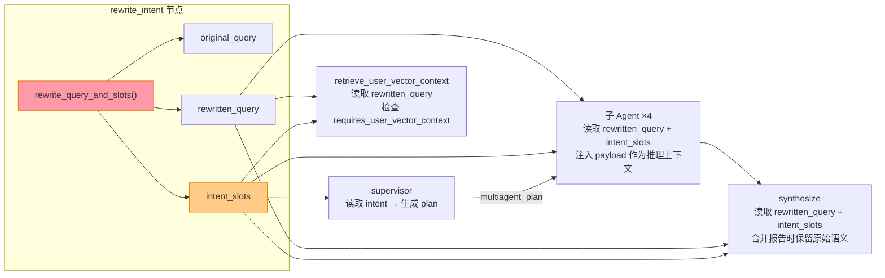

#### 意图分类

按优先级依次匹配 4 种意图，默认 fallback 到 `general`：

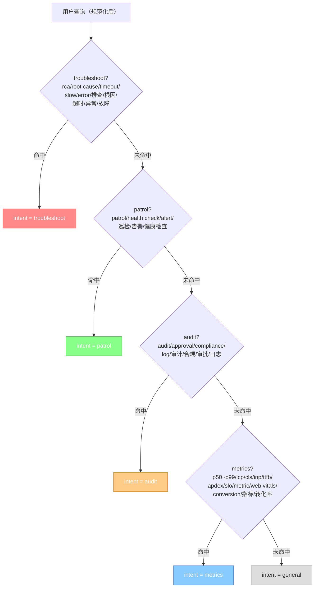

#### 指标提取

从查询中提取具体的 APM 指标名：

```python
metrics = _unique(
    match.group(0).lower()
    for match in re.finditer(
        r"\b(?:p50|p75|p90|p95|p99|lcp|cls|inp|ttfb|apdex|slo)\b",
        lowered
    )
)
```

#### 实体提取

提取字母数字标识符（如服务名、接口名）：

```python
entities = _unique(
    token
    for token in re.findall(r"\b[a-zA-Z][a-zA-Z0-9_-]{2,}\b", normalized)
    if token.lower() not in {"api", "apm", "rca", *metrics}
)
```

#### Domain 判定

`_looks_like_apm()` 检测是否包含 APM 相关术语，输出 `"apm"` 或 `"general"`。

#### 输出写入 AgentState

`rewrite_intent` 节点将函数的返回值写入 LangGraph state：

```python
async def rewrite_intent(state: AgentState, config=None) -> AgentState:
    query = _last_human_text(state)
    payload = rewrite_query_and_slots(query)
    return {
        "rewritten_query": payload["rewritten_query"],
        "intent_slots": payload["slots"],
    }
```

`original_query` 不单独写入 state（保留在 `messages` 的 HumanMessage 中），`requires_user_vector_context` 作为 slots 的子字段传递。写入后这些字段被后续所有节点通过 `state.get("rewritten_query")` 和 `state.get("intent_slots")` 消费。

### 2.3 supervisor（子 Agent 调度计划）

`_supervisor_plan()`（`multi_agent.py:167-185`）将意图映射为子 Agent 优先级列表：

| 检测到的 Intent | 调度的子 Agent（按优先级） |
|----------------|--------------------------|
| `metrics` | `metrics`, `audit` |
| `troubleshoot` | `troubleshoot`, `metrics`, `audit` |
| `patrol` | `patrol`, `metrics`, `audit` |
| `audit` | `audit`, `metrics` |
| `general`（默认） | 全部 4 个：`metrics`, `troubleshoot`, `patrol`, `audit` |

**设计要点**：
- 每个意图都有一个主 Agent（排第一）+ `audit`/`metrics` 做证据补充
- `troubleshoot` 最重：需要排障 + 指标 + 审计三层交叉验证
- `general` 兜底全开，确保不丢信息
- 图结构上 4 个子 Agent **全都会执行**（不是条件边），plan 的实际作用是作为上下文传给子 Agent 供其自我调整

### 2.4 子 Agent 并行执行

每个子 Agent 接收完整的上下文 payload：

```json
{
    "agent": "troubleshoot",
    "query": "排查 payment-service p99 超时",
    "intent_slots": {...},
    "user_vector_context": {...},
    "plan": {"intent": "troubleshoot", "subagents": ["troubleshoot", "metrics", "audit"]},
    "communication_contract": {
        "format": "json",
        "required_fields": ["agent", "findings", "evidence", "recommendations"]
    }
}
```

调用 LLM 生成结构化 JSON 报告：

```json
{
    "agent": "troubleshoot",
    "findings": ["payment-service 的 p99 延迟较上周增长 230%", "..."],
    "evidence": ["APM trace 显示数据库查询耗时占 80%", "..."],
    "recommendations": ["建议检查 db 连接池配置", "..."],
    "confidence": 0.85
}
```

`synthesize` 节点将所有子报告合并为一个用户可读的自然语言回答。

---

## 三、两种模式对比

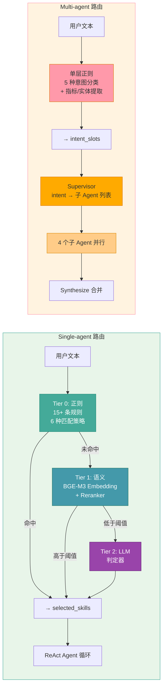

| 维度 | Single-agent | Multi-agent |
|------|-------------|-------------|
| 入口函数 | `route_skill_names_with_trace()` | `rewrite_query_and_slots()` |
| 路由层级 | 3 层（正则 → 语义 → LLM） | 1 层（纯正则） |
| 是否调用 LLM 做路由 | 仅在 Tier 2 | 不调用（子 Agent 阶段才用 LLM） |
| 是否使用 Embedding | Tier 1（BGE-M3） | 用于用户向量检索，非路由 |
| 输出粒度 | 精确到具体 Skill（7 个） | 粗粒度意图类别（5 种） |
| 是否支持多选 | 正则层支持多 Skill 组合 | 意图为单值，但 4 子 Agent 全并行 |
| 图结构 | 循环图（ReAct agent ⇄ tools） | 线性 DAG（单次流式处理） |
| 适用场景 | 通用 assistant | APM 可观测性专项 |
| 新 Skill/意图扩展 | 需更新正则规则 + 语义索引 | 意图类别固定 4+1，不需扩展 |
| 为什么会这样设计 | 通用场景下 Skill 类型差异大，需要多层策略保证精度 | APM 术语高度特化，正则精度足够；子 Agent 全并行确保不丢信息 |

---

## 四、路由追踪 (Trace)

两种模式都会产生结构化的 trace 数据，写入 `AgentState`。

### Single-agent trace

记录三层漏斗的完整决策过程：

```json
[
    {"stage": "regex", "status": "missed", "reason": "no regex or trigger matched"},
    {"stage": "semantic", "status": "below_threshold", "candidates": [
        {"name": "weather", "score": 0.65}
    ], "threshold": 0.72},
    {"stage": "llm_judge", "status": "selected", "selected_skill": "weather", "confidence": 0.85}
]
```

### Multi-agent trace

记录意图识别和子 Agent 执行过程（通过 `_record_multiagent_log()` 写入 execution_log）：

| 事件名 | 记录内容 |
|--------|---------|
| `rewrite_intent` | 意图分类结果 + slots |
| `supervisor` | 子 Agent 调度计划 |
| `user_vector_retrieval` | Qdrant 检索结果 |
| `{name}_agent` | 各子 Agent 的输入和输出报告 |
| `synthesize` | 最终合并结果 |

### Multi-agent 评估指标

`evaluate_multi_agent_intent_cases()` 使用 Golden 测试集评估意图识别的准确性：

| 指标 | 说明 |
|------|------|
| `intent_accuracy` | 意图分类精确匹配率 |
| `intent_precision` / `intent_recall` / `intent_f1` | 每个意图的精确率/召回率/F1 |
| `metric_extraction_recall` | 预期指标名被正确提取的比例 |
| `entity_extraction_recall` | 预期实体名被正确提取的比例 |

Golden 测试用例（`GoldenSkillCase`）的 multi-agent 专属字段：

```python
class GoldenSkillCase(BaseModel):
    # ... 通用字段 ...
    expected_intent: str | None = None       # 期望的意图
    expected_metrics: list[str] = []         # 期望提取的指标
    expected_entities: list[str] = []        # 期望提取的实体
```

---

## 五、Multi-agent 意图识别升级方案

### 5.1 当前方案的局限性

纯正则方案在以下场景存在明显短板：

| 问题 | 示例 | 根因 |
|------|------|------|
| **同义改写不识别** | "帮我看下服务是不是挂了" ≠ 正则命中，但语义 = troubleshoot | 正则依赖关键词逐字匹配 |
| **混合意图丢失** | "巡检一下，顺便看下最近有没有异常" → 仅匹配到 patrol，丢失了 troubleshoot | if-elif 优先级链只能输出单意图 |
| **否定/条件句误判** | "不是要巡检，只是想查个指标" → 仍命中 patrol | 正则有匹配无理解 |
| **拼写变体/缩写** | "trbleshoot" 或 "根因分析" vs "根因" | 正则对变形、缩写、近义词无泛化能力 |
| **缺乏置信度** | 所有匹配结果都是 100% 确定性的 | 无法区分"确定命中"和"碰巧命中"，也无法触发降级逻辑 |
| **扩展困难** | 新增意图类别或子 Agent 需要手动维护正则 | 不具备从数据中学习的能力 |

### 5.2 业界方案调研

#### 方案 A：Semantic Router（纯 Embedding 路由）

**代表**：[Aurelio AI Semantic Router](https://docs.aurelio.ai/semantic-router)（MIT 开源）

```
用户查询 → Embedding (BGE-M3) → 与每个意图的 utterances 计算余弦相似度 → 最高分 > 阈值 → 路由
```

- **延迟**：~80ms（本地 Ollama），比 LLM 调用快 7×
- **成本**：几乎为 0（本地 embedding）
- **局限**：纯语义匹配丢失了关键词精确匹配的优势（如 "p99"、"LCP" 等术语），需要配置足够多的 utterance 示例

#### 方案 B：LLM Structured Output 分类器

**代表**：LangGraph Supervisor Pattern、NVIDIA AI-Q Blueprint

```
用户查询 → LLM (DeepSeek, temperature=0) → Structured Output {intent, sub_intents[], confidence, reason}
```

- **延迟**：~300-800ms（取决于模型和 token 数）
- **成本**：每次路由约 200-500 input tokens + 50-100 output tokens
- **优势**：能处理复杂语义、混合意图、否定条件；输出可解释的 reason
- **局限**：每次路由都调用 LLM，延迟和成本是 embedding 方案的 5-10×

#### 方案 C：Hybrid 漏斗（正则 → Embedding → LLM）⭐ 推荐

**代表**：Microsoft Multi-agent Reference Architecture、本项目 Single-agent 模式已有的三层漏斗

```
用户查询
  │
  ├─ Tier 0: 正则快速匹配（保留现有逻辑，高置信度场景短路）
  │   └─ 命中 + 高置信度 → 直接返回
  │
  ├─ Tier 1: Semantic Router（Embedding 语义匹配）
  │   └─ 最高分 ≥ 阈值 → 返回
  │
  └─ Tier 2: LLM Structured Output（最终判定）
      └─ 返回 intent + sub_intents + confidence
```

这是**对本项目 Single-agent 模式三层漏斗的复用和适配**，而非引入全新架构。

### 5.3 推荐方案：Hybrid 三层漏斗

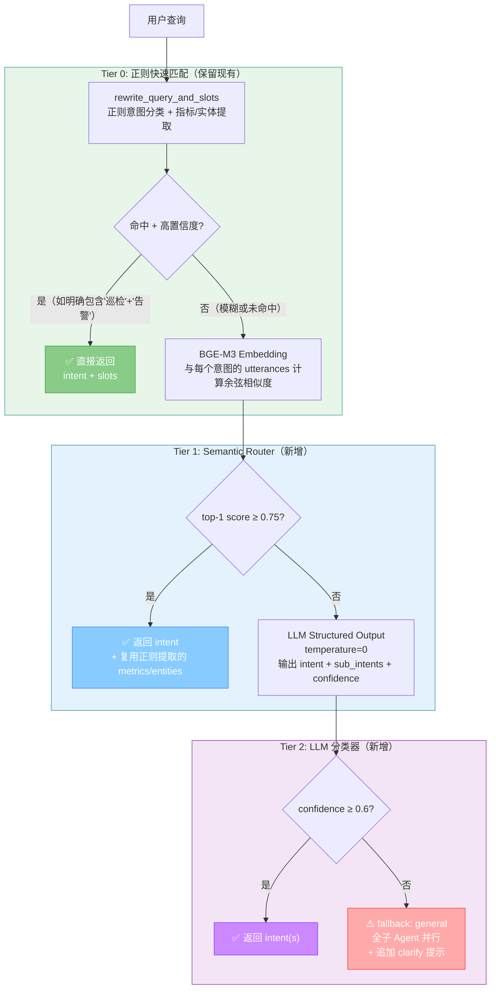

### 5.4 详细设计

#### 5.4.1 Intent Schema 升级

从单一的 `intent: str` 升级为支持多意图 + 置信度的结构：

```python
# 新 Schema（替代现有 intent_slots 中的 intent 字段）
class IntentSlots(TypedDict):
    domain: str                              # "apm" | "general"
    primary_intent: str                      # "troubleshoot" | "patrol" | "audit" | "metrics" | "general"
    secondary_intents: list[str]             # 次要意图，如 ["metrics"]（排障时常需查指标）
    confidence: float                        # 0.0 ~ 1.0
    source: str                              # "regex" | "semantic" | "llm"
    reason: str                              # 分类理由（LLM 层填充）
    metrics: list[str]                       # 提取的指标名（保留现有逻辑）
    entities: list[str]                      # 提取的实体名（保留现有逻辑）
    requires_user_vector_context: bool       # 保留
```

#### 5.4.2 Tier 0: 正则层（保留 + 增加置信度评估）

现有逻辑保持不变，增加一个简单的置信度启发式：

```python
def _regex_intent_with_confidence(normalized: str) -> tuple[str, float]:
    """返回 (intent, confidence)"""
    # 强信号：多个关键词命中
    troubleshoot_signals = len(re.findall(
        r"排查|根因|rca|troubleshoot|timeout|slow|error|异常|故障", normalized, re.I
    ))
    if troubleshoot_signals >= 2:
        return ("troubleshoot", 0.90)
    elif troubleshoot_signals == 1:
        return ("troubleshoot", 0.70)  # 单关键词，可能误判

    patrol_signals = len(re.findall(
        r"巡检|patrol|health check|告警规则|健康检查", normalized, re.I
    ))
    if patrol_signals >= 2:
        return ("patrol", 0.90)
    elif patrol_signals == 1:
        return ("patrol", 0.70)

    # ... audit, metrics 类似 ...

    return ("general", 0.40)  # 未命中，低置信度
```

当 `confidence < 0.80` 时，正则层不短路，继续进入 Tier 1。

#### 5.4.3 Tier 1: Semantic Router（新增）

利用项目已有的 BGE-M3 + Ollama 基础设施，无需新增依赖。为每个意图类别定义 utterance 示例：

```python
INTENT_UTTERANCES: dict[str, list[str]] = {
    "troubleshoot": [
        "排查 payment-service 超时问题",
        "帮我做一下根因分析",
        "最近错误率升高了是什么原因",
        "RCA the latency spike on api-gateway",
        "为什么数据库查询突然变慢了",
        "服务挂了帮我看看",
        "frontend error rate is spiking, need root cause",
        "分析一下 APM 里面的异常 trace",
    ],
    "patrol": [
        "设置一个夜间自动巡检规则",
        "配置告警阈值",
        "创建健康检查任务",
        "定时巡检所有服务",
        "帮我配一条 p99 > 500ms 的告警",
        "add a patrol rule for error_rate > 5%",
    ],
    "audit": [
        "审计一下最近的工具调用记录",
        "查看执行日志",
        "检查 SLA 合规情况",
        "审批通过率是多少",
        "audit the tool execution logs for security events",
        "跨线程治理巡检",
    ],
    "metrics": [
        "LCP 指标怎么定义的",
        "查看 p95 延迟趋势",
        "业务转化率是多少",
        "Web Vitals 指标解读",
        "what is Apdex and how to collect it",
        "自定义指标怎么采集",
    ],
}

# 预热时为每个意图生成 embedding（取 utterances 的均值向量）
class IntentEmbeddingIndex:
    def __init__(self, embedding_provider):
        self.provider = embedding_provider
        self.intent_vectors: dict[str, list[float]] = {}

    async def warmup(self):
        for intent, utterances in INTENT_UTTERANCES.items():
            vectors = [await self.provider.embed(u) for u in utterances]
            # 均值池化
            dim = len(vectors[0])
            avg = [sum(v[i] for v in vectors) / len(vectors) for i in range(dim)]
            self.intent_vectors[intent] = avg

    async def classify(self, query: str) -> list[tuple[str, float]]:
        q_vec = await self.provider.embed(query)
        scores = [
            (intent, _cosine_similarity(q_vec, vec))
            for intent, vec in self.intent_vectors.items()
        ]
        return sorted(scores, key=lambda x: x[1], reverse=True)
```

#### 5.4.4 Tier 2: LLM Structured Output（新增）

当语义层最高分低于阈值时，调用 LLM 做最终分类。使用项目已有的 DeepSeek LLM：

```python
from pydantic import BaseModel, Field

class IntentDecision(BaseModel):
    """LLM 结构化输出 Schema"""
    primary_intent: str = Field(
        description="主意图: troubleshoot | patrol | audit | metrics | general"
    )
    secondary_intents: list[str] = Field(
        default_factory=list,
        description="次要意图，如排障时可能需要查指标 ['metrics']"
    )
    confidence: float = Field(
        ge=0.0, le=1.0,
        description="置信度"
    )
    reason: str = Field(
        description="判定理由，一句话"
    )

INTENT_CLASSIFIER_PROMPT = """你是 APM 意图分类器。分析用户查询，输出结构化分类结果。

## 意图定义

- **troubleshoot**: 排查故障、根因分析、性能异常诊断、RCA
- **patrol**: 巡检规则配置、告警阈值设置、定时健康检查
- **audit**: 执行日志审计、SLA 合规检查、审批记录查询、安全事件审查
- **metrics**: 指标定义/解读、性能数据查询、Web Vitals、业务指标
- **general**: 以上都不匹配的通用查询

## 规则

- 用户可能同时有多个意图，主意图放 primary_intent，次要意图放 secondary_intents
- 如果确实无法判断，primary_intent 设为 "general"，confidence 设为 0.3 以下
- 只输出 JSON，不要解释"""

async def llm_classify_intent(llm, query: str, slots: dict) -> IntentDecision:
    response = await llm.bind_tools([]).ainvoke([
        SystemMessage(content=INTENT_CLASSIFIER_PROMPT),
        HumanMessage(content=(
            f"用户查询: {query}\n"
            f"已提取的指标: {slots.get('metrics', [])}\n"
            f"已提取的实体: {slots.get('entities', [])}"
        )),
    ])
    return _parse_intent_decision(response)  # 复用 _parse_llm_route_decision 的解析逻辑
```

#### 5.4.5 完整的 `rewrite_intent` 节点改造

```python
async def rewrite_intent_v2(state: AgentState, config=None) -> AgentState:
    query = _last_human_text(state)

    # Tier 0: 正则快速匹配（保留现有逻辑）
    regex_result = rewrite_query_and_slots(query)
    intent, confidence = _regex_intent_with_confidence(
        regex_result["rewritten_query"]
    )

    if confidence >= 0.80:  # 高置信度直接返回
        return _build_state_update(regex_result, intent, confidence, "regex")

    # Tier 1: Semantic Router
    semantic_scores = await intent_index.classify(
        regex_result["rewritten_query"]
    )
    top_intent, top_score = semantic_scores[0]

    if top_score >= 0.75:  # 语义匹配置信
        return _build_state_update(
            regex_result, top_intent, top_score, "semantic"
        )

    # Tier 2: LLM 判定
    llm_decision = await llm_classify_intent(
        llm, regex_result["rewritten_query"], regex_result["slots"]
    )

    if llm_decision.confidence >= 0.60:
        return _build_state_update(
            regex_result,
            llm_decision.primary_intent,
            llm_decision.confidence,
            "llm",
            reason=llm_decision.reason,
            secondary_intents=llm_decision.secondary_intents,
        )

    # Fallback: general，全子 Agent 并行
    return _build_state_update(
        regex_result, "general", 0.30, "llm",
        reason="low confidence fallback",
    )
```

#### 5.4.6 配置项

在现有 `SKILL_ROUTING_*` 基础上新增（环境变量前缀 `MULTI_AGENT_INTENT_`）：

| 配置项 | 默认值 | 说明 |
|--------|--------|------|
| `MULTI_AGENT_INTENT_REGEX_THRESHOLD` | `0.80` | 正则层置信度阈值，高于此值短路返回 |
| `MULTI_AGENT_INTENT_SEMANTIC_ENABLED` | `true` | 是否启用 Semantic Router 层 |
| `MULTI_AGENT_INTENT_SEMANTIC_THRESHOLD` | `0.75` | 语义匹配阈值 |
| `MULTI_AGENT_INTENT_LLM_ENABLED` | `true` | 是否启用 LLM 分类器 |
| `MULTI_AGENT_INTENT_LLM_THRESHOLD` | `0.60` | LLM 分类器置信度阈值 |
| `MULTI_AGENT_INTENT_LLM_MODEL` | — | LLM 分类器专用模型（不设则用主 LLM） |

### 5.5 评估与渐进迁移策略

#### 评估方式

利用现有的 `evaluate_multi_agent_intent_cases()` 评估框架 + Golden 测试集。升级后的评估增加：

| 指标 | 现方案 | 升级后新增 |
|------|--------|----------|
| `intent_accuracy` | ✅ | — |
| `intent_precision/recall/f1` | ✅ | — |
| **`secondary_intent_recall`** | — | 次要意图召回率 |
| **`confidence_calibration`** | — | ECE (Expected Calibration Error) |
| **`latency_p50/p99`** | — | 各层延迟分布 |
| **`llm_call_ratio`** | — | 穿透到 LLM 层的请求比例 |
| **`regex_hit_rate`** | 100% | Tier 0 短路率（目标 >70%） |

#### 渐进迁移步骤

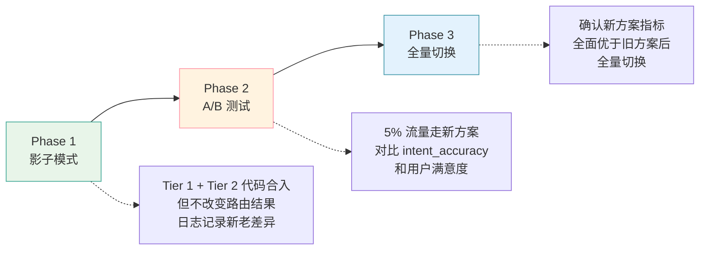

**Phase 1 — 影子模式**：新路由逻辑与旧逻辑并行运行，将新旧结果差异写入 trace。不改动实际路由行为。

**Phase 2 — A/B 测试**：通过 `agent_mode` 或实验参数控制流量比例。对比新旧方案的 `intent_accuracy` 和下游子 Agent 输出质量。

**Phase 3 — 全量切换**：确认新方案在 Golden 测试集和线上指标均优于旧方案后，切换默认路由。

### 5.6 方案对比总结

| 维度 | 现方案（纯正则） | 方案 A（纯 Semantic Router） | 方案 B（纯 LLM） | **方案 C（Hybrid 三层）⭐** |
|------|-----------------|---------------------------|-----------------|--------------------------|
| 意图准确率（预估） | ~75-85% | ~85-90% | ~92-97% | **~90-95%** |
| 混合意图支持 | ❌ 单意图 | ❌ 单意图 | ✅ 多意图 | **✅ 多意图（LLM 层）** |
| 置信度 | ❌ 无 | ✅ 相似度分数 | ✅ 显式 confidence | **✅ 每层都有** |
| 延迟（P50） | <1ms | ~80ms | ~500ms | **~80ms（70%+ 在 Tier 0/1 短路）** |
| 每次路由成本 | $0 | $0 | ~$0.001-0.003 | **~$0.0003（加权平均）** |
| 可解释性 | 低（正则命中即路由） | 中（相似度分数） | 高（reason 字段） | **高（reason + source trace）** |
| 从数据学习 | ❌ | ✅（更新 utterances） | ✅（更新 prompt） | **✅（三层都可迭代）** |
| 新依赖 | 无 | 无（复用 BGE-M3） | 无（复用 DeepSeek） | **无（全部复用现有基础设施）** |
| 与 Single-agent 架构一致性 | ❌ 完全不同的策略 | 部分一致 | 部分一致 | **✅ 复用三层漏斗模式** |

### 5.7 关键设计决策说明

**为什么 Tier 0 保留正则而不是直接用 Semantic Router？**

APM 领域有一批高度特化的关键词（`p99`、`LCP`、`Apdex`、`巡检`），它们的 embedding 向量在通用语义空间中不一定能形成紧密的簇。正则对这些术语的精确匹配比语义相似度更可靠。Tier 0 相当于一个"高精度过滤器"，只在高度确信时短路，其余情况交给后续层。

**为什么 Semantic Router 放在 LLM 之前？**

成本和延迟。根据 [Aurelio AI 2025 年的生产数据](https://speakerdeck.com/player/40cc22f20bb4452c8deac25e8c101172)，本地 embedding 路由比 LLM 调用快 7×、便宜 60×。将 Semantic Router 放在中间层可以在 70%+ 的场景下避免 LLM 调用，同时保持语义理解能力。

**为什么 LLM 层支持多意图输出？**

APM 场景中混合意图很常见——"巡检时发现异常，顺便做下排障" 同时涉及 patrol 和 troubleshoot。"查一下 p99 延迟，看看是不是数据库的问题" 同时涉及 metrics 和 troubleshoot。LLM 的多意图输出让 `supervisor` 的调度更精准——可以根据 `primary_intent + secondary_intents` 调整子 Agent 的优先级权重，而不是简单地图查表。
